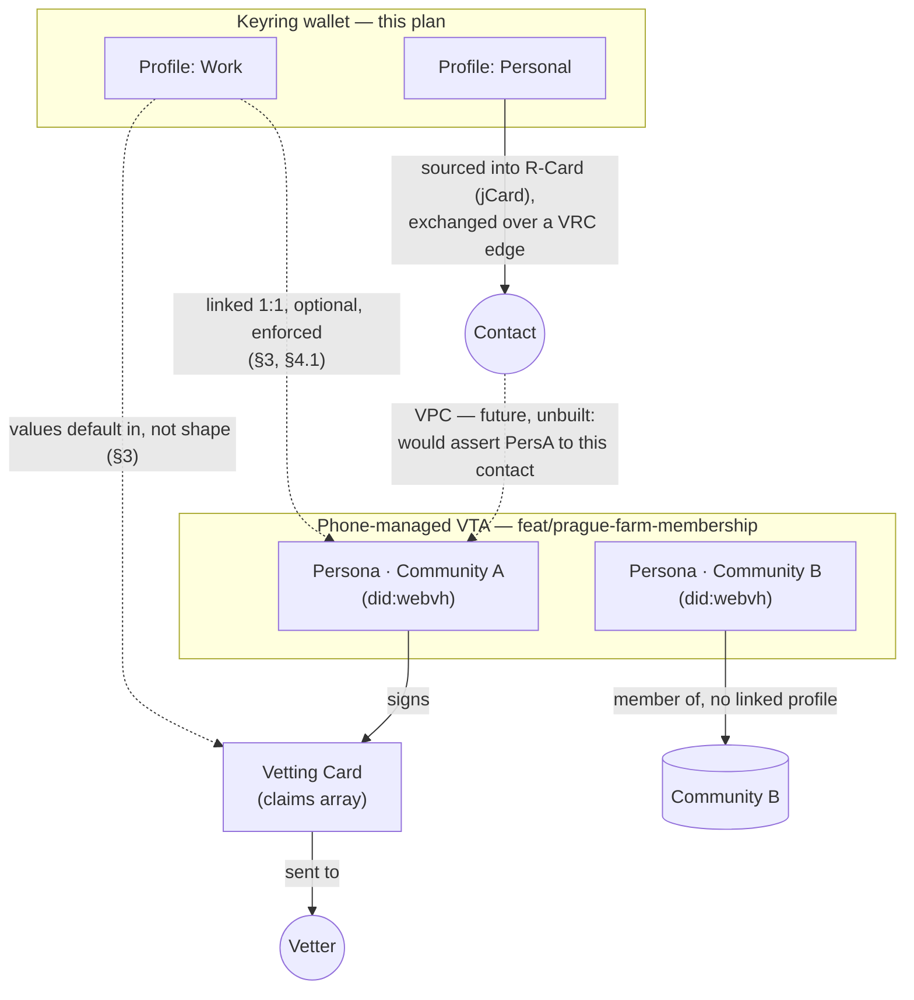

# Editable R-Card profile, then multiple selectable profiles

*Phase 1: let a user change the profile (name/email/organization/photo) they set up during
onboarding, at any time afterward. Phase 2: let a user hold more than one such profile and
choose which one to present when connecting to someone. No subtask plans yet; no
companions yet — this is the initial draft.*

---

## 1. Executive summary

Today a Keyring user's "profile" is a single unsigned R-Card template — a jCard
(`RCardTemplate`, `bifold/packages/core/src/modules/vrc/types/rcard.ts:33-43`) holding
first name, last name, email, organization and an optional photo. It is created exactly
once, only during onboarding (`RCardOnboarding.tsx`), and Credo storage
(`rCardCredential.ts`) is built around that assumption end to end: `loadRCardTemplate`
takes `records[0]` of whatever matches `{type: 'RCardTemplate'}` and `storeRCardTemplate`'s
own comment states *"During onboarding on a fresh install, there should be NO existing
R-card records"* (`rCardCredential.ts:219-247,283-317`). There is no screen anywhere in
the app, after onboarding, that shows or changes this data.

This plan phases the work the user asked for:

- **Phase 1 — editable.** Add a settings entry that opens an edit screen pre-filled with
  the current profile, and make storage support *replacing* the one existing record
  in place rather than only creating it. No change to the single-profile assumption
  otherwise.
- **Phase 2 — multiple, selectable.** Let a user hold several profiles (e.g. "Personal",
  "Work") and choose which one is *active* — the one offered when they connect to
  someone. This is a bigger change: the storage layer moves from "the one record" to
  "records disambiguated by an id," the app state shape moves from a single template to
  a list plus an active pointer, and the connect-time UI needs a way to make and show that
  choice *before* the automatic, asynchronous credential-offer machinery fires (§4.3
  explains why "before," not "during," is where this has to live).

Both phases touch only the R-Card *template* (the local, unsigned, editable draft) and
its Credo storage/state plumbing. Neither changes the wire shape of an issued
`RelationshipCard` credential (`buildRCardCredential`, `rCardCredential.ts:23-66`) or the
VRC/DIDComm exchange protocol itself. Existing contacts who already hold an issued R-Card
from before an edit or a profile switch keep exactly what they were issued — re-issuing
is required for them to see a change, which is the existing, already-shipped semantics
for editing any R-Card field (`rcard-profile-picture-plan.md` §3.6, "Immutability" —
carried over unchanged here, not a new decision).

---

## 2. Current state (verified 2026-09-17)

- **Data shape.** `RCardTemplate` (`types/rcard.ts:33-43`) = `{ id, '@context', type,
  templateId, label, jcard, issuer?, issuanceDate? }`. `id` is a per-instance
  `urn:uuid:...` (`buildRCardTemplate`, `types/rcard.ts:193-212`). `templateId` defaults
  to the constant `'rcard-basic-1'` (`DEFAULT_TEMPLATE_ID`, `types/rcard.ts:59`) for
  every template built today — it is not currently used to distinguish one template
  from another, only as a schema/version tag. `label` defaults to `'Default business
  card'` and is free text — already a display name, unused as one today.
- **Storage.** `buildRCardTemplateW3cCredentialRecord` wraps a template as an unsigned
  `W3cCredentialRecord`, tagged `{ type: 'RCardTemplate', isSelfIssued: 'true',
  templateId }` (`rCardCredential.ts:77-115`). `loadRCardTemplate` queries
  `{type: 'RCardTemplate'}` and returns `records[0]` — the first match, with no
  disambiguation (`rCardCredential.ts:219-247`). `storeRCardTemplate` calls
  `repository.save()` unconditionally and is documented as assuming no prior record
  exists (`rCardCredential.ts:283-317`). `deleteRCardTemplate` deletes every matching
  record (`rCardCredential.ts:252-278`) — already profile-agnostic in that one respect.
  `templateId` is never embedded in the *issued* credential (`buildRCardCredential`,
  `rCardCredential.ts:23-66`, has no `templateId` field in `credentialSubject`) — it
  lives only in the local, unsigned template record, so repurposing it is a local
  storage change with no wire-format effect.
- **App state.** `RCardState` = `{ template?: RCardTemplate; lastSyncedAt?: string }`
  (`types/state.ts:121-124`) — singular, not a list. Three reducer actions exist:
  `R_CARD_TEMPLATE_STAGED` (pre-agent staging), `R_CARD_CREDENTIAL_SYNCED` (confirmed
  persisted, sets `lastSyncedAt`), and `R_CARD_CREDENTIAL_CLEARED` (resets `template` to
  `undefined`) (`contexts/reducers/store.ts:165-199`). `useRCardCredential`
  (`modules/vrc/hooks/useRCardCredential.ts:10-79`) reads `state.rCard` and exposes
  `{ template, lastSyncedAt, refresh }` — a read/refresh hook with no update method,
  called once for its migration side effect from `MainStack.tsx:47`.
- **The only screen that writes a template is onboarding-only.** `RCardOnboarding`
  (`modules/vrc/screens/RCardOnboarding.tsx`) always starts from an empty form
  (`INITIAL_FORM`, no pre-population) and is not a container/DI token — it is imported
  directly and wrapped as `RCardOnboardingScreen` inside `OnboardingStack.tsx:21,145-150`,
  which threads `agent` to it as a **prop** from `OnboardingStackProps` (root-level,
  pre-store). It is unreachable once onboarding finishes. Ordinary main-app screens
  instead reach the agent through the `useAgent()` hook
  (`@bifold/react-hooks`/`AgentProvider.tsx:22-31`), as `QRScanner.tsx:41`,
  `NotificationListItem.tsx:89` and others already do.
- **Settings has the established pattern for a new entry, and no profile entry today.**
  `Settings.tsx` builds a flat array of `{ title, subtitle?, value?, onPress, testID }`
  rows rendered by a `SectionList` (`screens/Settings.tsx:93-339`); e.g. the "Change Pin"
  row is exactly `{ title: t('Settings.ChangePin'), onPress: () =>
  navigation.navigate(Screens.ChangePIN), testID: testIdWithKey('Change Pin') }`
  (`Settings.tsx:177-183`). Nothing in Settings shows the user's own name, email,
  organization or photo anywhere today.
- **Where "which template to send" is decided today: nowhere, because there is only
  one.** `createRelationshipInvitation` (`vrc-manager.ts:2634-2704`), the call behind
  both the QR-code "My QR Code" tab and the invitation-creation flow
  (`QRScanner.tsx:123-138`), takes `agent`, `walletName` and a `unidirectional |
  bidirectional` mode — it never touches an R-Card template; the label it sets on the
  invitation is just the wallet name. The template is chosen **automatically, later,
  asynchronously**, deep inside the DIDComm connection-completion handling:
  `issueRCardCredential` (`vrc-manager.ts:774-830`, called from `issueVrcCredential`
  at `:638` on the inviter side and `issueRCardForAcceptedExchange` at `:849` on the
  invitee side) calls `buildRCardCredential` → `loadRCardTemplate(agent)` with **no
  connection-specific parameter** — it always loads "the" template. A connection-keyed,
  **in-memory, non-persisted** `Map` (`connectionRCardOffers`) exists already, but only
  for offer/duplicate-send deduplication (`pending`/`offered`/`failed`), not for
  recording which template was chosen for that connection.
- **Tests encode the single-template assumption but nothing pins it as a hard
  requirement.** `bifold/packages/core/__tests__/services/rCardCredential.test.ts` and
  `__tests__/types/rCardCredential.test.ts` assert `findByQuery` returns `[]` before
  `storeRCardTemplate` is called, and `__tests__/modules/vrc/screens/RCardOnboarding.test.tsx`
  covers only the onboarding-time create path. No test exercises replacing an existing
  record or handling more than one.
- **The photo field already shipped.** `rcard-profile-picture-plan.md` is implemented:
  `RCardFormInput.photo`, jCard `PHOTO` property handling, the capture pipeline
  (`pickAndProcessRCardPhoto`, `processRCardPhoto`) and photo rendering in
  `RCardOnboarding.tsx` all exist on this branch already. This plan extends the same
  form and template shape; it does not redesign it.

---

## 3. Terminology, and how a profile relates to a VTA persona

This plan calls the thing a user edits and switches between a **profile**, deliberately
not a **persona**. `feat/prague-farm-membership` (bifold, not yet merged) uses "persona"
for a distinct concept: a `did:webvh` a member's own VTA mints and holds the keys for, one
per community. That branch's own architecture question (a remote Farm VTA vs. a
phone-managed one) is resolved, not open — see
[`2026-09-18-bam.md`](./editable-multi-profile-plan/2026-09-18-bam.md) for the evidence, and
for the `dtgwg-cred-spec` grounding (r-card as a VDS, persona and correlation scope, VPC)
behind everything in this section.



Solid arrows are built and shipping today; dashed arrows are this plan's decision (the
1:1 link, and vetting-claims value-sourcing) or explicitly unbuilt (VPC) — none of the
dashed paths exist in code yet. `Persona · Community B` shows the ordinary case for a
*persona*: one with no linked profile at all, since most won't need one. That's a
different case from a community membership that has no persona whatsoever — the spec's
`pairwise` scope, which `feat/prague-farm-membership`'s own `ensurePersonaFor` doesn't
currently produce (it mints or reuses a persona unconditionally on every join), so it
isn't pictured here.

**Decided: an optional, enforced 1:1 link between a profile and a persona.** A profile may
be linked to at most one persona DID, and a persona DID to at most one profile — never
many-to-one or one-to-many in either direction — and a profile needs no link at all, the
ordinary case for a casual, non-community-facing profile. This is a safety property: a
profile linked to two personas would let editing it silently change what both present,
bridging two identities a user chose to keep separately correlated. §4.1 gives the field
and its enforcement.

**Separately, and out of scope for Phase 1/2 below:** the community-vetting ceremony's
"Vetting Card" (`feat/prague-farm-membership`) should default its self-asserted claims
from a linked profile's data rather than have the user retype them — a values-level
default, not a shape merge; the two stay different credential shapes for different jobs
(companion has the detail). This needs Phase 1 to exist and belongs to that branch's own
work, not to this plan's implementation steps.

---

## 4. Design

### 4.1 Data model: from one template to a list, with room to grow

Phase 1 needs no shape change: it replaces the one existing record in place. Phase 2
promotes `RCardState` from a single template to a list plus an active pointer:

```ts
export interface RCardState {
  profiles: RCardTemplate[]
  activeProfileId?: string   // RCardTemplate.id of the profile offered when connecting
  lastSyncedAt?: string
}
```

Two existing fields are repurposed rather than replaced:

- **`RCardTemplate.id`** (already a per-instance `urn:uuid:...`) becomes the stable
  profile identifier — the thing `activeProfileId` points at and the thing storage
  queries disambiguate on. No schema change.
- **`RCardTemplate.templateId`** (already tagged into Credo storage,
  `rCardCredential.ts:108-112`) stops defaulting to the shared constant
  `'rcard-basic-1'` for every profile and is minted per-profile instead, equal to `id`.
  Because the tag already exists in the Credo record's tag set, `loadRCardTemplate`
  can become `loadRCardTemplate(agent, profileId)` →
  `findByQuery(agent.context, { type: 'RCardTemplate', templateId: profileId })` with
  **no new tag and no index migration** — only a change in what value gets written and
  queried. `templateId` is not part of the issued credential's `credentialSubject`
  (§2), so this is invisible on the wire.
- **`RCardTemplate.label`** (already free text, already defaulting to a human name like
  `'Default business card'`) becomes the profile's display name in the picker/list UI.
  No schema change.

**Migration is free.** An existing install has exactly one `RCardTemplate` record. Once
`templateId` is minted from `id` instead of the shared constant, that one record becomes
"the first profile" with `activeProfileId` pointing at it — no data migration step, no
new tag to backfill under duress, because a record with the *old* constant `templateId`
still matches `{type: 'RCardTemplate'}` and can be adopted as-is the first time Phase 2
code reads it (adopt-on-read: if `state.rCard.profiles` is empty but a legacy record
exists, load it, assign it `id` as its `templateId` going forward, and set it active). This
needs to be an explicit step (§5.2.1), not an assumption, but it costs no new storage
mechanism.

**Decided, not scheduled into Phase 1 or 2:** an optional `linkedPersonaDid?: string`
field on `RCardTemplate` — a bare persona DID, no other persona metadata duplicated here
(a persona's own details live in `VtiIdentityStore`, a different module on a different
branch today). §3 gives the reasoning; the constraint that makes it safe is enforced
entirely within this plan's own profile store, with no new dependency:

```ts
function assertPersonaLinkIsUnique(profiles: RCardTemplate[], profileId: string, personaDid: string) {
  const conflict = profiles.find((p) => p.id !== profileId && p.linkedPersonaDid === personaDid)
  if (conflict) throw new Error(`linkedPersonaDid ${personaDid} is already linked to profile "${conflict.label}"`)
}
```

Neither Phase 1 nor Phase 2 populates, reads, or enforces this field — it exists so that
whenever persona-linking UI is built (on whichever branch owns that work), adding it is
additive to already-shipped data, not a migration.

### 4.2 Phase 1 — editable profile after onboarding

**Screen.** Extract the shared, non-onboarding-specific parts of `RCardOnboarding.tsx`
(field rendering, validation via `validateRCardForm`, the photo pick/remove flow, the
error modal) into a presentational component parameterized by initial values and a
submit handler — call it `RCardForm`. `RCardOnboarding` becomes a thin wrapper supplying
an empty initial form and the onboarding submit path (staged-state fallback,
`DispatchAction.DID_SETUP_R_CARD`) unchanged. A new screen, `EditRCard`, becomes the
other thin wrapper: it reads the current profile from `useRCardCredential()`, passes it
as `RCardForm`'s initial values, gets `agent` from `useAgent()` (not a prop — this screen
is reached from the main app, not onboarding), and on submit calls an update path (below)
instead of a create path. This is not speculative abstraction: there are two concrete
call sites today (onboarding, edit) and a third in Phase 2 (add another profile), all
needing the identical form.

*Rejected: reusing `RCardOnboarding` directly with an `isEditing` prop.* It is threaded
through `OnboardingStackProps` and receives `agent` as a prop from the root, which
main-app screens don't have — bending it to work both ways would mean carrying
onboarding-only plumbing (the `agent` prop, `DID_SETUP_R_CARD` dispatch) into a
screen that has neither. Splitting into a shared form plus two thin screens is less
code overall, not more.

**Entry point.** A new row in `Settings.tsx`'s existing array, following the
`Screens.ChangePIN` row exactly (`Settings.tsx:177-183`): title, `onPress: () =>
navigation.navigate(Screens.EditRCard)`, a `testID`. No new pattern.

**Storage — replace, not append.** Add `updateRCardTemplate(profileId: string, input:
RCardFormInput, agent: Agent): Promise<boolean>` beside `storeRCardTemplate`
(`rCardCredential.ts`): find the existing record by `templateId === profileId` (today,
before Phase 2, this is simply "the one record"), rebuild its `jcard` from the new form
input, and call `repository.update()` — not `save()` — so the record's Credo id and tags
are preserved and no duplicate record is created. `storeRCardTemplate`'s own docstring
assumption ("no existing R-card records") stays true for the *create* path; it is
`updateRCardTemplate` that owns the *replace* path, so the two are not conflated.

**State.** No new `DispatchAction` needed — `R_CARD_CREDENTIAL_SYNCED` already means
"here is the current in-Credo template, mark synced" (`contexts/reducers/store.ts:178-189`)
and applies equally after an update as after a create. Add an `update` method to
`useRCardCredential` (currently only `refresh`) that validates, calls
`updateRCardTemplate`, and dispatches `R_CARD_CREDENTIAL_SYNCED` on success.

**Already-issued credentials are unaffected.** Editing the local template never
retroactively changes a `RelationshipCard` VC a contact already holds — inherited,
unchanged semantics from `rcard-profile-picture-plan.md` §3.6.

### 4.3 Phase 2 — multiple profiles, selectable at connect time

**Why "selectable at connect time" cannot mean "asked at the moment of exchange."**
§2 traced the exchange path: `issueRCardCredential` fires automatically, off a DIDComm
connection-state event, with no UI turn available at that point — by the time it runs,
the QR code was already generated (inviter) or already scanned and the connection
already completed (invitee). A picker that tried to interrupt *that* moment would be
racing an async event handler with no user-facing surface to show it on.

*Rejected: a true per-invitation binding*, chosen once at invitation time and persisted
against that specific connection regardless of what's active later. This would need a
durable, connection-keyed store (the existing `connectionRCardOffers` map is explicitly
in-memory and exists only for offer deduplication, not for this) and, on the invitee
side, a second interruption immediately after a QR scan but before the exchange
proceeds — a real UX cost for a capability most users will rarely need in the first
version. Deferred, not designed away: if a later need surfaces ("this specific contact
should always see profile X, even after I switch my active profile"), it is a
Phase 3 addition to this same connection-keyed storage question, not a redesign.

**What Phase 2 actually builds: an *active profile*, switchable before you connect.**
`rCard.activeProfileId` (§4.1) names which profile's template `loadRCardTemplate`
resolves for every exchange, with zero change to the automatic offer machinery beyond
the query key. The user's choice is made **before** generating an invitation or scanning
one — on the existing "My QR Code" tab (`QRScanner.tsx`, `showTabs` branch), add a small
header control showing the active profile's name/photo, tappable to switch among the
user's profiles. `createInvitation`'s `useCallback` (`QRScanner.tsx:123-138`) and the
effect that re-runs it (`:183-187`, already keyed on `store.preferences.walletName`)
gain `store.rCard.activeProfileId` as a dependency, so switching profiles on that screen
regenerates the invitation under the newly active one — no new invitation-creation
mechanism, just a wider dependency list on what already reacts to store changes.

**Settings — "My Profiles."** A new list screen (reachable the same way as `EditRCard`)
showing each profile by its `label` and resolved display info, reusing
`resolveContactDisplayInfo`'s "name/photo, else fallback" pattern rather than inventing a
new one. Tapping a row opens `EditRCard` parameterized by that profile's id (§4.2's
shared form, third call site). A "＋ Add profile" action opens the same form in create
mode. Deleting a profile is blocked when it is the last one — a user always has at least
one active profile — and deleting the active profile requires picking a new active one
first, not silently falling back to an arbitrary remaining one.

**Storage.** `loadRCardTemplate(agent, profileId)` and a new `loadAllRCardTemplates(agent)`
replace the `records[0]` assumption; `storeRCardTemplate` for a *new* profile mints a
fresh `id`/`templateId` pair rather than assuming zero prior records. `deleteRCardTemplate`
already deletes by query match (`rCardCredential.ts:252-278`) and needs only to take a
specific `profileId` instead of deleting every `RCardTemplate` record.

---

## 5. Implementation steps

### 5.1 Phase 1

1. **Extract `RCardForm`** from `RCardOnboarding.tsx` — initial values, a submit
   handler, and the existing field/photo/validation/error-modal behavior, unchanged in
   appearance. Re-point `RCardOnboarding` at it.
   **Done when:** the onboarding snapshot test (`RCardOnboarding.test.tsx`) passes
   unchanged, and `RCardForm` has no import of anything onboarding-specific
   (`OnboardingStackProps`, `DispatchAction.DID_SETUP_R_CARD`).
2. **`updateRCardTemplate`** in `rCardCredential.ts`, alongside `storeRCardTemplate`: find
   by `templateId`, rebuild `jcard`, `repository.update()`.
   **Done when:** a unit test creates a template, edits every field (including adding,
   changing and removing the photo), calls `updateRCardTemplate`, and confirms exactly
   one `W3cCredentialRecord` still matches the query afterward with the new values —
   not two.
3. **`useRCardCredential().update()`** — validates input, calls `updateRCardTemplate`,
   dispatches `R_CARD_CREDENTIAL_SYNCED`.
   **Done when:** a hook test confirms `template`/`lastSyncedAt` reflect the edit after
   `update()` resolves, and that a validation failure neither calls storage nor dispatches.
4. **`EditRCard` screen** — `RCardForm` pre-filled from `useRCardCredential().template`,
   `agent` from `useAgent()`, submits via `update()`.
   **Done when:** opening the screen shows the current name/email/organization/photo
   pre-filled (not the onboarding empty state); submitting a change and reopening the
   screen shows the new values.
5. **Settings entry** — a new row in `Settings.tsx` navigating to `Screens.EditRCard`,
   following the `Screens.ChangePIN` row shape exactly.
   **Done when:** the row is visible in Settings and navigates correctly; existing
   Settings tests/snapshots are updated for the new row, not broken by it.

### 5.2 Phase 2

1. **Adopt-on-read migration** — if `state.rCard.profiles` is empty but a legacy
   single-template record exists (matched by the old constant `templateId`), load it,
   assign it a fresh `templateId === id`, persist that via `repository.update()`, and set
   it as the sole profile and the active one.
   **Done when:** an existing (pre-Phase-2) install's one profile appears correctly in
   the new "My Profiles" list on first launch after the upgrade, with no user action
   required and no duplicate record created.
2. **Storage: `loadRCardTemplate(agent, profileId)`, `loadAllRCardTemplates(agent)`,
   profile-scoped `storeRCardTemplate`/`deleteRCardTemplate`.**
   **Done when:** creating three profiles and loading each by id returns the correct,
   distinct template for each; `loadAllRCardTemplates` returns all three; deleting one by
   id leaves the other two untouched.
3. **State: `RCardState.profiles[]` + `activeProfileId`.** Reducer changes for add/update/
   delete/set-active.
   **Done when:** switching `activeProfileId` and calling the existing exchange path
   (`buildRCardCredential` → `loadRCardTemplate`) resolves the newly active profile's
   jcard, verified by a test that sets up two profiles, switches active, and asserts the
   built credential's `credentialSubject.card` matches the second profile's jcard.
4. **"My Profiles" list screen + reused `EditRCard`/create form**, delete guarded against
   removing the last or the active profile without a replacement.
   **Done when:** a user can create a second profile, see both in the list, switch which
   is active, and is blocked (with a clear message, not a silent no-op) from deleting the
   only remaining profile or the currently active one.
5. **Connect-time switcher on the "My QR Code" tab.** Header control showing the active
   profile; switching it re-triggers invitation creation under the newly active profile.
   **Done when:** with two profiles configured, switching the active one on this screen
   and then completing a VRC exchange with a test peer results in the peer receiving the
   R-Card that was active at the moment the invitation was generated — verified via
   `yarn e2e:vrc` with an assertion on the received credential's fields, not just that an
   exchange completed.

---

## 6. Testing

- Extend `bifold/packages/core`'s existing VRC suites — `rCardCredential.test.ts`,
  `RCardOnboarding.test.tsx`, and new suites for `EditRCard`, the "My Profiles" screen,
  and the reducer/hook changes — per the root `CLAUDE.md`'s rule that a package's own
  `yarn test` is the gate, not an ad-hoc `tsc --noEmit`.
  Run the full suite (`cd bifold/packages/core && yarn test`) after each phase to catch
  regressions to the single-profile paths Phase 1 still relies on and the newly
  multi-profile paths Phase 2 adds.
- Root `yarn typecheck` after every schema/type change (`RCardState`, `RCardTemplate`
  usage sites).
- `yarn e2e:vrc` for Phase 2's connect-time switch (step 5.2.5) — this is the one
  behavior that cannot be verified by a unit test, since it depends on the real,
  asynchronous offer-on-connection path (§2).

---

## 7. Open questions / blocked

- **The profile↔persona link is designed (§3, §4.1) but not scheduled.** The 1:1
  `linkedPersonaDid` field and its uniqueness constraint are decided; building the UI to
  set it, and the vetting-claims value-sourcing that would consume it, are both
  `feat/prague-farm-membership`-side work with no phase or date assigned here.
- **VPC issuance (asserting a persona over an existing VRC edge) remains unbuilt and
  undesigned**, on either branch — a real, spec-sanctioned capability (§3), not something
  this plan or its sibling need to resolve to ship Phase 1 or 2.
- **A true per-connection profile binding** (§4.3's rejected alternative) is deferred,
  not designed — revisit only if the "active profile, switched before connecting" model
  proves insufficient in practice (e.g., a user wants a specific existing contact to
  keep seeing a profile they've since made inactive for new connections).
- **User-facing wording** ("profile" vs. "card" vs. something else in translated
  strings) is not decided here — a copy/product decision, not an engineering one, and
  it does not block any implementation step above.

---

## 8. Review index

| Companion | Author | What it settles |
|---|---|---|
| [`2026-09-18-bam.md`](./editable-multi-profile-plan/2026-09-18-bam.md) | BAM | Reads `feat/prague-farm-membership`'s persona implementation and `dtgwg-cred-spec`'s latest `main` directly; supersedes §3's "open, blocked" framing with the resolved VTA architecture, the r-card/persona/VPC spec grounding, and the decided 1:1 profile↔persona link |
