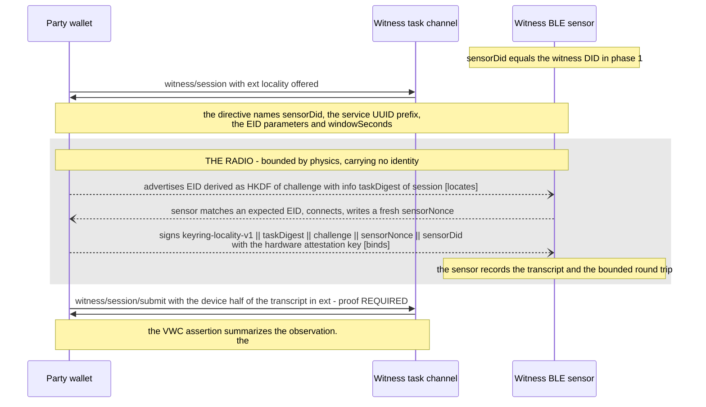

# Locality — co-presence evidence a third party can trust

**Scope.** A witness deployed in a physical space observes, over a short-range
radio channel it controls, that the devices completing a witnessed VRC exchange
were within its range while the ceremony ran — and attests to that observation,
with its evidence, inside the Verifiable Witness Credential it already issues.

**Dependency.** This plan is built on
[`openvtc-integration-plan.md`](./openvtc-integration-plan.md) and its
[Trust Tasks subtask](./openvtc-integration-plan/trust_tasks_subtask.md).
**Locality is designed on that infrastructure and not on the legacy
chat-message ceremony.** Where the two plans overlap, the OpenVTC plan owns the
exchange and this plan owns the locality evidence riding inside it. Named
specifically, so the coupling can be checked rather than assumed:

| What locality needs | Owner | Status at the pin |
|---|---|---|
| The witnessed exchange as Trust Tasks — `witness/session`, `witness/session/submit`, request and `#response` | openvtc §5.4 **stage 2** | **Implemented and live-proved**: two wallets + a witness-server complete the full ceremony under an e2e gate requiring the ceremony markers (§10.0). No longer a forward dependency |
| The `ext` extension member on those four documents | Trust Tasks framework SPEC.md §4.5.1 | Merged upstream; verified in the pinned schemas (§6) |
| `taskDigest(sessionDoc)` — the §4.9.3 digest over the session document | framework facility, shipped in trust-tasks 0.9.0 | Available. **Not** dependent on cred-spec #18 (§3) |
| Trust Task document proofs — `eddsa-jcs-2022` | openvtc §4.5, Phase D item 2 | **Implemented, both directions**: production (KMS-signed) and verification (expected-controller semantics). `ref-06p` still stubs task proofs for its own scope (§6.1); the framework facility itself is live |
| Credential proofs — a **proof set**: `eddsa-jcs-2022` + `bbs-2023` | `docs/CRYPTO_SUITE_FOLLOWUP.md` Decisions 10–13 (2026-08-18), cred-spec #18 | Decided, not built. Supersedes the shipped `eddsa-rdfc-2022`. Drives the vocabulary requirement in §7.1 and the member layout in §7.1 |
| BBS+ tooling (BLS12-381, on Hermes) | this plan, §11-Q5 | **Unsurveyed.** Does not block: the member layout is what must be right, and the second proof is additive |
| Outcome-evidence retention of the `witness/session` + `submit#response` pair | openvtc §8.1 | **Shipped**: the initiating-document + terminal-`#response` pair is retrievable by exchange id, which for a witness session is the VWC's `taskContext` (§7.2) |
| Member-level selective disclosure (`bbs-2023` / `ecdsa-sd-2023`) | `CRYPTO_SUITE_FOLLOWUP.md` "still open" | Not available. Bounds what §9.1 can offer a holder |
| Witness identity legible to a verifier (agent names, registry endorsement) | openvtc naming work | Future; bounds `venueClaim` (§11-Q4) |

**Reviews.** See [`locality-plan/`](./locality-plan/):

| Companion | Contents |
|---|---|
| [2026-07-20-bam.md](./locality-plan/2026-07-20-bam.md) | Mechanism survey, the honest-ceiling analysis, the standards ladder, and the first module sketch. The source material for this plan |
| [2026-08-18-bam.md](./locality-plan/2026-08-18-bam.md) | **The reasoning behind everything in this plan**, in three parts: the design decisions that turn the survey into a plan (evidence direction inverted, `ext` as the wire seam, the ladder scoped); the review decisions (namespace root, venue-hosted witness, annotate-over-gate, witness-free locality closed, NFC as phase 2); and the ZKP revision (the proof set, the six assertion rules and the failures each prevents, the key-id correlation correction, the evidence-vs-unlinkability trade, and what was deferred). Read it before changing anything here |
| [2026-08-19-al.md](./locality-plan/2026-08-19-al.md) | Review: the §10.0 prerequisites landed the night the plan went up (pin table refreshed here in its favor); the §8.2 policy mechanism is already implementable on shipped discovery; three ceremony-window edges from a day of live runs. Also the §5.1 two-channel figure and the §8.4 end-to-end UX section, contributed directly |
| [2026-08-19-bam.md](./locality-plan/2026-08-19-bam.md) | Dispositions on the three 2026-08-19-al.md findings: all three adopted, with the `windowSeconds` anchor narrowed to a sensor-side-only trust parameter, separated from the device's own (non-normative) advertise timeout |
| [2026-08-20-bam.md](./locality-plan/2026-08-20-bam.md) | `ref-06p2` built and run against a real phone: why a raw-HCI-socket BLE library (`@abandonware/noble`) failed silently on the dev machine it was first run on, and why BlueZ's D-Bus interface (`node-ble`) is the right default for `witness-server`'s own `BleLocalityProvider` (§10.2 item 2), not just this rung's workaround |
| [2026-08-21-bam.md](./locality-plan/2026-08-21-bam.md) | `ref-06p3`, `ref-06p4`, and `ref-06p5` built and run: the §7.3 verifier's three-state coverage, the one-real-leg simplification `ref-06p4` uses for the relay trial and why, the measured numbers (100ms first fully caught against a 224.7ms bound), a reconnect-retry bug (stale `Device` object across retries) that feeds back into §10.2 item 2, the App-Attest-vs-Play-Integrity offline-verifiability asymmetry behind new Q7, and why a summarizing web fetch is unsafe for pinning cryptographic material |
| [2026-09-01-bam.md](./locality-plan/2026-09-01-bam.md) | Item 12 run live on real hardware, both witnessed e2e variants passing. Four things found and fixed: the witness-connect pre-flight sheet (item 8) fired for witnesses with no locality leg at all (superseding its "always shown first" text); the sheet then had no operator cue, stalling an attended run; a locality-confirmed Contacts badge, which exposed a dead-code bug in the existing per-record display; and item 2's stale-`Device`-object fix, claimed "folded into" `BleLocalityProvider` since `ref-06p4` but never actually applied there — now is, with a bounded retry |

---

## 1. What is provable, and what is not

Stated first because every design choice below follows from it, and because a
plan that leaves it implicit will be read as claiming more than it delivers.

**No mechanism on consumer phones produces unforgeable, transferable proof that
humans were physically together.** The devices are the sensors. If the sensors
lie in concert, their output is indistinguishable from truth to anyone who was
not there. Two willing parties can always fabricate a meeting, and no amount of
radio protocol closes that.

Two facts change the picture enough to make this worth building:

1. **A trusted witness is an observer with no stake in the meeting.** In a
   two-party exchange the strongest available claim is "assume these two did not
   collude", because the only observers are the two interested parties. With a
   witness in the room, the claim becomes "a party trusted by the verifier
   states that it observed both devices in its radio range". The residual
   shrinks from *two counterparties colluded* to *both parties and the witness
   colluded* — and for a witness chosen by the verifier's own trust (a
   conference, an institution, a registry-listed notary) that is a materially
   smaller set.
2. **A device cannot attest to what it heard on the radio, but a witness can
   attest to what it heard.** Neither Apple nor Google will attest a Bluetooth
   or GPS observation; a device's signed statement "I heard the beacon" is a
   software claim worth exactly as much as the app's integrity. So the device's
   radio observations are **not** the evidence. The *witness's* radio
   observation is, and the device's only cryptographic job is to prove, over
   that radio channel, that it holds the key that signs the credential.

**This inverts the direction of the existing scaffold** in
`bifold/packages/witness-server/src/LocalityService.ts`, which records
device-signed returns of a witness-advertised challenge. See §5.2.

**The claim this design supports, stated exactly:**

> The witness `W`, whose DID resolves and whose venue claim the verifier
> evaluates independently, states that between times `t0` and `t1` it observed,
> on a short-range radio channel it operated at that venue, a device that
> demonstrated possession of key `K` under a challenge `W` itself generated for
> session `S`; and `K` is the key that signed the credential material submitted
> in session `S`.

Everything else — how tight the range is, whether the device was genuine, how
hard a relay would have been — is qualifying detail the evidence carries so a
verifier can price it. It is not part of the core claim.

**Range honesty.** BLE means *within radio range of the sensor*, which is
building-scale, not room-scale, and varies by tens of metres with walls and
antennas. RSSI narrows it probabilistically and is spoofable by an attacker with
an amplifier. So the honest phrasing of the evidence is **"at the venue"**, never
"at the table". Room-scale or table-scale assurance needs a different mechanism
(§4.3).

---

## 2. Why this shape and not the alternatives

Recorded as standing rationale so the options are not re-proposed. The full
survey is in [2026-07-20-bam.md](./locality-plan/2026-07-20-bam.md); these are
the constraints that decide.

| Option | Why it is not the primary mechanism |
|---|---|
| **Peer-to-peer, no witness** (two phones prove proximity to each other) | **Cannot produce third-party evidence at all, and no version of it can.** See below — this is ruled out, not deferred |
| **NFC tap between the two phones** | iOS peer-to-peer NFC is not available to apps, so the mechanism is unavailable on the most common pairing in our fleet. It also has no notion of a third device observing, which is the entire premise here |
| **Fixed NFC kiosk (double tap)** | **Genuinely stronger** — 4 cm range physically bounds proximity and defeats relay, and it is the only option that closes willing collusion. It is not the *primary* mechanism because it requires venue hardware and forces everyone through a queue at a fixed point. It is **specified as phase 2 in §4.4**: a VWC that says `method: nfc-kiosk` is a strictly stronger artifact than one that says `method: ble-challenge-response`, and the evidence typing means nothing downstream changes to add it |
| **GPS / location claims** | Neither platform attests location; a location claim is a software claim, which §1 already disposes of. Also the worst privacy trade in the list |
| **Ambient beacon witnessing** (each phone signs the set of BLE beacons it heard) | Same defect: a device's radio observation is not attestable, so this is probabilistic corroboration at best, and it is weakest exactly where events are quietest. Retained as a possible *corroborating* input, never as the claim |
| **SAS / short verification codes** | Defeats a remote man-in-the-middle, proves nothing about proximity — two people on a video call read codes to each other trivially. Retained only as connection authentication, and if ever recorded it is recorded with **zero locality weight** so a verifier cannot mistake it for co-presence |
| **UWB distance bounding** | The correct physics, and not buildable: the ranging primitives are not exposed to apps on either platform |

### 2.1 Witness-free co-presence is not a weaker option; it is not an option

Recorded as a closed question so it is not reopened as a feature request.

In a two-party exchange with no witness, **the set of observers is exactly the
set of interested parties**. Whatever the two devices produce — RSSI readings,
NFC taps, signed transcripts, attested assertions — both parties can produce the
same artifact by agreement, from anywhere, and a third party has no signal that
distinguishes the honest run from the agreed one. The gap is not narrow enough
to price and then accept: the artifact's entire value would rest on assuming the
two parties did not cooperate, which is precisely the assumption a locality
claim exists to remove. Adding hardware attestation does not close it either; it
only raises the claim to *two genuine attested apps produced this*, which two
cooperating owners of genuine phones satisfy by definition.

So Keyring does **not** offer a witness-free locality claim, and does not emit an
evidence member that could be read as one. A verifier encountering a VWC-less
exchange should conclude that no co-presence evidence exists, because none does.

This is a statement about the *locality* axis alone. An unwitnessed exchange
still carries real evidence on the other axes — ceremony (live, simultaneous,
challenge-bound) and device (hardware attestation) — and those remain worth
having. Locality is the one axis that requires an observer with no stake in the
outcome.

**BLE is primary because the topology requires a broadcast/scan medium.** A
witness observing two parties is a one-to-many relationship; NFC is intrinsically
one tap between two endpoints at a time. BLE is also the only mechanism present
and usable on the whole platform matrix, including iOS-to-Linux, which is the
witness deployment §5.6 recommends.

---

## 3. What the verifier ends up holding

A third party evaluating a witnessed exchange holds four artifacts, three of
which already exist in the design today and one of which this plan adds:

1. **The VRC** — the relationship credential, optionally carrying hardware
   attestation evidence for the issuing device (already shipping;
   [`docs/HARDWARE_ATTESTATION_FLOW.md`](../HARDWARE_ATTESTATION_FLOW.md)).
2. **The VWC** — the witness's credential, whose `taskContext` names the
   `witness/session` document (`witness/session` 0.1; SPEC.md §4.9.1) and whose
   `taskDigestMultibase` binds it to that document's bytes (SPEC.md §4.9.3).
   *Status, verified against the pin:* the witness Trust Task specification
   already **requires** that member of the delivered credential, while the
   credential schema that would define it is still open as cred-spec #18 — the
   sequencing gap the OpenVTC plan's §8.2 describes. Locality does not depend on
   #18 landing: the digest it needs for its own binding (§5.3) is computed over
   the session document, which is a framework facility, not a credential one.
3. **The retained outcome-evidence pair** — the `witness/session` document and
   the terminal `witness/session/submit#response`, which the holder must ship
   with the presentation (openvtc plan §8.1; `witness/session/submit` 0.1).
4. **The locality assertion** — *this plan* — carried in the VWC's
   `witnessContext`, and in the outcome-evidence pair as the transcript the
   assertion summarizes.

The locality assertion is only worth what the witness's signature is worth, so
the plan's job is to make it **checkable and self-describing**: every input the
witness relied on is named, every negative is explicit, and the verification is
mechanical (§7.3).

---

## 4. Topology and tiers

### 4.1 Witness-anchored, hub-and-spoke

The witness is the hub. Each party runs its own bilateral witness session
(required by `witness/session` 0.1 — "A session is **bilateral**: one
participating party, one witness"), and the locality leg attaches to each
session independently. The witness therefore establishes **A-near-W** and
**B-near-W** — not A-near-B directly.

That is the correct claim and not a weakness to hide: two devices within radio
range of the same venue sensor within the same time window are at the same
venue. The evidence says exactly that, and a verifier who needs A-near-B
directly does not have it. **State it in the evidence** (§7.1 `topology`) rather
than letting a reader infer mutual proximity from a witnessed exchange.

### 4.2 One sensor now, several sensors later

The observation artifact is defined as **signed by a sensor DID** from the first
implementation, even while the only sensor is the witness process itself and the
sensor DID equals the witness DID. That single decision is what makes the notes'
"buzzer at every lunch table" extension a deployment change rather than a
redesign: a second sensor is a new DID the witness enrolls, and its observations
appear in the same evidence array with a different `sensor` value.

### 4.3 Tiers, and how they compose

`method` is a typed value in the evidence, not a boolean, so tiers coexist and a
verifier can require a minimum:

| `method` | What it bounds | Status |
|---|---|---|
| `none` | nothing — locality not attempted or declined | phase 1, explicit negative |
| `ble-challenge-response/0.1` | venue-scale radio range, bounded round trip | phase 1, this plan |
| `nfc-kiosk/0.1` | centimetres, at a fixed device | **phase 2** — designed in §4.4, not built |
| multi-sensor RSSI | probabilistic room-scale narrowing | future, corroborating only |

### 4.4 Phase 2 — the NFC kiosk tier

Not built in phase 1, and specified here in enough detail that someone can pick
it up cold. It earns its own phase because it is the **only** mechanism in this
plan that closes willing collusion between the two parties: at 4 cm, a relay
needs purpose-built low-latency RF hardware and an accomplice holding it against
the reader, and two people who want to fake a meeting cannot do it from their
sofas.

**Topology.** A fixed kiosk at the venue — a reader with its own DID, enrolled to
the witness as a sensor (§4.2) — and each party taps it once. It is a *tap
against a fixed device*, not a phone-to-phone tap: peer-to-peer NFC is
unavailable to apps on iOS, and a phone-to-phone tap would in any case leave the
observer set equal to the interested set, which §2.1 has already ruled out.

**Ceremony.** The same two-value split as BLE (§5.3), with the tap replacing the
advert-plus-GATT rendezvous:

1. The party's session is already open, so the wallet holds the witness's
   `challenge` and the `witness/session` document's task digest.
2. The wallet presents an NFC interface carrying `taskDigest(sessionDoc)` — the
   locator, telling the kiosk which open session just tapped it.
3. The kiosk writes a fresh `sensorNonce` and the party signs the same binding
   BLE uses — `"keyring-locality-v1" || taskDigest(sessionDoc) || challenge ||
   sensorNonce || sensorDid` — with the hardware attestation key.
4. The kiosk records the transcript, and the tap-duration round trip, as an
   observation signed by the kiosk's sensor DID.

**Everything downstream is unchanged**, which is the point of typing `method`
(§4.3) and of putting the observation in `ext` (§6): the transcript, the
evidence assembly, the retention, and the verifier's algorithm (§7.3) are the
same code. The only new members are `method: "nfc-kiosk/0.1"` and a tighter
`residuals` set — `rf-relay` stays, `venue-scale-range` does not apply.

**Platform mechanics, which is where the work actually is.**

- **Android as the tapping device:** host card emulation (HCE) — the wallet
  registers an `ApduService` for an AID the kiosk selects, and the exchange is
  APDU command/response. Well-supported, foreground or background.
- **iOS as the tapping device:** this is the constraint that shapes the design.
  Core NFC gives apps *reader* mode, and card emulation is available only under
  Apple's entitlement for HCE with a Secure Element, which is granted case by
  case. **Verify the entitlement position before committing to a phase-2
  schedule** — if it is not available to us, the direction inverts for iOS: the
  *kiosk* presents an NFC tag and the *phone* reads it, which works with Core
  NFC's `NFCTagReaderSession` but means the kiosk cannot mint a nonce inside the
  tap and the round trip needs a second exchange. That fallback is
  implementable and strictly weaker; the plan does not assume either outcome.
- **Kiosk side:** a PC/SC reader on the venue machine already running the
  witness (§5.6), so the kiosk is a peripheral of the witness rather than a
  separate service in phase 2's simplest form.

**What it does not close.** A genuine unlocked device operated by someone other
than its owner, and a witness that lies. Both are already named in §9.2 and
neither is a radio problem.

**Acceptance criteria, when it is picked up.**

- A rung `ref-06p6-nfc-kiosk` produces a transcript byte-compatible with the BLE
  one, verified by the **unmodified** `ref-06p3` verifier — if the verifier needs
  changes, the `method` typing has failed and that is the finding.
- The iOS entitlement question is answered with a citation before any iOS
  implementation begins, and the answer is recorded in a dated companion.
- A staged relay at 4 cm is attempted and its hardware cost documented, in the
  same spirit as `ref-06p4` — the tier's whole claim is that this is expensive,
  and we should be able to say how expensive.
- Queue behaviour is measured with the kiosk under load: the mechanism's real
  cost is throughput at the door, not cryptography.

---

## 5. The mechanism

### 5.1 Two channels, and why both are needed

- **The task channel** — the Trust Task exchange over DIDComm (today) or TSP
  (later). Authenticated, confidential, and already carrying the session
  challenge. It is *not* a proximity channel: it runs equally well from another
  continent.
- **The physical channel** — BLE, operated by the witness's sensor. It *is*
  bounded by physics, and it carries no identity of its own.

Neither is useful alone. The design binds them so that evidence obtained on one
cannot be moved to an exchange conducted on the other. This is the pattern the
vetted standards use — FIDO CTAP 2.2 hybrid derives its BLE advert from the
tunnel secret carried in the QR; ISO/IEC 18013-5 binds device engagement to the
session it opens — applied to a Trust Task exchange.

The whole ceremony, with the two channels drawn as the separation they are —
the task channel never touches the boxed region, and nothing in the boxed
region carries an identity of its own:



### 5.2 The device does not report; the witness observes

Per §1: a device's account of what it heard is a software claim and cannot be
hardware-attested. The protocol therefore never asks a device to report a radio
observation. It asks the device to **answer a challenge over the radio channel**,
and the witness records what it heard.

The practical consequence is a direction flip relative to the current scaffold:

| | Existing scaffold (`LocalityService` + `LocalityProvider`) | This design |
|---|---|---|
| Who advertises | the witness, broadcasting a rotating challenge | the **device**, advertising a per-session ephemeral id |
| Who scans | the device (unimplemented) | the **witness sensor** |
| What is recorded | the device's signature over a value it says it received | the **witness's** own observation, plus the device's signature over a value the **witness** minted on the radio link |
| Replay window | up to the rotation period (default 5 minutes) | one session, one nonce, one bounded round trip |
| Cost to a remote party | obtain a broadcast value any passive listener in the room can read and post anywhere | operate a live bidirectional relay with an accomplice physically present, inside the timing bound |

The broadcast-challenge design fails on its own terms: a rotating value
broadcast to everyone in range is a shared secret with a five-minute life, and
anyone who hears it can hand it to anyone in the world. The device-advertises
direction also matches FIDO hybrid, where the phone is the peripheral and the
relying party's client is the central.

### 5.3 The advert locates; the GATT transcript binds

Two values with two jobs, deliberately separated — the same split that
`taskContext` (locator) and `taskDigestMultibase` (binder) make at the document
layer, and for the same reason: **a value everyone can see cannot be the proof.**

**The rendezvous EID (locator).** The device advertises

```
EID = HKDF-Expand(
        HKDF-Extract(salt = "keyring-locality-eid-v1", ikm = challenge),
        info = taskDigest(sessionDoc),
        L)
```

where `challenge` is the value the witness issued in `witness/session#response`
to *that* party over the authenticated task channel, and `taskDigest(sessionDoc)`
is the §4.9.3 digest of the `witness/session` document that opened the session.
Properties that matter:

- **Only the witness and that one party can compute it.** The challenge is
  fresh, unpredictable, single-use and reaches exactly one party
  (`witness/session` 0.1 forbids reuse across sessions, including across the two
  sessions of one witnessed exchange).
- **The witness knows the expected set.** It computes one EID per open session
  and scans for exactly those — no interpretation of arbitrary adverts.
- **It is unlinkable across sessions**, so it is not a tracking identifier.
- **It is a bearer value on the air, and that is fine**, because it proves
  nothing. Copying it lets an attacker be *found*, not *believed*.

*iOS constrains the carrier.* `CBPeripheralManager` accepts only a local name
and service UUIDs in an advertisement, so the EID travels as a **128-bit service
UUID** (a fixed prefix plus `L` bytes of EID), which is the one field both
platforms let an app control and any scanner can read. Foreground only — a
backgrounded iOS app moves its service UUIDs into an overflow area that
non-Apple scanners cannot read. The ceremony is a foreground user action, so
this is a constraint to enforce, not a problem to solve.

**The GATT transcript (binder).** Having located a candidate, the sensor
connects as GATT central and runs one bounded round trip:

1. Sensor writes `sensorNonce` (fresh, 32 bytes, never sent over the task
   channel).
2. Device responds with
   `sig_K( "keyring-locality-v1" || taskDigest(sessionDoc) || challenge || sensorNonce || sensorDid )`
   where **`K` is the hardware-backed key the device already uses for VRC
   attestation** (Secure Enclave / StrongBox), plus the key's public form and,
   when available, its attestation chain.
3. Sensor verifies the signature, records `rttMs`, `rssi`, and the wall-clock
   window.

Signing with the attestation key rather than a fresh session key is what lets
the witness state the strong form of the claim in §1: *the key I saw in range is
the key that hardware-signed this credential*.

**The key id does not follow it into the credential** (§7.1 rule 3). The same
property that makes one key useful here — it is the same key every time — would
link every ceremony a person performs if it were published in every credential
they carry. The witness verifies the relation in-session, where it has both
keys, and the credential asserts the relation rather than the identifier. The
notes' "shared-key continuity" idea (one key chaining a day's meetings) is
therefore **available but not automatic**: it would be a proof a holder chooses
to make, never a property of artifacts they hand out.

### 5.4 Binding runs both ways

Both directions are required, and omitting either is the classic integration
flaw the platform documentation warns about:

- **Physical → task.** The signed transcript covers `taskDigest(sessionDoc)` and
  `challenge`, so a transcript earned in one session cannot be presented in
  another, and cannot be presented under a counterfeit session document that
  merely reuses the `id` (the forgery ref-06w3 staged).
- **Task → physical.** The `witness/session/submit` request carries, in its
  `ext`, the `sensorNonce` and the transcript digest, so a session cannot claim
  a locality observation it did not earn — the witness cross-checks the
  submitted transcript against the one its own sensor recorded and refuses on
  mismatch.
- **The binding is a transcript, not a bare nonce — deliberately.** It commits
  to five values (context string, session task digest, challenge, sensor nonce,
  sensor DID) rather than to a nonce alone. That is the direction the ecosystem
  is moving: `witness/session` 0.1 says its `{challenge, domain}` pair *"may be
  superseded by a canonical session transcript … binding protocol and profile
  versions, context, purpose, scope, session and epoch"*, and the ZKP task force
  carries *"a bare nonce is insufficient"* as a failing test (openvtc plan §4.6).
  If a canonical transcript is ratified, this binding gains members rather than
  changing shape — which is why the context string is versioned
  (`keyring-locality-v1`) and why `ref-06p` freezes the binding as a fixture.
- **Integrity attestation, when present, covers the same binding.** Apple App
  Attest's `clientDataHash` and Play Integrity's `requestHash` are set to the
  same transcript binding, so the integrity verdict is about *this* action.
  Attestation is optional and its presence or absence is always recorded (§7.1)
  — never silently omitted.

### 5.5 The timing bound, and exactly what it buys

The sensor enforces a bound on the GATT round trip. What that bound actually
excludes has to be stated honestly, because it is frequently oversold:

- It **does** raise the cost of a long-haul relay: an intercontinental hop adds
  well over a hundred milliseconds of unavoidable latency.
- It **does not** exclude a relay from the parking lot, and it does not need to,
  because **the parking lot is already inside BLE range**. Sub-10 ms local
  relays are achievable, and no bound compatible with real BLE connection
  intervals (iOS enforces a 15 ms floor and commonly negotiates 30 ms) will
  separate them from an honest device.

So the bound is a **long-distance discriminator, not a distance bound**. The
value is not chosen by assertion: `ref-06p2` measures the honest-device RTT
distribution on real radios and `ref-06p4` measures where a staged relay starts
to fail, and the bound is set from those two distributions with the
false-rejection rate stated. A bound that rejects honest devices is worse than
no bound, because it converts a probabilistic security gain into a reliable
availability loss.

**A second, distinct bound: `windowSeconds` is the sensor's own trust
parameter, not the device's.** It is easy to conflate two different things
under one name: how long the *device* keeps advertising before giving up, and
how long the *sensor* will still credit a connection as belonging to the
session it opened. Only the second is load-bearing. The device's own patience
is an app-level UX choice — it decides when to show "interrupted" (§7.1's
`windowLost` reason) and does not travel in any credential — so it is not
specified here and does not need to be. `windowSeconds` in the directive
(§5.3, §6) is the sensor's bound: it is anchored to **the sensor's own
clock, from the moment it starts scanning for the session's expected EID to
the moment it first observes a matching advert**, not to when the directive
was minted. Both ends of that measurement are the witness's own — it mints
the challenge that derives the EID and it does the scanning — so the bound
never depends on the device's clock or on how long the directive took to
reach the device over the task channel. Anchoring it at mint time instead
would fold task-channel delivery latency (mediator dial-out, pickup-poll
cadence) into a security parameter that has nothing to do with delivery,
and would shrink the honest device's real window unpredictably as that
latency varies. `ref-06p2` measures against this anchor.

### 5.6 Where the sensor runs — decided: the witness is on location

**The witness server runs at the venue**, on a small Linux machine with a BLE
adapter, and is its own sensor. This is settled, and the rest of the design
assumes it.

It works because the witness server already dials *out* to a mediator over
WebSocket and needs no inbound ports, so a venue machine behind any ordinary
network is a complete deployment with no tunnel, no static address, and no
certificate. BlueZ gives a Node process the scanning and GATT-central roles
§5.3 assigns the sensor.

Two consequences to hold onto:

- **The witness's venue claim becomes a claim about itself, made from the
  venue.** That is what makes `venueClaim` (§7.1) worth anything at all, and it
  is why a remotely-hosted witness could not make this claim honestly no matter
  what its sensors reported.
- **Phone-as-sensor is not the path.** It inherits background-execution
  restrictions and raises the question of who attests the *sensor*, which a
  machine under the venue operator's control does not.

The remote-witness-plus-separate-sensor split stays *available* — that is what
§4.2's sensor-DID decision buys — but it is not phase 1 and nothing in phase 1
should be designed around it.

---

## 6. Where it rides on the wire

**In `ext`, under a namespace we control, on the four merged witness
documents.** No upstream specification changes, and no new Trust Task type, are
needed to ship this.

The framework's extension member is exactly this mechanism (SPEC.md §4.5.1,
pinned clone `7e0d755`, document version 0.3):

> A *Trust Task specification* **MAY** allow an `ext` member at the top level of
> `payload` … The `ext` member is the framework's sanctioned extension point for
> ecosystem-defined data that the base specification does not enumerate.

with immediate keys required to be reverse-DNS namespaces, and:

> a *conforming consumer* **MUST** ignore every `ext` immediate-key namespace it
> does not recognize … A *consumer* **MAY** require one or more specific
> namespaces under `ext` as a matter of local policy and **MUST** reject a
> document missing a required namespace with `malformedRequest`; *consumers*
> applying such a policy **SHOULD** publish the requirement via discovery
> (SPEC.md §7.2, §11).

That last sentence is the whole policy mechanism of §8, already normative.

All four documents of a session admit `ext` at the levels we need — verified
against the pinned schemas, not assumed:

| Document | `ext` level | Locality payload |
|---|---|---|
| `witness/session` (request) | `payload.ext` | the party's locality capability and consent: `{ offered: true, methods: [...] }`, or `{ offered: false, reason }` |
| `witness/session#response` | `payload.ext` | the sensor directive: `sensorDid`, `serviceUuidPrefix`, EID parameters, `windowSeconds`, and whether the witness's policy is `offered` or `required` |
| `witness/session/submit` (request) | `payload.ext` | the device's half of the transcript: `sensorNonce`, transcript digest, key id, attestation evidence reference |
| `witness/session/submit#response` | `payload.ext` | the witness's signed observation record — the artifact the VWC's assertion summarizes, retained by the holder as outcome evidence |

Two consequences worth stating because they are easy to get wrong:

- **`ext` is covered by the document's `proof`** (SPEC.md §4.5.1: "The signed
  envelope covers `ext` in the same way it covers any other member of
  `payload`"), and both `#response` variants declare `proof: REQUIRED`. The
  witness's observation record is therefore integrity-protected and attributable
  by construction, with no additional signing layer — and, because Trust Task
  proofs are `eddsa-jcs-2022` over RFC 8785, **every member is covered with no
  vocabulary work at all** (§6.1).
- **Nothing degrades for a peer that does not implement locality.** An
  unrecognized `ext` namespace must be ignored, so a locality-capable wallet
  talking to a locality-blind witness completes the exchange without locality,
  and vice versa.

**Namespace.** `edu.harvard.seas.atl.keyring`, with `locality` nested inside
it, so future Keyring extensions do not each mint a namespace:

```jsonc
"ext": { "edu.harvard.seas.atl.keyring": { "locality": { /* ... */ } } }
```

The reverse-DNS root follows the lab rather than the product: the work is the
Applied Technology Lab's at Harvard SEAS, and the namespace should name the
party that controls it and can still be resolved years from now, not an app name
that may be re-branded. It replaces the `berkmancenter.org`-rooted name the
first draft assumed — the lab moved, and the credential contexts already in the
tree (`firstperson.network`, `trustoverip.org`) belong to the ecosystem, not to
us.

The root is the reverse of `atl.seas.harvard.edu`, confirmed 2026-08-18.

**Upstream path.** Ship in `ext` first; propose `witness/locality/*` as a
registered specification only once the reference ladder has run it and the shape
has stopped moving. That order is deliberate: the framework reserves no `ext`
namespace and imposes no cross-specification semantics on ours (SPEC.md §4.5.1),
so we can iterate without touching anyone else's conformance, and we arrive at
the registry with a running implementation instead of a proposal — the same path
`witness/session` itself took (ref-06w → merged #213).

### 6.1 The suites, and which one covers what

Locality evidence lands in two artifacts secured under different rules. Neither
suite is this plan's choice; both are recorded in
[`docs/CRYPTO_SUITE_FOLLOWUP.md`](../CRYPTO_SUITE_FOLLOWUP.md).

| Artifact | Suite | Canonicalization | What is covered |
|---|---|---|---|
| The **Trust Task documents** — the `ext` transcript on all four | `eddsa-jcs-2022` | RFC 8785 over the JSON | **Every member**, including anything nested under `ext`. No vocabulary needed |
| The **credential** — the assertion in `witnessContext` | a **proof set**: `eddsa-jcs-2022` **+** `bbs-2023` | JCS for the first, RDF dataset for the second | The JCS proof covers everything. **The `bbs-2023` proof covers only members whose JSON-LD terms are defined** — and only those members can be selectively disclosed |

The proof set is [cred-spec #18](https://github.com/trustoverip/dtgwg-cred-spec/pull/18)'s
design: JCS so a credential formed in person verifies offline, `bbs-2023`
because selective disclosure needs an RDF-canonicalized base proof and an
`eddsa-jcs-2022` proof cannot yield one.

**Two consequences run through the rest of this plan.**

1. **The vocabulary is mandatory, not conditional.** An assertion member with no
   term definition is not merely unsigned under the `bbs-2023` half — it is
   **undisclosable**, because it is not in the dataset a derived proof discloses
   from. Locality's entire privacy story is member-level disclosure, so the terms
   are load-bearing (§7.1).
2. **The member layout is the part that is not additive.** A second proof can be
   added to a credential later without changing it; a credential's member layout
   cannot be re-cut once credentials exist. So the layout is fixed now (§7.1)
   even though BBS+ tooling is unsurveyed (§11-Q5), and issuing JCS-only against
   the final layout is a valid first step.

**Status caveat for the ladder:** `eddsa-jcs-2022` proof *verification* is Phase
D work in the OpenVTC plan and every rung to date stubs task-layer proofs
deliberately. `ref-06p` does the same, and produces no BBS+ proof — it fixes and
measures the *shape*, which is what has to be right first.

---

## 7. The evidence, and how a third party checks it

### 7.1 What the VWC carries

DTG Core Credentials defines `witnessContext` as an OPTIONAL object with three
OPTIONAL string members — `event`, `sessionId`, `method` — and nothing else
(cred-spec, pinned clone `b89f389`). Locality's members sit **beside** them,
flat, each prefixed `locality`. Sketch, not a schema — the authoritative shape is
[`ref-06p`](../../tsp-reference/ref-06p-locality-binding/), which runs it:

```jsonc
"witnessContext": {
  // tier 1 — disclosed in almost every show; a complete claim on its own
  "localityConfirmed": true,                  // explicit, never inferred from presence
  "localityMethod": "ble-challenge-response/0.1",
  // tier 2 — disclosed when the verifier needs venue, time or provenance
  "localityTopology": "witness-anchored",     // A-near-W and B-near-W; NOT A-near-B
  "localitySensor": "did:...",                // = witness DID in phase 1
  "localityVenue": "EthDenver 2027, Hall B",  // the witness's claim about itself
  "localityObservedAt": "2027-02-18T15:04:05Z",
  "localityWindowSeconds": 120,
  "localityKeyMatchesCredentialSigner": true, // a PREDICATE — see rule 3
  "localityHardwareAttestation": "verified",  // verified | present-unverified | absent
  // tier 3 — forensic; opens the artifact side
  "localityEvidenceCommitment": "z...",       // multihash over the JCS transcript
  "localityRttMs": 62, "localityRssiDbm": -58, "localityRttBoundMs": 400
}
// on failure: localityConfirmed false, localityMethod "none", plus localityReason
```

Six rules, each stopping a specific failure:

1. **Flat — no nested object.** `bbs-2023` discloses at the level of RDF quads,
   and a nested object is a blank node whose path must be revealed before
   anything under it can be disclosed. Nesting costs disclosure granularity, so
   there is none.
2. **Prefixed `locality*` — required, not stylistic.** cred-spec already defines
   `witnessContext.method`; an unprefixed locality `method` would collide with it.
3. **Predicates, not identifiers.** `localityKeyMatchesCredentialSigner` asserts
   the relation the witness verified in-session. The device **key id stays on the
   artifact side** — a stable key id across ceremonies is a correlation vector,
   and publishing it in every credential defeats the unlinkability the
   `bbs-2023` half exists to provide (§9.1).
4. **Tiered, so the common show is the private one.** A tier-1-only derivation is
   a complete claim — *a witness I trust says these parties were co-present, BLE
   tier* — carrying no venue, no time, no sensor and no corroboration. `ref-06p`
   asserts that it canonicalizes on its own, so the tiering is a property of the
   shape rather than a hope.
5. **`localityConfirmed: false` is emitted, not omitted**, with a
   `localityReason`. A verifier must be able to distinguish *"attempted and did
   not succeed"* from *"this witness does not do locality"* — and the only signal
   for the latter is the **absence of the members entirely**. The reason
   vocabulary itself must distinguish *declined* from *interrupted*, because a
   verifier should treat them differently — one is a choice, the other says
   *try again*, not *suspicious*: `declinedByHolder` (the §8.1 setting was off)
   and `windowLost` (the ceremony window closed before the radio phase
   completed — the app backgrounded, locked, or was watchdog-killed mid-window,
   the common case at a real event) are both first-class values, not a shared
   catch-all.
6. **No `residuals` member.** What a method cannot exclude is a deterministic
   function of `localityMethod`, so a verifier who reads the method knows them.
   Carried as a disclosable set it would let a holder reveal the flattering half
   of a threat list, which is worse than not carrying it. The residual table
   lives in §9.2, where it cannot be cherry-picked.

Corroboration (`localityRttMs`, `localityRssiDbm`) is readable and is never a
security boundary.

#### The vocabulary is mandatory

`bifold/packages/vrc-contexts/src/witnessedExchangeContext.ts` must define a term
for **every** member above, with explicit `@type` where typed. Two reasons, and
the second is the one that makes it non-negotiable:

- A member with no term definition **is not covered by the `bbs-2023` proof** —
  it never enters the RDF dataset. `ref-06p` act 6 runs both failure modes: safe
  mode (which the signing path uses) refuses to canonicalize the credential at
  all, and with safe mode off the members drop to **zero quads** while still
  sitting in the JSON, which is signed-looking evidence that is not signed.
- Worse, it is **undisclosable**. A derived proof discloses from the dataset, so
  a member that never entered it cannot be selectively revealed. The privacy
  design of rule 4 depends entirely on the terms existing.

The list is `ref-06p`'s `fixtures/locality-context-terms.json` — fourteen
definitions, already authored. App and witness server import one agreed copy or
canonicalization diverges between signer and verifier.

**This defect is present today**, latent: the context defines
`localityVerification` but none of the members the shipped `LocalityEvidence`
nests inside it (`challenge`, `proofs`, `did`, `sig`). It has never fired only
because the sole provider is `NullLocalityProvider`. The fix is not just the term
list but a **guard** (§10.3) — a test that expands every credential shape we
issue against the real context and fails on any dropped term, so the discipline
is CI rather than memory.

### 7.2 What is retained

The transcript that the assertion summarizes lives in the retained
`witness/session/submit#response` — the document the holder must already keep
under the openvtc plan's §8.1 obligation. Locality therefore adds **no new
retention mechanism**, only bytes to an artifact already being stored and
indexed. Measured in `ref-06p`: **1,887 bytes per session** — the transcript in the
`submit` request's `ext` (523), the witness's observation in the `#response`'s
`ext` (515), the credential assertion (511), and the sensor directive on the
session `#response` (235) — on top of the 2,213 bytes/ceremony `ref-06w`
measured for the retained pair itself.

**Retention is also a privacy boundary, not only a storage cost.** The OpenVTC
plan's §4.6 records the ZKP task force's finding that presenting outcome
evidence contributes the longest-lived linkage in a bundle, so a show that
includes it forfeits unlinkability. That is why §7.1's tier 1 is designed to be
sufficient on its own: **a default show must never need the artifact side
opened**, or the locality evidence defeats the ZKP presentation it travels
with.

### 7.3 The verification algorithm

Mechanical, and implemented as a rung (`ref-06p3`) so it is executable rather
than described:

1. Verify the VWC's proof and resolve the witness DID.
2. Pair the VWC with the retained outcome evidence: `taskContext` locates the
   `witness/session` document; `taskDigestMultibase` binds it (recompute over
   the JCS form with the top-level `proof` removed).
3. Verify the `submit#response` proof — it is `proof: REQUIRED` — and confirm
   its `vwcDigestMultibase` matches the presented VWC.
4. Read the locality assertion from the VWC and the transcript from the
   `#response`'s `ext`; confirm they agree.
5. Recompute the transcript binding and verify the device signature over
   `taskDigest(sessionDoc) || challenge || sensorNonce || sensorDid`.
6. Confirm the key that answered on the radio is the key that signed the VRC's
   attestation evidence — the step that upgrades "a device was present" to
   "*this credential's* device was present". The credential asserts this as
   `localityKeyMatchesCredentialSigner`; a verifier who wants to check it rather
   than trust it opens the retained transcript, where the key id lives (§7.1
   rule 3). **That check is tier 3** — it costs the unlinkability of the show.
7. Where hardware attestation is present, verify the chain to the Apple/Google
   roots and confirm it commits to the same binding. **Verify at the verifier,
   never trust a client self-report.**
8. Apply policy to what remains: is this witness trusted for this venue claim,
   is `method` at or above the required tier, is the `residuals` set acceptable.

Steps 1–7 are mechanical and either pass or fail. Step 8 is the verifier's
judgement and the design deliberately does not pretend to make it.

---

## 8. Settings and policy

### 8.1 The wallet setting

`useLocalityConfirmation`, **default on**, in Settings → Secure Exchanges beside
`useHardwareAttestation`, following the same store/reducer/screen pattern
(`contexts/store.tsx`, `contexts/reducers/store.ts`,
`screens/ToggleHardwareAttestation.tsx`).

*Note the existing inconsistency to avoid repeating it:*
`useHardwareAttestation` initialises to `false` in the store while
`vrc-manager.ts` reads it from AsyncStorage with `?? true`. The two defaults
disagree. `useLocalityConfirmation` must default `true` in **both** places, and
the fix for the attestation flag is called out in §10.

**Off means:** the wallet does not advertise, does not answer GATT, and never
requests Bluetooth permission. The exchange still runs; the VWC records
`method: "none", confirmed: false, reason: "declinedByHolder"`. Off is a real
choice with a visible consequence, not a silent downgrade.

### 8.2 The witness policy — gate or annotate

Independent of the wallet setting, per deployment: `off` (no locality leg),
`offered` (attempt it; annotate the outcome either way), or `required` (refuse to
issue a VWC without a confirmed observation).

**The design is `offered` by default, with `required` available per event.**
The reasoning matters more than the default, because this is the one setting an
event operator will actually think about.

**What gating would buy, and why it is less than it looks.** A witness in
`required` mode issues only VWCs whose locality is confirmed, so "this witness's
credentials always mean co-presence" becomes a property of the issuer rather
than of the credential. That is genuinely simpler for a verifier who knows the
witness — but only for one who knows it. A verifier who does not already know
that this witness gates cannot tell a gated VWC from an ungated one, so the
guarantee does not travel with the artifact. Gating moves information **out** of
the credential and into out-of-band knowledge about the issuer, which is the
opposite of the direction this whole plan pushes.

**What annotation buys.** The claim travels with the credential. `confirmed:
true` plus `method` plus `residuals` is checkable by a verifier who has never
heard of this witness, and a verifier who requires co-presence simply demands
`confirmed: true` — which is exactly the check they would have to do anyway,
since they cannot otherwise know the witness gated. Annotation makes gating
*unnecessary* for the verifier's purposes; gating does not make annotation
unnecessary.

**What gating costs, concretely.** Locality fails for boring reasons: Bluetooth
off, permission denied, a phone whose radio is busy, a device at the far end of
a hall, a sensor that lost its adapter. Under `required`, every one of those
becomes "you cannot get a witnessed credential", at an event, in a queue, with
staff who cannot debug it. The failure lands on the honest majority, while the
dishonest minority it targets — two parties who agreed in advance to fake a
meeting — is not blocked by BLE at all (§9.2). It is a control that inconveniences
exactly the people it is not aimed at.

**The precondition that makes annotation safe**, and the reason this is a real
design position rather than a shrug: it holds **only** because the evidence is
typed and negatives are explicit (§7.1). If a failed observation could be
represented by omitting the member, annotation would silently degrade to "no
claim", every implementation bug would look like a policy outcome, and gating
would be the only honest option left. That is why the "emit `confirmed: false`,
never omit" rule is stated as a MUST and tested in `ref-06p3` rather than left
to implementer taste.

**When to switch an event to `required`.** When the event's own claim depends on
it — a credential whose meaning is "attended this thing" rather than "met this
person" — and when the operator accepts the door-queue consequence. It is a
deployment decision with a visible cost, made per event, not a default.

**Either way, the witness publishes its policy** via discovery (SPEC.md §11), so
a wallet can tell the user what this witness requires *before* the ceremony
rather than after a refusal (§8.3).

**The publication mechanism is shipped, not aspirational.**
`trust-task-discovery` (framework 0.1) carries it: a wallet queries before
proposing, and any v4 witness answers with its `supportedTypes`. The tiers
above map onto that response directly:

- **`off`** — the response lists `witness/session` bare, or omits it.
- **`offered`** — bare listing; the witness annotates the outcome when the
  wallet offers.
- **`required`** — the **expanded** `supportedTypes` entry,
  `{ "type": ".../witness/session/0.1", "requiredExt": ["edu.harvard.seas.atl.keyring"] }`
  — the framework's own rejection rule (`malformedRequest` on a listed
  namespace the producer did not populate) enforces it without locality
  writing any gating logic of its own.

### 8.3 The cross-product, resolved

| Wallet | Witness `off` | Witness `offered` | Witness `required` |
|---|---|---|---|
| on | no assertion in VWC | attempt; annotate the outcome | attempt; refuse on failure |
| off | no assertion in VWC | `method: none, reason: declinedByHolder` | **refused** — `witness/session:refused` (or `malformedRequest` if the required `ext` namespace is absent, per SPEC.md §7.2) |

The refusal case is the one that needs UX work: the wallet must learn from the
`witness/session#response` directive that this witness *requires* locality
**before** the user is deep in the ceremony, and offer to enable it for this
exchange with a clear explanation — never a bare failure. The witness's policy
is discoverable ahead of the session under SPEC.md §11 (§6), which is the
mechanism to use rather than inferring it from a rejection.

---

### 8.4 The user experience, end to end

The governing principle comes from the exchange this rides in: as of the v4
consent flip, a relationship exchange asks the user **one question** —
accepting the proposal — and everything downstream is automatic. **Locality
must not add a second question to the ceremony.** Its interactions belong at
the edges: settings, the moment of joining an event, and the evidence a user
can inspect afterwards. During the ceremony itself, locality is at most a
line in the existing progress overlay.

| Moment | What the user sees | What happens underneath |
|---|---|---|
| **Onboarding / Settings** | A single toggle: *"Confirm in-person meetings"* (default on), with one sentence: *"At participating events, lets the event confirm you and your contact met in person."* | `useLocalityConfirmation`, defined in one place (the [keyring-bifold#38](https://github.com/berkmancenter/keyring-bifold/issues/38) lesson). No permission is requested here. |
| **Connecting to a witness** (scanning the event's QR) | This is the *"you are at an event"* moment, and the only new prompt surface. If the event **offers** locality: the OS Bluetooth permission request, primed by one app sheet first (*"⟨Event⟩ can confirm in-person meetings. Allow Bluetooth?"*). If the event **requires** it (known via the witness's discovery `requiredExt`) and the user declines or Bluetooth is off: say so **now** — *"This event requires in-person confirmation"* — with a settings deep-link, never mid-ceremony. | Permission requested once, at a moment with social context. The `required` refusal path surfaces here, before any exchange opens. |
| **During the ceremony** | Nothing new to tap. The existing flow overlay gains at most one transient status line (*"Confirming you're here…"*) during the radio window. | The advert/transcript run inside the existing witnessed-exchange progress; the window is short and foreground-anchored. |
| **Interrupted mid-window** (app backgrounded, locked, killed) | No error dialog. The exchange completes as it would have; the contact's witness record later shows *"in-person confirmation was interrupted"* rather than a failure. | The `windowLost` reason (§7.1 reason vocabulary): distinguishable from *declined* and from *not offered*, and read by a verifier as *try again*, not *suspicious*. |
| **Afterwards** (contact detail / VWC view) | The witness record renders the tier as a plain badge with exactly three user-facing states: **Confirmed in person** (method shown on tap: BLE / kiosk), **Not confirmed** (with the reason: not offered / declined / interrupted), or nothing at all when the event ran with locality off. | `WitnessCredentialHandler` renders from the typed assertion — the three states of §7.1 mapped one-to-one, never collapsed into a boolean. |
| **Gated event, refused entry** | If the witness policy is `required` and the ceremony proceeds anyway without locality, the refusal arrives as a task error — the wallet shows it as an event rule, not a technical fault: *"⟨Event⟩ requires in-person confirmation for exchanges here."* | The framework's `malformedRequest`-on-missing-namespace path (§8.2), translated to human language once, in one place. |

**Two boundaries, stated so they hold:** the ceremony window never blocks on
a human (no tap, no prompt, no modal inside it — if anything is missing, the
exchange degrades per §8.3 and the evidence records why); and the Bluetooth
permission dialog appears exactly once per install, at witness-connect,
never later. Visual design is deliberately not specified here — this section
fixes *when* and *what*, not *how it looks*.

---

## 9. Privacy, permissions, threat model

### 9.1 Privacy

- **The advert is a per-session ephemeral value, unlinkable across sessions**,
  and advertising runs only inside the ceremony window (§5.3). Keyring never
  advertises a stable identifier.
- **No stable identifier reaches the credential either.** The transcript is
  signed by the device's long-lived hardware attestation key, which is what binds
  locality to *this* credential's signer (§5.3) — but that key id would link every
  ceremony a person ever performs. It stays on the artifact side; the credential
  carries the predicate instead (§7.1 rule 3). The same property read as a
  feature — one key chaining a day's meetings into a trajectory — is a
  correlation vector under a design where unlinkable presentation is the goal, and
  it is treated as one.
- **Permissions are requested lazily**, at the first witnessed exchange with
  locality enabled: Android `BLUETOOTH_ADVERTISE` + `BLUETOOTH_SCAN` (and, below
  API 31, location — which must be explained in the prompt, because "why does
  this need my location" is the single most likely reason a user turns the
  feature off), iOS `NSBluetoothAlwaysUsageDescription`.
- **The witness learns nothing new about the parties.** It already learns the
  relationship DIDs by opening the session (`witness/session` 0.1, Security &
  Privacy). Locality adds a radio observation of devices already identified to
  it, at a venue they are attending.
- **What the witness retains** about observations, and for how long, is governed
  by its published policy — the witness-server's existing no-retention default
  is the baseline, and locality observations must not quietly become an
  exception to it.
- **The holder must be able to withhold the locality detail when presenting.**
  DTG Core Credentials is explicit (cred-spec `b89f389`, Privacy
  Considerations): *"Issuers should include only what the witnessing purpose
  requires, and holders should be able to withhold `witnessContext` details when
  proving the attestation."* The assertion of §7.1 names a venue, a time window
  and a sensor, which is the most location-revealing thing a Keyring credential
  will carry — so this is not a generic privacy nicety, it points squarely at
  this member. The presentation path must let the holder drop the locality
  assertion (and therefore drop the claim) rather than forcing an
  all-or-nothing VWC. **Member-level selective disclosure is the design target**, via the
  `bbs-2023` half of the proof set (§6.1): the holder discloses tier 1 and
  withholds venue, time and sensor. Until BBS+ tooling is in place (§11-Q5) the
  wallet offers present-or-withhold-the-whole-credential, and the UI must say
  that rather than imply the finer control. **The shape is built for the finer
  control from the start** (§7.1) — that is the part that cannot be retrofitted.

### 9.2 Residuals, priced

| Attack | Closed by | Residual |
|---|---|---|
| Remote party with no accomplice | the EID is derived from a challenge only the witness and one party hold | none |
| Passive listener rebroadcasts the advert | the advert locates, the transcript binds (§5.3) | none — the attacker is found, not believed |
| Replay of a transcript into another session | transcript covers `taskDigest(sessionDoc)` and `challenge`; challenges are single-use per session | none |
| Counterfeit session document reusing an `id` | `taskDigestMultibase`, proven in ref-06w3 | none |
| **RF relay by an accomplice physically present** | timing bound (long-haul only), NFC-kiosk tier where deployed | **open, and named in `residuals`** |
| Modified app fabricating a transcript | hardware key + App Attest / Play Integrity bound to the same transcript | as strong as those services; explicitly typed as `verified` / `present-unverified` / `absent` |
| Both parties collude with an accomplice in the room | nothing here | **open** — only the NFC-kiosk tier closes it |
| Genuine unlocked device operated by someone else | out of scope for any device-based mechanism | out of scope, stated |
| Compromised or dishonest witness | nothing here — the witness is the trust anchor | the verifier's trust decision; mitigated by registry/domain endorsement of the witness, not by this protocol |

---

## 10. Implementation, in order, with acceptance criteria

### 10.0 Prerequisites (from the OpenVTC plan)

The witnessed exchange runs as Trust Tasks (`openvtc-integration-plan` §5.4
stage 2, live since 2026-08-18 — see
[2026-08-19-al.md](./locality-plan/2026-08-19-al.md) Finding 1) and the
outcome-evidence retention of §8.1 exists. Locality is **not** retrofitted onto
the legacy chat-message ceremony — that path is itself standing down for v4
pairs in favor of the task ceremony — so the `ext` seam, the `taskContext`
digest, and the retained pair are all task-layer facilities. A locality-specific
path built alongside them, rather than on them, would be exactly the "second
task spine" the parent plan forbids.

### 10.1 The reference ladder — `tsp-reference/ref-06p*`

Built and green **before** any Keyring code, per the standing rule. Same house
rules as every rung: pure TS/JS core, no React Native imports, frozen fixtures,
a README stating what it proves and what it does not.

| Rung | What it does | Needs | Done when |
|---|---|---|---|
| [**`ref-06p-locality-binding`**](../../tsp-reference/ref-06p-locality-binding/) ✅ | The binding and evidence algebra with **no radios**: EID derivation, GATT transcript construction and verification, the `ext` payloads on all four documents through the published `@openvtc/trust-tasks` 0.9.0 §7.2 pipeline, VWC assertion assembly, the canonicalization split of §6.1, and four staged forgeries | nothing | **Done — 26 checks green.** All four forgeries rejected by their named checks; `ext` survives byte-identically and a locality-blind peer ignores it; the assertion is flat, carries no key id, and a tier-1-only show canonicalizes on its own; the three evidence states are distinguishable; **1,887 bytes per session measured** (transcript 523, observation 515, assertion 511, directive 235). Found: without term definitions the assertion is not signed *in two ways* — safe mode rejects the document outright, unsafe mode drops it to zero quads (§7.1). Terms authored as the rung's `fixtures/locality-context-terms.json` |
| [**`ref-06p2-ble-observation`**](../../tsp-reference/ref-06p2-ble-observation/) ✅ | The same transcript over **real BLE** between two independent radios: a phone advertises the EID as a service UUID (nRF Connect's GATT-server test app), this box's sensor script scans for the expected set, connects, runs the round trip | two BLE radios | **Done — round trip completes over the air.** The sensor correctly discriminated the target EID against 8–11 real ambient BLE devices per scan; two runs (35 trials total) against a real phone measured **median ≈180ms, p95 ≈224ms**, appended to `fixtures/measured-rtt.jsonl` as the input `ref-06p4` needs. Runs over BlueZ's D-Bus interface (`node-ble`), not a raw HCI socket — see [2026-08-20-bam.md](./locality-plan/2026-08-20-bam.md) for why `@abandonware/noble` failed silently on this box and what it means for §10.2's `BleLocalityProvider`. Only one of the three candidate sessions was actually advertised (the other two exercised matching against real noise, not two more live advertisers); no signature (nRF Connect can't sign) — that binding stays ref-06p's, proven with no radios |
| [**`ref-06p3-third-party-verify`**](../../tsp-reference/ref-06p3-third-party-verify/) ✅ | §7.3 executed: a verifier given VWC + retained pair + assertion emits a verdict and a named residual set; run against a genuine bundle and against tampered ones | nothing | **Done — 16 checks green.** All seven mechanical steps fail independently under a targeted forgery built consistent-up-to-the-flaw (a naive clone-and-mutate kept tripping an earlier step, since the artifacts chain — recorded as the rung's main finding); the genuine bundle passes and matches a frozen fixture; the verdict always names `failedAtStep` + `reason`, or `residuals`, never a bare boolean; step 6 is exposed as two modes (trust the credential's predicate vs. open the artifact and check the key), and forgery 6 shows the trust-only default passing a witness that lies about the predicate — documented as the cost §9.1 already named, not a defect found here; the §7.1 rule-5 "emit `confirmed:false`, never omit" rule this section already promises is exercised as three pairwise-distinguishable outcomes (`confirmed`/`declined`/`not-offered`), including that a declined claim still fails integrity checks if its documents are tampered |
| [**`ref-06p4-relay-trial`**](../../tsp-reference/ref-06p4-relay-trial/) ✅ | A relay staged for real: two processes bridge the GATT exchange over a socket with injected latency, sweeping added delay | two BLE radios (one leg — see the rung's README for the honest simplification: only one radio is real, the second is a socket-injected delay standing in for the missing physical hop) | **Done — two real runs, 5 checks each.** The relay succeeds unconditionally at every swept delay (5–1000ms); a bound set at the honest sample's p95 (**224.7ms** both runs) is not reliably exceeded by 5–20ms of injected delay, measuring §5.5's "sub-10ms local relays are indistinguishable" claim rather than restating it; the first delay fully caught was **100ms**; the false-rejection rate is checked against a second, independent honest sample (which landed within 0.2ms of the first — the bound is measuring a stable percentile, not noise) |
| [**`ref-06p5-attestation-binding`**](../../tsp-reference/ref-06p5-attestation-binding/) ✅ | App Attest / Play Integrity `clientDataHash` / `requestHash` set to the transcript binding and verified against the platform roots | platform test credentials — **App Attest**: real, vendored (a genuine captured attestation object, MIT-licensed, from an open-source verifier; Apple's real root fetched directly). **Play Integrity**: none exist and none can — its tokens are encrypted and only decodable via a live call to Google's backend, not an offline-verifiable format at all | **Done — 15 checks green, for App Attest.** A real Apple-signed attestation verifies against Apple's real public root, offline, in both environments; four independent forgeries (the object, the challenge, the keyId, the App ID) each caught by a different named check; the transcript binding is shown to wire correctly into App Attest's `challenge` parameter (mutating any of the five bound fields changes the resulting hash, and substituting our binding into the real fixture correctly fails, proving the check reads bytes rather than shape) — though no real device has signed *our* binding, which this rung cannot produce without one; the `absent`/`present-unverified`/`verified` states are explicit and never inferred. **Play Integrity is shape-only here** (§7.3-step-7-style consistency, not a signature/root check) with a separate, explicitly parked live script (`live-play-integrity-optional.mjs`) ready to run once real Play Console + Google Cloud access exists |

Naming follows the house convention — a lettered line under `ref-06` for one
topic (`v1`, `w`, `x` already), numbered within it — and `ref-07`…`ref-09` stay
free for the Credo adapter, RN, and the Keyring module.

### 10.2 Witness server

**Status: items 1–6 implemented and typechecked, unit-tested where the logic
is pure; the DIDComm/BLE integration claims each item's own "Done when" makes
are not yet proven end-to-end — that needs a live two-wallet e2e run (or a
dedicated Credo-agent integration test), the same gate `e2e:vrc:devices`
already applies to hardware attestation. See
[2026-08-21-bam.md](./locality-plan/2026-08-21-bam.md) for what was found
building this slice, including one real blocker resolved along the way: the
bifold submodule pin didn't carry the Trust Tasks witnessed-exchange code
these items depend on at all (it lived on `feat/trust-tasks-integration`,
2281 commits past what `.gitmodules` tracked) — fixed by repointing the
submodule, with the user's explicit sign-off, before any of this could start.**

1. ✅ **Observer direction in `WitnessTaskSessions`** (§5.2) —
   `witness-server/src/trustTasks/WitnessTaskSessions.ts`, not the legacy
   `LocalityService` (untouched; still serves the old basic-message
   ceremony, which the plan leaves alone). `handleSession` reads the party's
   locality offer from `payload.ext`, kicks off the BLE observation
   concurrently with VP assembly, and emits the sensor directive;
   `handleSubmit` awaits that observation, verifies the transcript for real
   (`trustTasks/locality.ts`'s `verifyTranscript`, real P-256 ECDSA via
   `@noble/curves`, not the reference ladder's Ed25519 stand-in — see the
   companion for why), and refuses with `malformedRequest` on a bad
   signature. *Done when:* no code path records a proof the sensor did not
   itself observe, and a transcript with a valid-looking but wrong signature
   is rejected — **the crypto-level half of this is unit-tested
   (`__tests__/unit/locality.test.ts`, 19 cases); the full DIDComm path
   (session offer → directive → BLE → submit → refusal) is not yet exercised
   end-to-end.**
2. ✅ **`BleLocalityProvider`** (`trustTasks/BleLocalityProvider.ts`) — a
   **deliberately separate port** from `../LocalityProvider.ts`'s
   `LocalityProvider`/`NullLocalityProvider` (reworking that shared interface
   in place would have broken the legacy ceremony's still-serving, if
   never-real, locality gate for no benefit). Over BlueZ's D-Bus interface
   (`node-ble`), not a raw HCI socket — `ref-06p2` measured the latter
   producing zero discover events against a live advert while `bluetoothd`
   was running, silently, on the same box D-Bus scanning worked on
   ([2026-08-20-bam.md](./locality-plan/2026-08-20-bam.md)). One shared scan
   loop serves every concurrent `observeSession` call. **Corrected
   (2026-09-01-bam.md): this item previously claimed `ref-06p4`'s
   reconnect-from-scratch fix was already "folded into" this class — it was
   not. The production class had no retry at all until today: a single
   mid-exchange GATT failure resolved the session `null` immediately, and
   the failed `Device` object stayed cached forever, exactly `ref-06p4`'s
   bug, just never actually fixed here.** Now retries up to
   `MAX_TRANSCRIPT_ATTEMPTS` (3) within the same `windowSeconds` budget,
   evicting the cached `Device` on each failure so a retry reconnects fresh.
   *Done when:* the
   `ref-06p2` transcript runs against the real witness process —
   **run live (2026-08-21), via item 9's verification pass: a temporary
   script reused this exact class's real `runTranscriptExchange` (not
   `ref-06p2`'s bare echo test) as the sensor side against a physical
   Android peripheral, and it completed the write-nonce-then-read round
   trip for real —
   `RESULT: observed after 12555ms, rttMs=522`. That harness bypassed
   `WitnessTaskSessions` itself, so this closes only this class's own gap;
   the full DIDComm session flow (items 1/3/4/5 below) is still not
   exercised end-to-end.**
3. ✅ **Sensor identity** — `sensorDid` is the witness's own DID (§4.2),
   resolved once per session via `getIssuer()` and threaded through the
   directive, the observation, and the transcript's `expected` binding.
   *Done when:* a second sensor can be added by configuration alone — the
   design supports it (a distinct sensor DID is just a different value at
   this one call site), but a second sensor has not actually been run.
4. ✅ **Policy configuration** — `off | offered | required`
   (`WITNESS_LOCALITY_POLICY`, default `offered`, distinct from the legacy
   `localityVerificationRequired` flag), plus a new discovery responder
   (`handleDiscovery`) answering `trust-task-discovery` with the expanded
   `supportedTypes` entry carrying `requiredExt` when `required`. *Done
   when:* the §8.3 cross-product is exercised end-to-end — **not yet
   live-run (needs the same live run as item 1), but a real gap in
   `required`'s own enforcement was found and fixed while merging in
   `feat/trust-tasks-integration` (2026-08-21, see the dated companion):
   `handleSubmit` checked only that the session request had POPULATED the
   ext namespace (which `{offered: false}` satisfies), never that the radio
   phase actually SUCCEEDED — a `required` witness would still issue a VWC
   carrying `localityConfirmed: false` on `declinedByHolder`/`windowLost`.
   `handleSubmit` now refuses to issue in that case, matching §8.3's
   "refuse on failure" cell for real.**
5. ✅ **VWC assembly** — `buildWitnessCredentialJson` gained a
   `localityAssertion` parameter (additive; the legacy `localityEvidence`
   parameter and its nested `witnessContext.localityVerification` shape are
   untouched) that spreads the flat `locality*` members directly into
   `witnessContext`. *Done when:* `confirmed:false` appears with a reason on
   every failure path (unit-tested via `assertionFromObservation` in
   `locality.test.ts`), and the member is absent only when policy is `off`
   (implemented in `WitnessTaskSessions`; not yet integration-tested).
6. ✅ **Vocabulary** — the 14 `locality*` terms from `ref-06p`'s
   `fixtures/locality-context-terms.json` added to `@bifold/vrc-contexts`'s
   `witnessedExchangeContext.ts` — the actual single source of truth (the
   `vrc-reference` and `core/modules/vrc/types` copies are re-exports).
   *Done when:* the dataset-coverage assertions hold against the real
   context document and a tier-1 subset canonicalizes on its own —
   **done, real check**: `core/src/modules/vrc/__tests__/unit/localityVocabulary.test.ts`
   imports `@bifold/vrc-contexts` live and runs real `jsonld.canonize()`
   over it, 4 cases green. Found along the way: `vrc-contexts` publishes
   from `build/`, not `src/` — a source edit with no `yarn build` silently
   keeps serving the old context to every consumer, portal-linked or not.

### 10.3 Keyring app

**Status: items 7, 8, 9, 10, 11, 13 implemented, typechecked, and unit-tested
— item 9's Android peripheral is proven live end to end on a physical
device (2026-08-21), not just compiling, with three real bugs found and
fixed along the way (see its own entry below); iOS deferred outright (no
Xcode in this environment). Item 8's pre-flight sheet is now built —
`LocalityPreflightModal`, merged with item 11's remaining "what will be
shared" sheet into one, per §8.4's own "only one new prompt surface"
language — with one known, stated gap: it requests the Android 31+
Bluetooth permissions the native manifest declares, not pre-API-31
`ACCESS_FINE_LOCATION`, which the manifest doesn't declare at all yet.
`ceremony.ts`'s real call site now constructs `createDeviceLocalityProvider(agent)`
in place of `NullDeviceLocalityProvider()` (2026-08-21) — the wiring itself
is done, typechecked, and covered by the full `core` suite (174 suites,
1574 tests) with no regressions; what this does *not* establish is the
same thing item 9 never claimed to establish, restated so it isn't
overread here either: no test exercises the real `WitnessTaskSessions`
DIDComm session flow end-to-end against a live Android peripheral (§10.2
items 1/3/4/5's own caveats still hold), and neither this wiring nor item
9 has landed on `main` in either repository — both sit in open,
unmerged PRs ([keyring-bifold#40](https://github.com/berkmancenter/keyring-bifold/pull/40),
[keyring-wallet#21](https://github.com/berkmancenter/keyring-wallet/pull/21)),
with keyring-bifold#40 itself cut from `feat/trust-tasks-integration`'s tip
and not yet mergeable into `main` until that branch lands first. Item 12
(`e2e:vrc:devices`) can now build on a working peripheral rather than
being blocked behind one, but has not been run — `e2e/lib/witness.js`
still hard-codes `WITNESS_LOCALITY_REQUIRED=false` because Appium-driven
phones can't produce a locality proof, which is exactly this item's gap,
not yet closed. Item 14 stays out of scope pending §11-Q5. See
[2026-08-21-bam.md](./locality-plan/2026-08-21-bam.md) for what was found
doing this slice, including why item 8 needed a new call site (the witness
connection was never discovery-queried at all before this) and the
Android/iOS tooling asymmetry in this environment.**

7. ✅ **`useLocalityConfirmation` setting**, default true in store and in the
   AsyncStorage read path (§8.1) — `types/state.ts`, `contexts/store.tsx`,
   `contexts/reducers/store.ts` (`?? true` on read, matching the *fixed*
   pattern, not keyring-bifold#38's split-default bug), plus a
   `ToggleLocalityConfirmation` settings screen mirroring `ToggleWitnessing`.
   *Done when:* a fresh install defaults on, the toggle round-trips, and off
   produces no Bluetooth permission prompt — **the store/reducer/screen
   round-trip is unit- and snapshot-tested; "off produces no Bluetooth
   prompt" is an item 9/12 claim and can't be proven until that exists.**
8. ✅ **Read `requiredExt` on the witness row of a discovery response**, not just
   the propose row, and surface it at witness-connect (§8.4's "Connecting to a
   witness" moment) — before Bluetooth permission is requested and before any
   session opens. *Done when:* a `required` witness's discovery response drives
   the pre-flight "this event requires in-person confirmation" sheet, and the
   `malformedRequest` refusal (§8.2) is never the first the user hears of it in
   the run where discovery already told the wallet. — **Data layer** (as
   before): `queryWitnessDiscovery` (`trust-tasks/ceremony.ts`) fires at
   witness-connect from `WitnessConnectionProvider.tsx`'s
   `handleWitnessAnnouncement`, and `getWitnessLocalitySupport` reads the
   retained answer's `witness/session` row for `requiredExt`/`offeredExt`,
   returning a tri-state (`required`/`offered`/`off`/`null`-not-yet-known)
   — `off`, or a row with neither marker, means no locality leg at all.
   **Superseded (2026-09-01-bam.md): the offer state is not "always shown
   first" regardless of policy** — that language only reasoned about
   telling `offered` apart from `required`, and missed that discovery
   originally couldn't tell `offered` apart from `off` either (both produced
   identical `supportedTypes`), so the sheet fired for witnesses with no
   locality leg at all. Discovery now marks `offeredExt` distinctly, and the
   sheet is scheduled only when support resolves to `offered` or `required`.
   **The sheet is now built**: `LocalityPreflightModal`
   (mounted at root beside `RelationshipProposalModal`), shown at most once
   per install — a new `hasSeenLocalityPreflight` preference, one-way once
   set, sibling to `useLocalityConfirmation`'s own store/reducer pattern —
   Android only, only while `useLocalityConfirmation` is on. It merges items 8
   and 11's remaining sheet into one (see item 11's own entry for why: §8.4's
   own "only new prompt surface" language settles this as one sheet, not two).
   `WitnessConnectionProvider` schedules it from `handleWitnessAnnouncement`
   right after firing discovery, polling `getWitnessLocalitySupport` for
   up to 5s (failing open to `offered` — i.e. still showing the sheet, just
   without the harder required-refusal copy — on timeout or a thrown error,
   never silently suppressing it) so a `required` answer that arrives in time
   drives the harder copy rather than the sheet only ever showing the generic
   offer.
   Declining reuses the existing `useLocalityConfirmation` setting (no new
   per-session gate invented) — `resolveLocalityPreflight(false)` flips it off
   through the same dispatch action Settings uses, which
   `isLocalityConfirmationPreferred()` already reads. Allowing requests the
   two Android 31+ permissions the native module's manifest actually declares
   (`BLUETOOTH_ADVERTISE`, `BLUETOOTH_SCAN`, via `react-native-permissions`)
   regardless of the OS grant outcome — a denial surfaces later as
   `windowLost`, not as a second prompt. **Known gap, stated rather than
   papered over:** pre-API-31 `ACCESS_FINE_LOCATION` is not requested — the
   manifest doesn't declare it at all (item 9's own write-up), so requesting
   it here would silently no-op; closing this is a manifest change first, not
   a sheet change. Unit-tested: `WitnessConnectionProvider`'s scheduling logic
   (`witnessConnectionProvider.test.tsx`, 8 new cases — Android gating, the
   one-shot flag, the required-vs-not-required race, both `resolveLocalityPreflight`
   outcomes) and the sheet component itself (`LocalityPreflightModal.test.tsx`,
   9 cases — both sheet states, both buttons in each, the settings deep-link).
9. ✅ **Device-side peripheral** — advertise the EID as a service UUID, serve the
   GATT characteristic, sign with the existing hardware-attestation key, all
   inside the ceremony window and foreground only. *Done when:* the app's
   transcript verifies in the `ref-06p3` verifier unchanged. — **Proven live,
   end to end, on a physical Galaxy S20+ (2026-08-21):** the native
   peripheral advertised, witness-server's real `BleLocalityProvider`
   connected and wrote the nonce, the device signed and served the
   transcript across both GATT characteristics, and `verifyTranscript()`
   confirmed it — `RESULT: observed, rttMs=522`, `VERIFY: {"ok":true}`, on a
   freshly-produced signature, not the frozen fixture. Both gates the
   previous status held open are now closed: the authorized `CryptoObject`
   does survive being held across the advertising window (confirmed by the
   run completing at all), and the live round trip against the real
   `BleLocalityProvider` succeeded. `deviceLocality.ts`'s `deriveEid`/
   `serviceUuidFromEid`/`bindingFor` remain cross-checked byte-for-byte
   against witness-server's copy (`__tests__/deviceLocality.test.ts`, 5
   cases); `AndroidBleDeviceLocalityProvider` (in `core`) imports the real
   `@bifold/react-native-locality-peripheral` package and is unit-tested
   against a mocked bridge (4 cases). iOS has no native implementation
   (deferred outright — no Xcode available in this environment).

   Getting from "compiles" to "verified" surfaced three real bugs along the
   way, each fixed and now covered by a permanent test using the actual
   captured on-device data, not a synthetic fixture:
   - **`verifyTranscript()` silently rejected every real Android signature**
     — two independent format mismatches invisible to this file's own
     noble-signed unit tests, because those tests signed with noble's own
     convenient defaults instead of anything device-representative.
     `devicePublicKey` is SPKI-wrapped DER on Android (91 bytes), not the
     raw 65-byte point `@noble/curves`'s `verify()` expects (confirmed via
     `BiometricSignatureVerifier.ts`'s own "platform asymmetries" note —
     the design notes calling this field "raw EC-P256 point" were wrong for
     Android, corrected in `deviceLocality.ts` and the native Spec too).
     Separately, `java.security.Signature` produces DER, non-canonical
     ("high-S") signatures; `@noble/curves` defaults to rejecting non-low-S
     signatures in compact form. Fixed `verifyTranscript()` to unwrap SPKI
     when present and to verify with `{format: 'der', prehash: true,
     lowS: false}`; fixed the test helper to sign the same way a real
     device does. Two new tests freeze a real captured signature as a
     permanent regression fixture.
   - **Android's `BluetoothGattCharacteristic.value` silently caps at 512
     bytes** (`GATT_MAX_ATTR_LEN`) — the transcript JSON runs to ~630 bytes
     with a real key and signature. Fixed by serving from the module's own
     `ByteArray` instead, and by only completing a characteristic's read
     once its actual last chunk has been served, not on the first read
     regardless of length.
   - **BLE's GATT protocol itself caps a single attribute value at 512
     bytes** (Bluetooth Core Spec, Vol 3, Part F, §3.2.9, "Long Attribute
     Values"), independent of the negotiated ATT MTU — confirmed via
     logcat showing a real MTU of 517 alongside a transcript still
     truncated at exactly 512, which is what made this look like an
     MTU/chunking bug at first rather than a hard protocol ceiling the
     previous fix couldn't actually clear. No single-characteristic fix
     exists for a value this size. **The wire protocol now uses two GATT
     characteristics**, not one: the existing one (write nonce, read the
     non-crypto fields) plus a new read-only
     `LOCALITY_SIGNATURE_CHARACTERISTIC_UUID` carrying just
     `devicePublicKey`/`signature` — the two fields whose size scales with
     the crypto primitives. `readFullValue()`'s long-read chaining (with a
     pacing delay between reads — a real `le-connection-abort-by-local`
     appeared without one — and an iteration cap raised from 20 to 80,
     since 20 wasn't enough for a connection stuck at the ATT default MTU)
     still applies per characteristic.

   `runTranscriptExchange` was pulled out of `BleLocalityProvider` as a
   standalone function (it never touched instance state) specifically so
   the two-characteristic merge — proven live but previously untested —
   could get a real unit test against a fake `BleDevice`
   (`BleLocalityProvider.test.ts`, new, 7 cases covering `readFullValue`'s
   chunking and the merge itself).

   Other findings from building and verifying this, beyond the three bugs above:
   - **The public-key encoding is platform-specific, and the design notes
     calling it "raw EC-P256 point" were wrong for Android.**
     `BiometricSignatureVerifier.ts`'s own "platform asymmetries" note says
     so: Android's `getHardwarePublicKey()` returns SPKI-wrapped bytes (from
     `PublicKey.encoded`), not a raw 65-byte point — only iOS uses a raw
     point. `transcriptKeyMatchesVrcSigner`'s plain `===` only holds if the
     locality transcript's `devicePublicKey` matches the SAME platform's
     existing VRC-evidence encoding byte-for-byte, so
     `LocalityPeripheralModule.kt` uses `publicKey.encoded` directly — the
     *correct* choice for Android, matching `AttestationModule.kt`'s own
     convention, not a raw-point extraction. Comments in `deviceLocality.ts`
     and the native Spec corrected to say so.
   - **This is a new package**, `bifold/packages/react-native-locality-peripheral/`,
     Android-first, not an addition to `@bifold/react-native-attestation` —
     that package's concern is attestation/signing, and folding
     GATT-server/advertising Android APIs into it conflates two things the
     monorepo otherwise keeps separate. It reads the *same* KeyStore alias
     `AttestationModule.kt` creates (`vrc_hardware_signing_key`) as a
     **deliberate duplicate constant**, not a shared import — a real
     cross-module Gradle dependency between two independent RN native
     packages proved not worth the fragility for one string constant.
     Wired into the workspace for real: `@bifold/react-native-locality-peripheral`
     is now a dependency of both `core`'s `package.json` (`workspace:*`) and
     `app`'s own `package.json` (autolinking specifically needs the direct
     app-level dependency — a transitive one via `core` is not enough), with
     matching `portal:` resolutions at the repo root, mirroring exactly how
     `@bifold/react-native-attestation` is wired.
   - **The binding assembly is a third deliberate duplicate, not two.** Only
     the native side ever learns `sensorNonce` (the sensor writes it over
     BLE, as UTF-8 text of a hex string — traced against witness-server's
     real `BleLocalityProvider.runTranscriptExchange()`, not assumed from
     the reference ladder's bare-echo test), so `LocalityPeripheralModule.kt`
     assembles the same JCS-canonicalized five-value binding
     `deviceLocality.ts`'s `bindingFor()` computes, itself, in Kotlin —
     joining the wallet (Hermes) and witness-server (Node) copies. Checked
     against `deviceLocality.test.ts`'s frozen fixture's field ordering,
     not just eyeballed for agreement. The GATT read response is the full
     `LocalityTranscript`, split across the two characteristics (§10.3
     item 9's own status above) rather than one JSON blob — witness-server
     merges both back into one object before `JSON.parse`-equivalent
     consumption — not just the bare signature, which the reference
     ladder's echo test never exercised either.
   - **The manifest permissions are self-declared on the new package**, not
     hand-added to `app/android/app/src/main/AndroidManifest.xml` —
     `BLUETOOTH_ADVERTISE`/`BLUETOOTH_CONNECT` (API 31+) plus the legacy
     `BLUETOOTH`/`BLUETOOTH_ADMIN` (`maxSdkVersion="30"`, `minSdkVersion` is
     24) live in the library module's own manifest and merge into the app's
     final manifest automatically. The actual OS permission-request UX is
     still not built — `LocalityPeripheralModule.kt` defensively checks
     `ContextCompat.checkSelfPermission` and resolves `null` (not a crash,
     not a reject) if not yet granted, treating "not granted" the same as
     §7.1's `declinedByHolder`/`windowLost` until item 8's still-unbuilt
     pre-flight sheet is the thing that actually asks.
10. ✅ **`ext` on the two request documents**, and the wallet-side cross-check that
   the `#response` assertion matches what the device actually did. *Done when:* a
   witness claiming an observation the device did not make is detected and
   surfaced. — `witnessCeremony.ts`'s `runWitnessSession` conditionally carries
   the locality offer/transcript in `payload.ext` and throws if the VWC claims
   confirmed observation with no matching device-produced transcript, or a
   digest mismatch. Unit-tested (`witnessCeremony.test.ts`, 7 new cases,
   including both refusal paths named in this item's own "Done when").
11. ✅ **Display and consent** — `WitnessCredentialHandler` renders the tier
   honestly (venue-scale, not "verified together"), and the pre-ceremony sheet
   explains what will be shared. Note this is a **shape** change on the consumer
   side too: `witnessCredentialUtils.ts` and the handler read
   `witnessContext.localityVerification` as a nested object, which §7.1 replaces
   with flat `locality*` members. *Done when:* `localityConfirmed:false`,
   `localityMethod:"none"`, and absent-members all render as three visibly
   different states, and the reader no longer looks for a nested object. —
   **The three-state reader/renderer half is done** (`getLocalityField`,
   `formatDeclineReason`, flat-members-first with legacy-nested fallback) and
   unit-tested. **The pre-ceremony "what will be shared" sheet is now built —
   merged into item 8's `LocalityPreflightModal`, not a second sheet.**
   §8.4's own table names exactly one new prompt surface at witness-connect;
   building a separate second sheet for "what will be shared" would itself
   be the second question §8.4's governing principle rules out. The offer
   sheet's body names what the assertion discloses if confirmed — venue, a
   time window, and the witness — before the ceremony, not after. See item
   8's entry for the sheet's full detail and test coverage.
12. ✅ **`e2e:vrc:devices` covers locality** on physical phones with a real sensor —
    the same rule that already makes hardware attestation provable only there.
    *Done when:* the suite fails if the locality assertion is missing or
    unconfirmed on a run where it should be confirmed. — **Run live (2026-09-01),
    passing: both phones' co-presence confirmed over a real BLE round trip,
    VWC issued, on this Linux host's own Bluetooth adapter.** A script,
    `run-vrc-exchange-witnessed-locality-android-only-devices.js`
    (`yarn e2e:vrc:witnessed:locality:android-only`), extends the existing
    android-only witnessed-exchange flow: sets `WITNESS_LOCALITY_REQUIRED=true`
    before the witness starts (so it refuses to issue a VWC without a
    confirmed observation — §8.2's `required` policy, whose own issuance-side
    enforcement gap this session also found and fixed, see the dated
    companion), and asserts a new dedicated logcat marker
    (`witnessCeremony.ts` now logs "locality confirmed"/"locality not
    confirmed" once it processes the witness's response — distinct from the
    existing "radio phase produced a transcript" line, which only reports
    the device's own half). Fails loudly on a "not confirmed" line, not just
    on a missing one. Android-only for two independent reasons: item 9 has
    no iOS peripheral, AND the witness's own BLE sensor (`node-ble`/BlueZ)
    only runs on Linux — this is the one witnessed-exchange variant where the
    machine running the test needs its own real Bluetooth adapter, not just
    the phones. The first live run found the witness-connect sheet had no
    operator cue (item 8's dated companion, 2026-09-01) — fixed with a loud
    banner before either phone connects to the witness, same treatment as
    the existing biometric banner. Second attempt passed clean.
13. ✅ **A vocabulary guard in CI**, not a discipline. A test in the bifold suite
    expands **every credential shape we issue** against the real context document
    and fails on any dropped term — `ref-06p` act 6 promoted from a rung
    demonstration to a standing check. *Done when:* deleting one term from
    `witnessedExchangeContext.ts` turns the suite red. This is what stops the
    §7.1 defect recurring on the next evidence member somebody adds. —
    `core/src/modules/vrc/__tests__/unit/localityVocabulary.test.ts`, real
    `jsonld.canonize()` against the real published context, 4 cases (see
    §10.2 item 6 for the build-staleness gotcha this shares).
14. **Selective-disclosure presentation**, once BBS+ tooling exists (§11-Q5): the
    holder discloses tier 1 by default and opts into tier 2/3. *Done when:* a
    derived proof carrying tier 1 alone verifies, and the wallet's presentation
    UI names what each tier costs. Additive — it does not change §7.1's layout,
    which is why the layout ships first. — **Out of scope**, per the plan's own
    gate on §11-Q5.

### 10.4 Adjacent items, and their status

- **`useHardwareAttestation`'s split default — reported, not fixed here:**
  [keyring-bifold#38](https://github.com/berkmancenter/keyring-bifold/issues/38). The store initialises the preference to `false`
  while `vrc-manager.ts` reads it from AsyncStorage with `?? true`, so on any
  install whose preferences have never been persisted the VRC flow runs hardware
  attestation while Settings shows it off. `e2e/lib/flows.js` documents the
  intended behaviour (*"Enable the 'Hardware Attestation' preference (OFF by
  default on fresh…)"*), as does `docs/HARDWARE_ATTESTATION_FLOW.md` ("default
  **off** in store"). It belongs to the VRC module, not to this plan, and a
  one-line submodule fix riding a plan branch is how a real bug gets buried.
  **`useLocalityConfirmation` must not repeat the pattern:** default `true` in
  the store **and** in every read path.
- **`dtgwg-cred-spec` — pinned.** Added to `scripts/openvtc/PINS.json` at
  `b89f389` (2026-08-12) and logged in `SYNC_LOG.md`, so the VWC schema half of
  §7.1 is now checkable locally. Pinning it immediately paid for itself twice:
  it confirmed `witnessContext`'s exact shape (§7.1) and the holder's
  withholding expectation (§9.1), and it showed that `taskDigestMultibase` is
  **not** in the merged credential schema yet (§3) — a fact the plan would
  otherwise have asserted from memory.

---

## 11. Open questions

Decisions taken on 2026-08-18 — the `ext` namespace root
(`edu.harvard.seas.atl.keyring`, hostname confirmed), the venue-hosted witness,
annotate-by-default, and NFC as a designed phase 2 — are recorded in
the plan above and argued in
[`locality-plan/2026-08-18-bam.md`](./locality-plan/2026-08-18-bam.md). What
remains open:

**Q1 — the venue machine.** §5.6 settles that the witness runs on location.
Still to name: who supplies and operates that machine at the first real event,
and whether its BLE adapter is a known-good part or whatever the box has. The
adapter matters — `ref-06p2`'s measured RTT distribution is only transferable to
production if production uses comparable hardware.

**Q2 — the first event, and whether it gates.** §8.2 makes `offered` the default
and `required` a per-event choice. The question is not the default but whether
any specific upcoming event wants gating, since that changes the door
experience and needs staff briefing rather than code.

**Q3 — NFC kiosk scheduling.** Designed in §4.4, not built. It is the only tier
that closes willing collusion, so if a use case needs *that* specifically, it
moves ahead of parts of the BLE work rather than following it. Blocked in part
on an external fact: Apple's HCE entitlement position (§4.4).

**Q4 — venue-claim provenance.** `venueClaim` (§7.1) is the witness's assertion
about itself. Binding it to a domain-verified agent name or a trust-registry
listing is what would make it independently checkable, and that machinery
belongs to the OpenVTC naming work. *Ship it in v1 as an explicitly unverified
member, or leave it out until it can be verified?* Shipping it unverified is the
lean — a verifier who can read `residuals` can also read an unverified flag —
but it is a judgement about how much unverified text belongs in a credential.

**Q5 — BBS+ tooling, deliberately deferred.** The proof set (§6.1) needs a
`bbs-2023` implementation over BLS12-381, and we have not surveyed one: what
exists in the `@digitalbazaar` / `@digitalcredentials` families, whether it
composes with our Data Integrity path, and **whether BLS12-381 runs on Hermes** —
the same class of problem the noble HPKE work solved for TSP, and plausibly the
same answer. Deferred on purpose: the member layout is the part that cannot be
retrofitted, and it is fixed without any of this. *Check before the
selective-disclosure step (§10.3 item 14), not before the rest.*

**Q6 — the issuer's second key.** BBS+ runs over BLS12-381, so every issuer of a
DTG credential needs a BLS key alongside its Ed25519 one — the witness server,
and the wallet itself, since VRCs are wallet-issued. A DID adds a key rather than
rotating one (openvtc §4.6), so this is a DID-document change rather than a
migration, but it is a change with a shape someone must design. Same timing as
Q5.

**Q7 — Play Integrity verification is an online dependency, permanently, and
§5.4 doesn't say so.** Building `ref-06p5` surfaced an asymmetry the plan
doesn't currently name: App Attest's attestation object can be verified
fully offline, against Apple's own public root, forever — but a Play
Integrity token is encrypted, and decoding one is *always* a live call to
Google's own backend (`playintegrity.googleapis.com`) with a registered
Play Console app and Google Cloud service-account credentials. There is no
future where a witness server verifies a Play Integrity–backed locality
claim without a network call to Google, an API-availability dependency,
and a credential to manage — none of which App Attest verification needs.
This is a materially different operational cost between the two platforms
that the design has treated symmetrically so far (`localityHardwareAttestation:
verified | present-unverified | absent`, one field, same three states,
implicitly the same verification story). *Worth deciding explicitly, not
silently accepting: is the online dependency acceptable for Android's half
of this feature, or does Android's existing (offline-verifiable) Key
Attestation — already used elsewhere for VRC hardware evidence, per
`docs/HARDWARE_ATTESTATION_FLOW.md` — belong here instead of Play
Integrity?* Not resolved here; `ref-06p5`'s Play Integrity coverage is
shape-only pending this decision, with a live round trip
(`live-play-integrity-optional.mjs`) parked and ready either way.

**Not open, recorded so it is not reopened:** witness-free peer-to-peer locality
(§2.1). It cannot produce third-party evidence in any form, so there is nothing
to schedule.

---

## 12. Sources

- **Trust Tasks framework**, `SPEC.md` document version 0.3 — §4.5.1 (`ext`),
  §4.9.1 (naming an exchange), §4.9.2 (`parentThreadId`), §4.9.3 (task digest),
  §7.2 (consumer requirements, `ext` namespace policy), §11 (discovery).
  Verified against pinned clone `dtgwg-trust-tasks-tf@7e0d755`. *On the version
  labels: the framework is at **0.4** per its own Appendix B changelog while the
  `SPEC.md` header at that commit still reads 0.3 — explained in cred-spec #18,
  which cites the framework by commit permalink for exactly this reason. Not an
  inconsistency to report; citations here are by section against the pinned
  file.*
- **`witness/session` 0.1** and **`witness/session/submit` 0.1** —
  `external/dtgwg-trust-tasks-tf/specs/witness/`, same pin. Bilateral sessions,
  challenge freshness and non-reuse, `taskContext` anchoring, `proof: REQUIRED`
  on both responses, `ext` at every level used here.
- **FIDO CTAP 2.2, hybrid transports** — the channel-bound BLE advert pattern,
  and the direction (authenticator advertises, client scans) this plan follows.
- **ISO/IEC 18013-5** — device engagement bound to the session it opens.
- **Apple App Attest / DeviceCheck** and **Google Play Integrity** — action
  binding via `clientDataHash` / `requestHash`, server-side verification,
  freshness windows.
- **DTG Core Credentials** — the VWC schema (`taskContext`, `credentialSubject.digest`,
  `witnessContext { event, sessionId, method }`) and the holder-withholding
  expectation in Privacy Considerations. Verified against pinned clone
  `dtgwg-cred-spec@b89f389` (2026-08-12), added to `PINS.json` by this plan.
- **`docs/CRYPTO_SUITE_FOLLOWUP.md`** — Decisions 1–9 (2026-07-14, including
  Decision 3's choice of `eddsa-rdfc-2022`) and Decisions 10–13 (2026-08-18),
  which supersede them with the `eddsa-jcs-2022` + `bbs-2023` proof set, drop
  the legacy suites and the negotiation ladder, and make the vocabulary
  mechanically enforced.
- **[cred-spec #18](https://github.com/trustoverip/dtgwg-cred-spec/pull/18)** —
  `DataIntegrityProof` with `eddsa-jcs-2022` RECOMMENDED for DTG credentials,
  `bbs-2023` as the selective-disclosure path in a proof set, `digestMultibase`,
  and `taskContext` re-anchored onto the initiating document's `id`. Open, ours.
- **In this repository**: `bifold/packages/witness-server/src/LocalityService.ts`
  and `LocalityProvider.ts` (the scaffold this plan reworks),
  `WitnessService.ts` (`buildWitnessCredentialJson`),
  `bifold/packages/core/src/modules/vrc/utils/witnessCredentialUtils.ts` and
  `display/handlers/WitnessCredentialHandler.ts` (the consumer side),
  [`docs/HARDWARE_ATTESTATION_FLOW.md`](../HARDWARE_ATTESTATION_FLOW.md) (the
  attested key this design signs the transcript with),
  [`tsp-reference/ref-06w3-taskcontext-binding/`](../../tsp-reference/ref-06w3-taskcontext-binding/)
  (the locator/binder split this design reuses at the radio layer).
