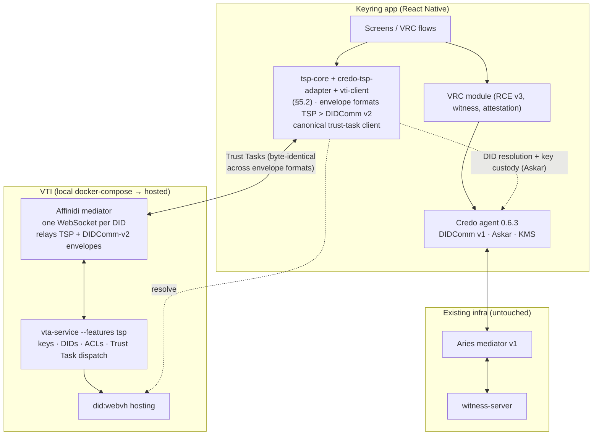
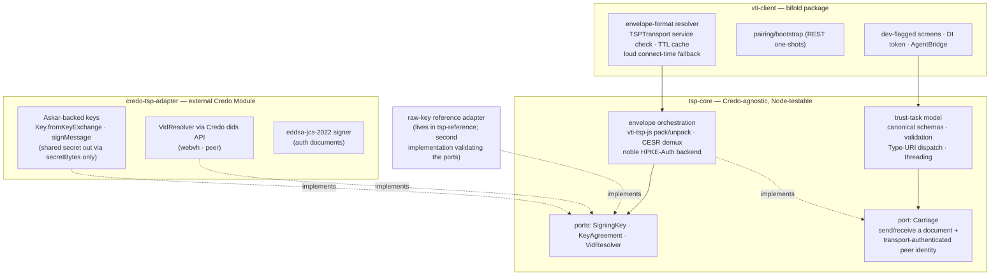

# TSP / OpenVTC Integration — Analysis, Architecture & Phased Plan

*Living plan for the OpenVTC infrastructure-compatibility workstream, at **Rev 5**. Supporting research (TSP/DIDComm learning notes, engineering brief) is kept out of the repo for now; ask if you want it.*

**Reviews that shaped it** — each records its own reasoning and disposition; this plan states only the current position:

| Rev | Driven by |
|---|---|
| 2 (07-22), 3 (07-27) | Upstream re-audits; research notes not in the repo (`tsp-didcomm-learning-notes.md`) |
| 4 (07-29) | [`2026-07-29-bam.md`](./openvtc-integration-plan/2026-07-29-bam.md) — Brendan. Adopted: the `tsp-core`/`credo-tsp-adapter` split, external-package-not-fork, two-adapter conformance. Rejected on evidence: static-until-rotation selection, per-transport proof rules, the `TspMessaging` service name |
| 5 (08-05) | [`2026-08-05-bam.md`](./openvtc-integration-plan/2026-08-05-bam.md) — Part A: six findings against this plan (A5 still uncosted). Part B: the Trust Tasks design decisions, detailed in [`2026-08-05-trust_tasks_subtask.md`](./openvtc-integration-plan/2026-08-05-trust_tasks_subtask.md) |

---

## 1. Executive summary

We are aligning Keyring with the OpenVTC / First Person Project (FPP) ecosystem — TSP (Trust Spanning Protocol) as the emerging transport, Trust Tasks as the operation layer, PNM functionality on top — while preserving Keyring's differentiators (VRC module, RCE v3, witnessed exchange, hardware attestation). Keyring is positioned to be the **first user-friendly mobile/PNM implementation** in this ecosystem; our posture is contributor, not consumer.

**Bottom line up front:**

1. **TSP is usable experimentally today, end to end.** The VTA's outbound TSP send landed on main 2026-07-19 (device push over TSP with DIDComm fallback; replies to inbound TSP over TSP). It's feature-gated (`--features tsp` build + `pnm services tsp enable`), which is exactly the experimental posture we want. On the JS side the wire layer is published (`@openvtc/vti-tsp-js`) and a full Trust-Task-over-TSP channel is merged in the browser-plugin repo (unpublished on npm until Cypress). We can build against repo-main now.
2. **"Cypress" is at release-candidate.** `VTI-Cypress-RC-0` annotated tags landed across nine OpenVTC repos (07-29/31, two waves); no GitHub Releases and no npm publishes yet (`vti-tsp-js` 0.1.0 / `pnm-core` 0.2.0 unchanged — our tripwire), so the final cut is imminent but we keep consuming pinned repo-main clones. Implication unchanged: **don't build against the old REST-only API surface** — the client shape Cypress publishes is the session-channel abstraction with priority **TSP > DIDComm > REST**, and the canonical-task migration is a **clean cutover** (old URIs are being deleted, no dual-accept).
3. **Do we need TSP for Keyring to work? No.** Keyring's existing stack (DIDComm v1, VRC, witness) needs nothing from TSP, and even VTA connectivity works over DIDComm v2/REST. TSP is the direction the stack is actively migrating (the channel priority ladder already prefers it), so we adopt it early *by choice*, experimentally, as pioneers — with fallback always present.
4. **The React Native crypto problem is solved in principle — small.** Only HKDF and X25519 inside hpke-js touch WebCrypto; hpke-js has first-class pluggable KDF/KEM interfaces; a noble-backed implementation (≈100–350 LOC, zero native code) makes `vti-tsp-js` run everywhere, validated against official CFRG Auth-mode test vectors. **≈2–4 days including upstream review — and it's our first flagship contribution** (nobody has run hpke-js on RN anywhere).
5. **Integration locus, now concretized as a three-package split** (adopted from team review, evidence-checked): **`tsp-core`** — Credo-agnostic envelope orchestration + Trust-Task model/validation/dispatch behind small ports (`SigningKey`, `KeyAgreement`, `VidResolver`); **`credo-tsp-adapter`** — a thin external package implementing those ports via Askar (`Key.fromKeyExchange` + `signMessage` — verified real; the static private key never leaves Askar, only the DH shared secret exits via `secretBytes` to feed HPKE's KDF), registered through Credo's *public* Module API exactly like our `DataIntegritySuiteModule` precedent — **no credo-ts fork by default**; **`vti-client`** — the bifold/RN assembly. Credo 0.6.3's KMS has no derive operation (verified), so the adapter talks to Askar directly; an upstream KMS RFC becomes an optional contribution, not a blocker.
6. **Requirement made explicit: coexistence.** Keyring must run DIDComm v1 (legacy VRC/witness stack), DIDComm v2, and TSP side by side behind one transport abstraction — mirroring the VTA's own protocol ladder — for the foreseeable future.
7. **The levels double as a conformance suite.** Each level emits frozen fixtures and runnable tests (pure TS → Node → RN), against a locally running VTA. This seeds the conformance harness the ecosystem lacks (TSP spec issue #14; Trust Task "candidate" status formally requires **two independent interoperable implementations** — Keyring can be the second implementation on record).

---

## 2. The OpenVTC landscape (verified 2026-07-22)

OpenVTC is an **LF Decentralized Trust lab** implementing the First Person Project. Glenn Gore is the primary author; everything is Apache-2.0, 0.x **by design** — the ecosystem is deliberately in its pioneering phase and we are part of the feedback loop shaping it.

### 2.1 Terminology

| Term | Expansion | Meaning |
|---|---|---|
| **FPP** | First Person Project | LFDT + Ayra + ToIP + DIF + OWF effort: prove "you are a real unique person with real trust relationships" via PHCs + VRCs |
| **VTA** | Verifiable Trust Agent | Server-side custodian of keys, DIDs, ACLs for one identity; what our app enrolls against |
| **VTC** | Verifiable Trust Community | Self-governing community (members/credentials/policies) on top of a VTA |
| **VTI** | Verifiable Trust Infrastructure | VTA + did:webvh DID hosting + DIDComm/TSP mediator |
| **PNM / CNM** | Personal / Community Network Manager | Operator tooling for a single VTA / a community |
| **Trust Task** | — | Versioned, JSON-Schema-specified wire operation — see §2.3 |
| **PHC / VRC** | Personhood / Verifiable Relationship Credential | The latter is the concept Keyring's VRC module already ships |

### 2.2 Maturity truth-table — published vs merged-to-main (pre-Cypress)

| Component | Published today | Merged to main (what Cypress snapshots) |
|---|---|---|
| TSP wire (TS) — `@openvtc/vti-tsp-js` | 0.1.0 (2026-07-05): pure TS, HPKE-Auth, CESR, byte-compat with Rust `affinidi-tsp`; WebCrypto-dependent; wire-only | unchanged |
| DIDComm v2 (TS) — `@openvtc/vti-didcomm-js` | 0.6.2 (2026-07-19) | 0.6.0 added **TSP frame demux**: mediator interleaves raw CESR TSP frames (first byte `0xF8`) on the *same* WebSocket as DIDComm → `onTspFrame` handler |
| PNM core — `@openvtc/pnm-core` | 0.2.0 (2026-06-08), **no TSP** | repo has `tsp-channel.ts` (**TrustTaskChannel over TSP** — plaintext byte-identical to the REST body and DIDComm body), `tsp-mediator-transport.ts`, and a **session channel chain: TSP > DIDComm > REST with degradation** |
| Trust Tasks — `@openvtc/trust-tasks` | 0.2.37 (2026-07-22; 24 publishes on 07-21 alone) | tracking the new `vtc/*` spec wave |
| VTA (`vta-service`) | — | **Outbound TSP landed 2026-07-19**: relationship-free routed send (design decision "3c", confirmed against a live mediator), device push over TSP via learn-from-inbound TTL map, DIDComm fallback, TSP replies to TSP inbound. Feature-gated: `--features tsp` build, `pnm services tsp enable --mediator-did <did>`, `[services] tsp = true` in setup recipes. VTC-side member send is still DIDComm-only |
| iOS reference (`vta-mobile-agent-ios` + `vta-mobile-core` 0.6.14) | — | Enrolment (QR), auth step-up (AAL1→AAL2), consent approver, **TSP inbox receive + reachability announce, with DIDComm/TSP toggle**. Caveat: device replies still ride REST/DIDComm — full flow ≠ full bidirectional TSP on the phone yet |
| Containers | **None.** Only Dockerfile in the org is the AWS Nitro enclave image; no compose, no published images; `local-dev.md` unwritten | — (contribution opportunity, see §7) |
| TSP spec (ToIP) | v1.0 Experimental Draft; no official test vectors (Appendix A empty, issue #14) | — |

Third-party VTI components: Affinidi's `affinidi-webvh-service` (DID hosting) and `affinidi-messaging-mediator` (dual-protocol DIDComm v2 + TSP relay; Valkey-backed). Neither ships containers either.

### 2.3 Trust Tasks — what they are and how they fit

A **Trust Task is a single JSON document** — no envelope: `type` (a versioned Type URI like `https://trusttasks.org/spec/acl/grant/0.1`), `id`, optional `threadId`, a task-specific `payload` governed by a JSON Schema 2020-12, optional W3C Data-Integrity `proof`, and `issuer`/`recipient` VIDs. Bilateral by design; multi-party flows are chained bilateral tasks sharing a `threadId`.

**Why they matter to us:** Trust Tasks are the *operation layer* that rides any transport. The VTA deliberately keeps the three carriages **byte-identical** — REST `POST /api/trust-tasks` body = DIDComm message body = TSP message plaintext — funneling into one dispatch spine gated on authentication + ACL. So everything we build at the task layer is transport-portable by construction: implement once, run over REST today, TSP tomorrow. Transport bindings live in a separate namespace (`binding/didcomm/0.1`, `binding/https/0.1`, `binding/tsp/0.1`, `binding/push/0.1` — the push one is a contentless wake-up "doorbell" via a push gateway, never content carriage).

**Concrete examples:** `auth/authenticate/0.1` (VTA login handshake), `acl/grant/0.1` (proof-required evidentiary record), `task-consent/request|decision/0.1` (the approve-on-second-device ceremony the iOS app implements), `trust-task-discovery/0.1` (capability negotiation via slug globs), `messaging/ping/0.1` (the TSP health probe). A new `vtc/*` family (join-requests, members, endorsements) landed this week.

**Governance & how we'd register our own** (e.g. a witnessed-exchange task): the registry *is* the git repo (`trustoverip/dtgwg-trust-tasks-tf`), auto-published to trusttasks.org; anyone can PR a spec; review currently routes to Glenn via CODEOWNERS, and a namespace CODEOWNERS entry can hand us review of our own tasks. Versioning is MAJOR.MINOR with a maturity lifecycle (draft → candidate → standard); **candidate requires two independent interoperable implementations** — a formal slot for Keyring as second implementor. There's also a **private-authority route** (spec §6.5): publish `https://<our-domain>/trust-tasks/witnessed-exchange/0.1` under our own domain with zero permission needed, promotable to the registry later. TS + Rust codegen twins (`@openvtc/trust-tasks` / `trust-tasks-rs`) guarantee byte-identical wire shapes.

---

## 3. Where Keyring stands (relevant facts)

- **Stack**: credo-ts **0.6.3** (extracted `@credo-ts/didcomm` architecture), bifold 3.0.16, RN 0.81.5 / React 19, Askar 0.6.0, new-arch + Hermes enabled. Upgrade phases 0–5 complete; settled base. Nearest active thread: deferred DI/`eddsa-rdfc-2022` issuance (RCE v3, `docs/CRYPTO_SUITE_FOLLOWUP.md`).
- **DIDComm**: v1 only (Credo has no v2); Aries-style mediator. The VTI mediator is DIDComm v2 + TSP. Keyring↔VTA therefore uses OpenVTC's JS libraries beside Credo, never through it.
- **DID methods registered**: peer, key, jwk, web, **webvh** — exactly TSP's method set. Head start for VID resolution.
- **Crypto on device**: `@noble/curves` + `@noble/hashes` already vendored and proven green on Hermes (the eddsa-rdfc-2022 suite); Askar (Rust) carries the DIDComm hot path. No WebCrypto `subtle` (the `rdf-canonize` patch exists for exactly this) — addressed by §4.1.
- **KMS**: Credo KMS (Askar + SecureEnvironment backends); no raw X25519 derive/export in the public API — see §4.3.
- **VRC/RCE v3**: rides DIDComm v1 connections + Basic Messages; witness signalling (`session-request` → `session-challenge` → `submit-presentation` → VWC issuance) is JSON payloads — conceptually already Trust-Task-shaped; hardware attestation is P-256 Secure Enclave/StrongBox. All payloads transport-agnostic.
- **Local-backend precedent**: `e2e/lib/witness.js` spawns witness-server + cloudflared tunnel + injects the invitation — the pattern for wiring the app to a local VTA.

---

## 4. Gap analysis (updated rev 2)

### 4.1 React Native crypto — RESOLVED IN PRINCIPLE (small, and a flagship contribution)

Deep-dive findings (sources read at file level in dajiaji/hpke-js and vta-browser-plugin):

- In hpke-js, **only HKDF (HMAC via `subtle`) and X25519 (`subtle.deriveBits`) require WebCrypto**; `@hpke/chacha20poly1305` is already pure JS (vendored noble code). `vti-tsp-js` confines all `@hpke/*` usage to one ≈90-line file (`src/crypto/hpke.ts`); its Ed25519 signing already uses `@noble/curves` — which runs on Hermes today.
- hpke-js's `CipherSuite` takes **pluggable `{kem, kdf, aead}` interfaces** — documented, supported usage. A noble-backed KDF (≈60 LOC on `@noble/hashes` hmac/hkdf) + noble X25519 KEM (≈40 LOC) drop in without patching hpke-js; wire bytes identical (same suite IDs).
- Fallback: a self-contained **≈250–350 LOC RFC 9180 Auth-mode implementation** on `@noble/{curves,hashes,ciphers}` — fully validatable against the official CFRG test vectors, which cover **exactly TSP's suite in Auth mode**, plus vti-tsp-js's own Rust-interop vector.
- `react-native-quick-crypto` 1.x (Nitro, new-arch, actively maintained) now implements the extended `crypto.subtle` including HKDF, X25519, ChaCha20-Poly1305 — kept **in reserve as a later performance upgrade** behind the same interfaces; not the first move (unproven pairing with hpke-js, permanent native dep, global-`crypto` ownership conflicts).
- Performance: TSP is O(1) crypto ops per message (2 X25519, ≈6 HMAC, one ChaCha pass, one Ed25519); estimated 5–50 ms worst-case on Hermes — acceptable for message-sized payloads; verify with a 20-line on-device timing probe at Level 1.
- **Nobody anywhere has run hpke-js on React Native.** The upstream pluggable-crypto PR to `vti-tsp-js` makes it runtime-agnostic for the whole ecosystem — precisely our "build for others" mandate. Watch item: panva's `hpke`/`@panva/hpke-noble` would be the clean off-the-shelf answer *if* it ever gains Auth mode (today it's Base/PSK only).

### 4.2 Envelope-format coexistence and selection (requirement + policy)

Keyring runs three stacks concurrently: Credo DIDComm v1 (legacy VRC/witness — untouched), and — toward the VTA — **two envelope formats on one connection**: TSP and DIDComm v2 are both sign+encrypt envelope formats riding the *same* mediator WebSocket (one socket per DID; the mediator evicts duplicates), not two network paths. Selection policy, mirroring upstream's shipping client (verified in vta-sdk):

- **Prefer by DID-document capability**: the peer advertises TSP via a service of type **`TSPTransport`** (the exact string — defined in vta-sdk `matching.rs`, matched by pnm-core; the ToIP spec names no service type). Ladder: `TSPTransport` > `DIDCommMessaging` > `VTARest`.
- **Cache with bounded staleness (TTL), never until-rotation**: upstream mutates DID documents at runtime *without* key rotation (`pnm services tsp enable` adds `#tsp`; verificationMethod stays byte-identical), and its own reachability map expires in 300 s. A rotation-only cache would stick forever.
- **Fall back loudly at connect time**, as vta-sdk's `Auto` does — degradation is session-scoped and logged, not silent per-message flapping.
- **Documents stay transport-agnostic by construction**: byte-identical across REST/DIDComm/TSP; both authcrypt and TSP give intrinsic sender authentication; `proof` is a **per-task** requirement (`IS_PROOF_REQUIRED` — tasks that need replayability require proof on *every* transport, TSP included). No rebuild-on-fallback exists or is needed.

Convergence of the legacy stack (VRC-over-TSP, witness ops as Trust Tasks) remains a deliberate later phase.

### 4.2a Task-layer coexistence — a client-side policy we set ourselves

*§4.2 above governs **envelope formats**; this governs **task versions**. The two are independent — an app can be perfectly TSP-capable and still be bricked by a Type URI that was deleted.*

§1.2 records the upstream norm: the canonical-task migration is a **clean cutover** — "old URIs are being deleted, no dual-accept" — and ref-06 reinforces it ("never deprecated `vta/*` 1.0 shapes"). We have since watched that happen in the working tree: **54 of the 74 `spec.md` files** in `verifiable-trust-infrastructure/trust-tasks/` are `status: retired`, re-minted into the registry under new URIs and renumbered downward (`/openvtc/vtc/relationships/publish/1.0` → `/spec/vtc/relationships/publish/0.1`).

That cadence is workable for a server and a browser extension, which update in lockstep. **It is not workable for a phone app**: old versions persist in the wild for months, app-store review adds latency, and native code has no OTA path. A clean cutover upstream is a hard break for every un-updated install.

The framework permits what we need, so this costs no upstream negotiation: [SPEC §5.2](https://github.com/trustoverip/dtgwg-trust-tasks-tf/blob/main/SPEC.md#52-compatibility-rules) makes forward-minor compatibility a SHOULD and lets consumers accept several versions concurrently, and [§5.4](https://github.com/trustoverip/dtgwg-trust-tasks-tf/blob/main/SPEC.md#54-migrating-between-versions)'s expand-then-contract sequence ("update receivers first") is written for exactly this.

**Policy:**

- **Consumers accept N and N−1** of any task version we emit, for at least one release cycle.
- **Type URI churn upstream is absorbed in the client**, never propagated as a hard break to an installed app.
- **Where we are the producer, follow §5.4 receiver-before-sender ordering** — ship acceptance first, emission second, retirement last.
- **Pin, don't track.** The reference ladder consumes pinned repo-main clones (§5.3); this policy sets how far the app may lag those pins without breaking — which is the tolerance that decides how aggressively the ladder can chase upstream `main`.

This is a stance we take, not one upstream needs to adopt. It does mean our conformance fixtures must cover N−1 as well as N, which is a small ongoing cost in the level suite (§4.4).

### 4.3 Credo custody — RESOLVED PATH (validated, not investigated)

The KMS question has a concrete answer: **Askar's `Key.fromKeyExchange({algorithm, publicKey})` (x25519 supported) + `signMessage`** cover TSP's static-DH and signing with the private key never leaving Askar. One honest caveat: Askar has no HKDF/HPKE (its `Ecdh1PU` implements the JOSE ConcatKDF — the wrong schedule), so the DH **shared secret** exits via `secretBytes` to feed HPKE's labeled KDF in `tsp-core` — custody covers the long-term key, not the per-message secret. Credo 0.6.3's public KMS API has **no derive operation at all** (verified: `KeyManagementApi` = create/sign/verify/encrypt/decrypt/import/getPublicKey/delete/randomBytes), so `credo-tsp-adapter` talks to Askar directly, packaged as an **external Credo Module via public extension points** (the `@credo-ts/askar` / our-`DataIntegritySuiteModule` pattern) — **no fork by default**; fork only if the public API proves insufficient. Phase D validates this end-to-end (two adapters against one fixture suite) rather than investigating from scratch. The upstream KMS-HPKE RFC drops to an optional contribution (§7.7).

### 4.4 Conformance vacuum → our levels fill it

No TSP spec test vectors (issue #14); OpenVTC repos move daily; "conformant" is currently defined by interop. Our level suite is therefore designed as a **portable conformance harness**: frozen fixtures at every layer, pure-TS test cores that run in Node first and RN later, executed against a local VTA. This is both our regression net against upstream churn and a visible ecosystem contribution. Adopted from team review: the **same fixture suite runs against every adapter** (the raw-key reference adapter and the Askar-backed one) to prove the `tsp-core` ports don't leak backend-specific behavior.

### 4.5 New scope: JCS Data-Integrity signing for auth

Upstream (#880, 07-30) made REST `/auth/` require a **DI-signed `auth/authenticate/0.1` Trust Task using `eddsa-jcs-2022`** — anonymous-envelope login is dead. Keyring ships `eddsa-rdfc-2022` (RDFC canonicalization); the JCS variant is the *simpler* sibling, and a pure-TS JCS (RFC 8785) implementation already lives in `@bifold/vrc-contexts`. Concrete, bounded new work item — scoped into Phase D — and a second life for our DI investment.

---

## 5. Target architecture

### 5.1 End-state

Properties: two stacks, one app, no rewrite; the new modules are additive and dev-flagged; envelope selection follows the VTA's own DID-doc service-type ladder with TTL caching and loud connect-time fallback (§4.2); the task layer is transport-portable by construction (§2.3), so nothing we build at that layer is throwaway when transports evolve.

### 5.2 Module architecture — three packages (adopted from team review, evidence-checked)

The two-adapter rule is load-bearing: the raw-key adapter (born in Phases A–B) and the Askar adapter run the **same frozen fixture suite**, proving the ports don't leak backend behavior. Each box is proven as a standalone reference before assembly — the packages are an assembly step, not a rewrite.

**The task model depends on a `Carriage` port, not on the TSP wire.** Wiring it `TT --> WIRE --> IFACE` instead — the obvious arrangement if the TSP envelope is the only carriage in view — would make the trust-task layer depend on envelope orchestration, contradicting §2.3's own claim that the task layer "rides any transport" and that everything built there is "transport-portable by construction", and [Trust Tasks SPEC §1.1 goal 1](https://github.com/trustoverip/dtgwg-trust-tasks-tf/blob/main/SPEC.md#11-design-goals) normatively. Concretely, that coupling would have dragged HPKE, CESR and the noble backend into three places that need none of them:

- the **DIDComm v1** carriage the legacy VRC/witness stack uses (§7.6);
- the **REST** leg of the TSP > DIDComm > REST ladder (§1.2, §4.2);
- any Node-side conformance run exercising task validation alone.

Inverting it costs a port definition today. After Phase D it is a refactor of the package everything else depends on. It also lets the §7.6 recast consume `tsp-core`'s task model over a DIDComm-v1 carriage rather than standing up a second task spine — making that work an early second consumer of the abstraction, the same two-implementations logic already applied to adapters (§4.4) and bindings (§7.9).

### 5.3 Where code lives

- **Three bifold packages** (`tsp-core`, `credo-tsp-adapter`, `vti-client`) beside `witness-server`/`vrc-*`, consumed via `portal:`; `vti-client` DI-exposed via a `TOKENS` entry + the `AgentBridge` pattern. **`tsp-core` has zero Credo/Askar/RN imports** so the same code runs in Node (levels, conformance CI) and RN (the app); `tsp-core` + `credo-tsp-adapter` are npm-publishable later if the ecosystem wants them.
- **Reference corpus** in `tsp-reference/ref-NN-*` at the repo root (§6) — a standalone suite outside the yarn workspaces, the same shape as `e2e/`. It does not move wholesale: the conformance rungs stay there, and only the integration rungs follow their packages (§6, "where the corpus ends up").
- **External clones** in `external/` at repo root (gitignored), each pinned to a recorded SHA; unpublished TS packages are consumed from the clones until the "Cypress" release puts them on npm.

---

## 6. The reference-script ladder

Modeled on `vrc-reference`: instead of throwaway test spikes, we build a **corpus of small, runnable, permanently-kept reference scripts**, living at `tsp-reference/` in the repo root — a standalone npm suite outside the yarn workspaces, the same arrangement `e2e/` already uses. Each rung is one script (plus README + frozen fixtures) that does exactly one new thing on top of the previous rung. The corpus serves four purposes at once: **(1)** the learning curve — you run and read each rung before we climb; **(2)** living documentation of how our stack talks TSP; **(3)** regression fixtures — every rung's frozen bytes become CI checks against upstream churn; **(4)** the implementation guide for the eventual Keyring module and future upgrades (when something breaks after an upstream bump, the failing rung pinpoints the layer).

Rules for every rung: *pure-TS core, no RN imports* (so the same file later runs on Hermes unchanged); frozen fixtures (`fixtures/*.json`: keys in → expected bytes out); a `README.md` saying what it teaches and how to run it; graduation = you've run it and it makes sense. Upstream-contribution checkpoints are marked ⭱ — **each one is drafted locally and shown to Alberto before anything is pushed** (standing rule).

### Phase A — TSP mechanics, zero infrastructure (Node only)

| Rung | Script does | You learn | Est. |
|---|---|---|---|
| **ref-00-hello-direct** | Alice → Bob in one Node process: mint 2×(Ed25519+X25519), `pack("hello bob")`, `unpack`, print each wire segment | The 5 keys, HPKE-Auth double authentication, what `pack`/`unpack` actually are | ½ d |
| **ref-01-modes** | Nested (pairwise VIDs), then Routed: Alice → Relay1 → Relay2 → Bob, all in-process; annotated hexdump of the CESR frames; cross-check the package's Rust-interop vector | The onion: relays do ordinary `unpack`, see only next-hop; CESR framing (`0xF8`); **first frozen fixtures** | 1 d |
| **ref-02-two-processes** | Alice and Bob as separate Node processes exchanging TSP bytes over a dumb HTTP relay | Transport-agnosticism: the pipe knows nothing, the envelope does everything | ½ d |

### Phase B — crypto portability (first upstream contribution ⭱)

| Rung | Script does | You learn | Est. |
|---|---|---|---|
| **ref-03-noble-crypto** | ref-00 re-run on a noble-backed KDF/KEM injected into hpke-js's pluggable `CipherSuite`; validated against CFRG Auth-mode vectors + ref-01 fixtures; byte-identical output proven | Why only HKDF/X25519 needed WebCrypto; how the suite plugs; ⭱ **PR to vti-tsp-js** (unblocks RN for the whole ecosystem) | 2–3 d |

### Phase C — real infrastructure, one piece at a time

| Rung | Script does | You learn | Est. |
|---|---|---|---|
| **ref-04-mediator** | Alice ↔ Bob through the Affinidi mediator: **one WebSocket per DID**, TSP frames demuxed off the same socket (`onTspFrame`), send = POST, replies correlated by `threadId` | The per-surface "leg" model the whole ecosystem just standardized on — the exact constraints our RN client inherits | 1–2 d |
| **ref-05-vta-hello** | Local VTA: `cargo build --features tsp`, `vta setup --from <toml>` (explicit `[secrets] backend`, `data_dir_exists="reuse"`); pair/enrol; send `messaging/ping/0.1` and `auth/authenticate/0.1` as Trust-Task documents; then wrap the recipe in **docker-compose** | Running VTI ourselves; enrolment + intrinsic TSP auth (no tokens); ⭱ **compose + `local-dev.md` upstream** | 3–5 d |
| **ref-06-trust-tasks** | A minimal trust-task client speaking the **canonical grammar** (canonical `trusttasks.org/spec/` URIs, camelCase, RFC 3339, cursor pagination — never deprecated `vta/*` 1.0 shapes), sending the *same document* over the DIDComm leg and the TSP leg — diffing the bytes to prove carriage-identity | The task layer as the stable contract; transport as a swappable leg; fixtures per task type — ⭱ conformance vectors upstream | 2–3 d |

### Phase D — tsp-core ports & the Credo adapter (validation, not investigation)

The Credo-integration question is **decided by design** (§4.3, adopted from team review): Credo-agnostic core + external adapter, no fork. Phase D builds and *validates* that design instead of investigating from scratch.

| Rung | Script does | You learn | Est. |
|---|---|---|---|
| **ref-07-credo-adapter** | Extract the ports (`SigningKey`/`KeyAgreement`/`VidResolver`) from the Phase A–B work; keep the raw-key implementation as the **reference adapter**; build `credo-tsp-adapter` on two `@credo-ts/node` 0.6.3 agents (Askar `Key.fromKeyExchange` + `signMessage`, VIDs via Credo's dids API); run the **same fixture suite against both adapters**; add the `eddsa-jcs-2022` signer for `auth/authenticate` (§4.5); scope the **DIDComm-v1 basic-message binding** we author (§7.9) — *not* `binding/didcomm/0.1`, which is DIDComm v2.1 and unreachable from Credo 0.6.3; the v2.1 leg, where needed, rides `@openvtc/vti-didcomm-js` beside Credo | The custody boundary made concrete (what stays in Askar, what exits as `secretBytes`); proof the ports don't leak; Credo integration settled by construction | 2–3 wk |

### Phase E — React Native and Keyring

| Rung | Script does | You learn | Est. |
|---|---|---|---|
| **ref-08-rn-hello** | The ref-00 + ref-03 cores imported unchanged into a dev screen in the app (Hermes), with an on-device timing probe | Proof the pure-TS rule held; real perf numbers | 1–2 d |
| **ref-09-keyring-module** | `bifold/packages/vti-client` assembling `tsp-core` through `credo-tsp-adapter` (§5.2) behind a DI token + RN shims; envelope-format resolver (TSPTransport check, TTL cache, loud fallback); dev-flagged screen; app enrolls against the ref-05 compose stack; e2e via the witness spawn/tunnel pattern | The production shape; VRC/witness untouched and green | 2–4 wk |

**After the ladder (ecosystem phase):** hardening + **external review of the crypto path** (the noble HPKE-Auth backend and the Askar custody boundary — a small, isolated surface thanks to the ports) before any production flag-flip; **VRC-over-TSP** (which *depends on* the recast below — a relationship handshake cannot ride TSP while it is a regex in a chat message); the PNM mobile library / new-repo proposal ⭱ (§7); Cypress tracking; PQ watch.

> **The witnessed-exchange Trust Task specification is not post-ladder work, and not a private-authority route.** DTG Core Credentials makes a qualifying Trust Task specification a *normative dependency* of the VWC's `taskContext` binding — we cannot conformantly issue VWCs without one — and the framework editor has **invited** the specification as a joint appendix ([#173](https://github.com/trustoverip/dtgwg-trust-tasks-tf/issues/173#issuecomment-5189686547)). Spec **authoring** therefore runs in parallel with Phases A–C (document work, long registry lead time, and the editor's timeline is not ours); spec **implementation** lands at Phase D/E. See §7.6, §8.1, and [`2026-08-05-trust_tasks_subtask.md`](./openvtc-integration-plan/2026-08-05-trust_tasks_subtask.md) §9 for the order and its acceptance criteria.

**Demo milestones (the story we can show, per phase):**
1. **Phase C** — laptop-only: local VTA in docker; a script enrolls and runs authenticated Trust Tasks over the TSP envelope (hexdump shows the mediator relays opaque bytes); flip the VTA's TSP flag → the *identical document* arrives over DIDComm v2. Proves the architecture in ten minutes.
2. **Phase E** — the stakeholder demo: browser → "log in with your agent" → Keyring buzzes, shows the verified request → Face ID → in. Then an ACL grant attempt → Keyring buzzes as the approver device → deny → it never happens. Passwordless login + human-in-the-loop authority on RN — exists nowhere else.
3. **Ecosystem** — the Keyring-signature demo: two phones perform a witnessed VRC exchange whose witness ceremony rides as registered Trust Tasks over TSP — hardware-attested relationship credentials over the trust-spanning layer.

**Demo concepts — brainstorm only, for after full integration (ideas, not scope):**

- **Agent names as the legibility layer (cross-cutting).** Render every actor via upstream's `display_name` seam: `domain/@name` handles bound two-way (DID doc `alsoKnownAs` + reverse resolution → "verified"; one-way claims render with a mandatory distrust tag). Turns consent cards from `did:webvh:…z6Mk8j…` into "`photos.family/@sister` ✓ requests: Family Photos, 7 days". The staged *unverified-name* request (⚠ tag) is the anti-phishing money shot.
- **Sequencing: deliberately TBD until the integration lands** — current leaning is to aim for the showstopper ("Meet your Agent"). Candidates on the shelf: the git demo (doable during Phase C–D with near-zero Keyring code: VGI `did-git-sign` + local VTA + the upstream iOS agent as approver), and "Log in with your Agent" + one veto (= Phase E exit + the names seam).
- **Witness governance under remote connection (design position):** a VRC carries a *bundle of evidence axes* — ceremony (live, simultaneous, challenge-bound), device (hardware attestation), locality (co-present meetup, QR-in-room), domain endorsement (verified agent name). Handle-initiated remote exchange keeps ceremony+device+domain but loses locality; meetup flow keeps ceremony+device+locality. Solution: **type the evidence in the VWC** (the taskContext-on-VWCs thread) so remote-witnessed vs co-present-witnessed are distinct, honest claims — locality becomes a named premium tier, not a diluted default. vs Signal in one line: Signal proves you can talk in secret; this produces a portable, third-party-verifiable artifact of the relationship and how it was formed. Onboarding arc: connect VTA → agent-as-concierge (claim your name via consent card) → find by handle → **agent narrates the ceremony fork** (remote-witnessed now vs co-present Thursday).
- **MVP (P1) detail:** browser login via the upstream `demo-rp`; phone shows verified requester, Face ID, in — no password exists. Then an ACL grant attempt from an unverified name → deny → signed refusal in the audit log. Lands for normies (no passwords, phone is the boss) and nerds (DID auth, zero bearer tokens, two-way naming, evidence trail).
- **Agent-name unlock for Keyring:** *add contact by handle* — type `keyring.app/@name`, resolve → verified identity card → connect → candidate witnessed VRC. Names solve VRC's cold-start (bootstrapping a relationship at distance) and give every consent card human-readable, auto-verified actors.
- **"Meet your Agent" architecture note (P2):** the LLM never lives inside the VTA — it's a separate process with its own DID, enrolled under a scoped ACL grant (`scopes`, `expiresAt`, `stepUp`, phone holds `approve`). Engine = any function-calling LLM (local Hermes-class via ollama for the self-hosted story, or Anthropic API; precedent: witness-server's LangChain layer); tools = tsp-core's typed task builders. Demo beat that matters: a prompt-injected agent is rejected/escalated identically — **security never depends on the model behaving**. Est. ≈1–2 wk on a finished Phase D core.
- **"Meet your Agent" (post-integration showstopper).** VTA appears in Keyring as a chat contact (the witness-contact UX pattern we already ship); an LLM beside the VTA (precedent: witness-server's LangChain/Anthropic layer) turns plain language into typed trust tasks — routine ones execute inside a scoped grant, consequential ones bounce to consent cards. "An assistant that can actually act, and physically cannot overstep."
- **Vignettes:** temporary family access ("sister gets the photos context for a week" — `acl/grant` + `expiresAt`, revocable); subscription killer (`vault/proxy-login`, each login phone-approved); verified-human interaction (PHC personhood without identity disclosure); for developers: AI-written commits signed only after phone approval (VGI `did-git-sign` — the agent cannot manufacture your signature), with CI verifying against the community trust registry.
- **Keyring-unique flourish:** sign consent *decisions* with our attested hardware key — approver evidence at Secure-Enclave grade, which no other client in the ecosystem does.

### Where the corpus ends up

A reference belongs next to what it exercises — and this corpus exercises two different things, so it has two destinations:

- **Conformance rungs (ref-00…06) exercise *upstream*.** ref-00–02 touch none of our code at all; ref-04/05 drive someone else's mediator and the VTA. Their job is drift detection against an external ecosystem, so they **stay at `tsp-reference/`**, hardened into a CI suite at Phase C's end. Keeping them portable (no bifold deps, no app paths) also keeps the upstream-donation door open — the TSP spec's test-vector appendix is empty, and Trust Task specs need two independent implementations to advance from draft (§7.3, §7.9).
- **Integration rungs (ref-07…09) exercise *ours*.** They demonstrate `tsp-core` / `credo-tsp-adapter` / `vti-client` and move wherever those packages land — decided at Phase D/E with evidence, not now. Current lean: `tsp-core` stays maximally portable (publishable, per §7.5), while `credo-tsp-adapter` and `vti-client` go to `bifold/packages/` where the app consumes them via `portal:`.

**Sequencing:** A → B strictly (B needs A's fixtures); C can start in parallel with B (ref-04/05 don't need noble crypto); D after A+B; E after B+C+D. Each rung is a natural pause point — nothing above a rung is blocked *while you're learning it*, because the corpus below it keeps standing. When upstream moves (it will), we re-run the ladder bottom-up; the first red rung names the broken layer.

---

## 7. Contribution roadmap — pioneering for others, not just for us

OpenVTC is *ours to shape*: Glenn has offered npm-namespace access and direct changes, and the 0.x phase is explicitly the feedback window. Concrete contributions this plan generates, roughly in order:

| # | Contribution | Where | Why it matters beyond Keyring |
|---|---|---|---|
| 1 | **Noble-backed pluggable crypto for `vti-tsp-js`** (Level 1) | PR to vta-browser-plugin / vti-tsp-js | Makes TSP-JS runtime-agnostic: RN, older Node, any subtle-less runtime. First RN-capable TSP anywhere |
| 2 | **docker-compose for the full local VTI + `local-dev.md`** (Level 3) | PR to vti-setup / verifiable-trust-infrastructure | Fills the documented gap (`local-dev.md` is an unwritten stub); every future implementor gets a local stack |
| 3 | **Conformance fixtures & harness** (Levels 0/3/5) | vti repos + TSP spec issue #14 | The ecosystem has no test vectors; "conformant" is currently undefined at byte level |
| 4 | **Functionality wishlist → Glenn's helper roadmap** (Level 2 exit) | Discussion + issues | He explicitly asked for it; steers upstream toward mobile needs |
| 5 | **The RN/PNM mobile library itself** (Level 5 core) | New repo proposal, e.g. `OpenVTC/pnm-react-native` (or publish `@openvtc/pnm-mobile`) | pnm-core is "too browser-specific" (Glenn's words); our pure-TS core + RN shims is the mobile answer; proposing new repos under the org is on the table |
| 6 | **Witnessed-exchange Trust Task spec** (+ CODEOWNERS for our namespace) | **Joint appendix in dtgwg-trust-tasks-tf — invited by the framework editor 2026-08-05** ([#173](https://github.com/trustoverip/dtgwg-trust-tasks-tf/issues/173#issuecomment-5189686547)); private authority no longer the expected route | DTG Core Credentials makes a qualifying Trust Task specification a **normative dependency** of the VWC's `taskContext` binding, and none exists — so this is a named, delegated gap, not a nice-to-have. The editor has asked for "a relationship-witnessing Trust Task specification satisfying the qualifying profile" as the test of whether that profile is satisfiable at all. See [`2026-08-05-trust_tasks_subtask.md`](./openvtc-integration-plan/2026-08-05-trust_tasks_subtask.md) §4 Layer C and §8.5 |
| 7 | **Credo KMS-HPKE extension** (post-Level 4) | credo-ts fork → upstream RFC | The bridge between the OWF credo world and TSP; whoever writes it owns the lane |
| 8 | **Continuous feedback** | Issues/discussions across the org | 0.x is intended; we are part of the design loop |
| 9 | **A DIDComm-v1 basic-message transport binding** — authored by us, private authority → dtgwg-trust-tasks-tf (Phase D/E). *Not* a second implementation of `binding/didcomm/0.1`: that binding is **DIDComm v2.1 authcrypt**, and Credo 0.6.3 is v1-only (§3), so a Credo-native client cannot implement it. Where we do exercise the v2.1 binding it is via `@openvtc/vti-didcomm-js` beside Credo (§3), and *that* is what any second-implementation claim must name | New binding spec + interop evidence to dtgwg-trust-tasks-tf | **No registry binding covers DIDComm v1 at all** — so the legacy VRC/witness stack cannot speak Trust Tasks today. Every Credo-based wallet in the ecosystem has this same gap, which makes a v1 binding more reusable than a second implementation of an existing one. Identity mapping is clean: the connection's `theirDid` is the transport-authenticated sender for [SPEC §4.8.1](https://github.com/trustoverip/dtgwg-trust-tasks-tf/blob/main/SPEC.md#481-precedence-of-in-band-over-transport-derived-identity). See [subtask](./openvtc-integration-plan/2026-08-05-trust_tasks_subtask.md) §6 |

Posture rules: upstream-first (fork only to move fast, PR back immediately); everything generic goes to the org, everything Keyring-specific stays in bifold; normal review hygiene on both sides.

**Contribution review workflow (agreed 2026-08-01):** every upstream candidate stages on a **shared fork** (e.g. Alberto's personal GitHub fork of the target repo) as a ready branch + PR description, reviewed by Alberto + a colleague for as long as review takes, before any official PR is opened. Each candidate ships with (a) the community rationale — why this serves the ecosystem, framed beyond our use case; (b) a no-breakage proof (test vectors, byte-identical fixtures, upstream's own tests green); (c) DCO sign-off. The ladder never blocks on upstream review: the same change is consumed locally (vendored/patched) so later rungs proceed while the PR waits. Note: GitHub forks of public repos are public — the staging branch is visible but obscure; if private review is required, stage in a private mirror first and push to the fork at PR time.

---

## 8. Keyring's unique assets in this ecosystem

- **VRC ↔ FPP-VRC**: the white paper's Verifiable Relationship Credential is what Keyring already ships — with witnessing (VWC) and hardware attestation on top. Keyring contributes the relationship-credential layer; the ecosystem contributes the spanning layer.
- **Witnessed exchange as Trust Tasks**: our witness session messages are already Trust-Task-shaped (typed JSON ops, bilateral, threaded) — §7.6 formalizes them.
- **Hardware attestation**: the ecosystem's AAL1→AAL2 step-up model rhymes with our Secure Enclave/StrongBox evidence; convergence story for device-bound attestation.
- **Non-negotiable at every level**: VRC module tests stay green; witness flow untouched *by the TSP transport work* — changes to it are gated on §7.6 and on `e2e:vrc:devices` staying green (see review A4); `e2e:vrc:devices` remains the attestation proof; legacy DIDComm v1 stack fully supported throughout.

### 8.1 Unscoped work item: VWC outcome-evidence retention

*Detail in the [Trust Tasks subtask](./openvtc-integration-plan/2026-08-05-trust_tasks_subtask.md) §4 Layer C. **Not currently costed in any phase of §6.***

DTG Core Credentials §Outcome Interpretability is normative: a verifier **MUST NOT** read a `taskContext`-bearing credential as proof its ceremony completed unless matching trust-task outcome evidence is present and verified, and the **holder MUST include that evidence with the presentation**. Discovery and retrieval are explicitly out of scope of that spec, so evidence a holder does not ship is evidence that does not exist.

Keyring is the holder. Today our VWCs are standalone credentials and the witness ceremony's messages are transient, so we currently cannot present a VWC as proof a witnessing occurred. Closing that needs:

1. **Persistence** of the ceremony's `#response` document with its proof.
2. **Indexing** by the identifier the credential's `taskContext` carries, so it is locatable from the credential.
3. **Presentation assembly** — attaching it whenever a VWC is offered as completion evidence.
4. **A retention policy** covering the VWC's useful life.

This is storage, presentation and policy work — not spec work — and it lands wherever the wallet's credential store lives, not in `tsp-core`. **The failure mode is silent**: without it, our VWCs verify perfectly well as credentials and simply fail to prove the one thing a witnessed exchange exists to prove. Worth costing into a phase explicitly rather than discovering at demo time (milestone 3 depends on it).

## 9. Sources

- OpenVTC org: <https://github.com/OpenVTC> · npm: `@openvtc/{vti-tsp-js,vti-didcomm-js,pnm-core,trust-tasks,rp-sdk}` · releases pattern: "Banyan" coordinated tag (2026-06-23), binary channel "birch" at firstperson.dev; "Cypress" pending
- VTA/VTI: <https://github.com/OpenVTC/verifiable-trust-infrastructure> (`docs/02-vta/tsp.md`, `docs/05-design-notes/tsp-outbound-send.md`, `docs/02-vta/secret-backends.md`, `non-interactive-setup.md`) · <https://github.com/OpenVTC/vti-setup>
- Plugin/mobile: <https://github.com/OpenVTC/vta-browser-plugin> (`packages/tsp-js`, `packages/core/src/vta/tsp-channel.ts`) · <https://github.com/OpenVTC/vti-didcomm-js> · <https://github.com/OpenVTC/vta-mobile-agent-ios>
- Trust Tasks: <https://trusttasks.org> · <https://github.com/trustoverip/dtgwg-trust-tasks-tf> (SPEC.md — header says v0.2 while Appendix B documents v0.3; editor has confirmed the header is stale and is fixing it)
- **DTG Core Credentials (normative for our credential work): <https://github.com/trustoverip/dtgwg-cred-spec> (`spec/body.md`)** — the DTG credential taxonomy (`DTGCredential` → VRC / VMC / VIC / VPC / VEC / VWC), the **VWC schema**, and **Trust Task Context Binding** (`taskContext`, the qualifying-specification profile, and Outcome Interpretability). Establishes that a qualifying Trust Task specification is a *normative dependency* of the VWC — see §7.6 and §8.1. Note: the r-card is a **VDS, not a `DTGCredential` subtype**, and is deferred to the planned DTG Verifiable Data Structures spec
- **Task-force coordination thread: [dtgwg-trust-tasks-tf#173](https://github.com/trustoverip/dtgwg-trust-tasks-tf/issues/173)** — cred-spec's `taskContext` binding cited against this framework ([opening issue](https://github.com/trustoverip/dtgwg-trust-tasks-tf/issues/173), Brendan, 2026-08-04) and the [framework editor's response](https://github.com/trustoverip/dtgwg-trust-tasks-tf/issues/173#issuecomment-5189686547) (Glenn Gore, 2026-08-05). Load-bearing for §7.6: (a) `proof: REQUIRED` is **not reachable** for the `trust-task-error` variant today, so the failure branch carries no integrity guarantee; (b) a retained error response names neither the originating `type` nor `id`, so it is unusable as third-party outcome evidence; (c) `taskContext` should anchor on the initiating document's **`id`** (§4.3 uniqueness) rather than `threadId` (§4.9, non-validating); (d) four framework changes are coming as an editor PR; (e) **the editor has invited a relationship-witnessing Trust Task specification as a joint appendix**
- Crypto: <https://github.com/dajiaji/hpke-js> (pluggable interfaces; subtle usage verified at source level) · CFRG HPKE test vectors (mode 2/Auth, suite 0x0020/0x0001/0x0003) · <https://github.com/margelo/react-native-quick-crypto> · <https://github.com/panva/hpke> (watch: no Auth mode yet)
- TSP spec: <https://trustoverip.github.io/tswg-tsp-specification/> (vectors gap: issue #14) · FPP: <https://firstperson.network/white-paper>
- Trust-task transport bindings: <https://trusttasks.org/bindings/didcomm/0.1/spec.md> (draft; authcrypt-mandatory, per-task proof rules)
- Reviews and design decisions: see the disposition index at the head of this document, and the dated documents in [`./openvtc-integration-plan/`](./openvtc-integration-plan/)
- Full research detail: `tsp-didcomm-learning-notes.md` (not in-repo)
