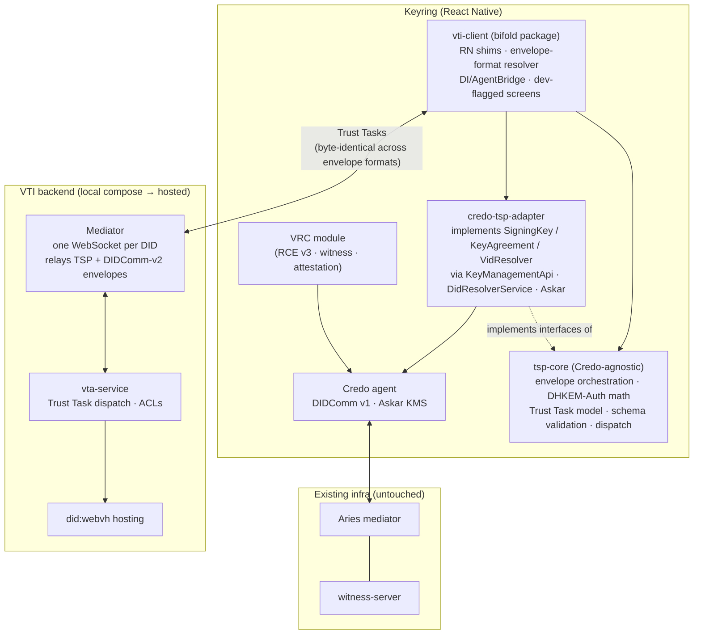
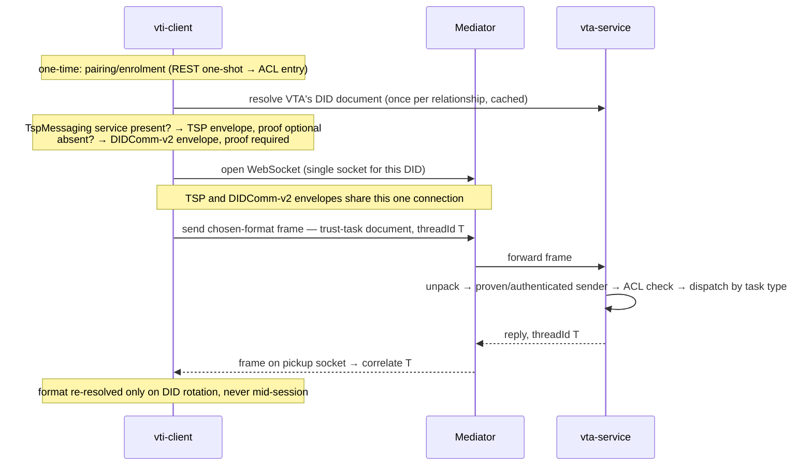
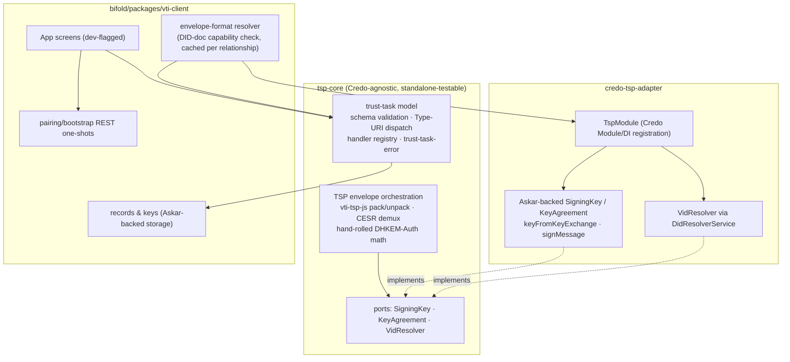

# Keyring × TSP — Revised Plan

*2026-07-29 · Brendan · revisions to [20260729_keyring-tsp-engineering-brief_alberto.md](./20260729_keyring-tsp-engineering-brief_alberto.md), folding in [20260710_credo-ts-tsp-implementation-plan_brendan.md](./20260710_credo-ts-tsp-implementation-plan_brendan.md)*

## 0. Where this lands

Net: yes to the plan — goals, topology, and phased approach all hold up. Section 1 below is the delta: five adjustments, each with the reasoning, that I think we should fold in before Phase C/D work starts. None of these change the destination. They rename one confusing abstraction, remove a risky runtime component in favor of a simpler and more-correct one, resolve the one open architectural question (Phase D) with a specific design instead of leaving it as a TBD, and flag one scope gap the plan currently assumes away. Everything from Section 2 onward is the brief, restated with these adjustments applied.

## 1. Adjustments to the previous version

### 1.1 "Leg" is a protocol choice, not a transport choice — rename it

The original language ("leg selection TSP > DIDComm," "on TSP leg failure → ... DIDComm leg") reads as if TSP and DIDComm-v2 are two different network paths a message could travel. They aren't. Neither TSP nor DIDComm v2 *is* a transport protocol — both are message-envelope formats (sign+encrypt a payload into bytes), and both are transport-agnostic by their own design. The only actual transport in this architecture is the single mediator WebSocket per DID; TSP and DIDComm-v2 frames both ride that identical connection.

**Why it matters:** calling this a "leg" invites building it like transport-level failover (health checks, reconnect on a different path, etc.) when what's actually being decided is "which envelope format do these bytes use on the one connection we already have." That's a much smaller, much safer thing to build, and the terminology should say so.

**Action:** rename the channel manager's "leg selection" to **envelope-format selection**; drop "TSP leg" / "DIDComm leg" from diagrams and docs in favor of "TSP envelope" / "DIDComm-v2 envelope."

### 1.2 Replace live runtime degradation with static, pre-flight selection per relationship

Original design has the channel manager pick TSP, detect failure at send time, and retry the same document over DIDComm-v2 mid-session. Proposing instead: **resolve the envelope format once per relationship, from the peer's DID document, and cache it.** Prefer TSP if the DID document advertises a `TspMessaging` service entry (the new DID service type from §3.7 of the credo-ts plan); otherwise use DIDComm-v2. Re-resolve only on DID rotation — never per-message.

**Why:**

- **VTA TSP support is a deployment fact, not a per-message coin flip.** The ecosystem-state table already notes VTA-over-TSP is "feature-gated off by default" — that's a property of *which VTA* you're talking to, not something that changes moment-to-moment inside a session. There's little to gain from live failover machinery for a condition that's effectively static per relationship.
- **Live fallback is the highest-risk, least-tested class of code in any protocol stack.** Failure/retry paths are combinatorial and rarely exercised outside real outages — exactly where subtle bugs survive longest.
- **There's a genuine correctness problem with reactive fallback, not just a risk-profile one.** A Trust Task document sent over the TSP envelope can validly omit `proof`, because TSP's HPKE-Auth already gives the receiver a cryptographic sender-authentication guarantee intrinsically — the transport supplies it, not the document. DIDComm-v2 doesn't supply that same intrinsic guarantee, so a document built assuming TSP's authentication can't simply be replayed over DIDComm-v2 after a failed send — it may need `proof` added. That means the envelope format has to be chosen *before* the document is constructed, not reactively after a send attempt fails. Static, pre-flight selection isn't just simpler — it's the only version of this that's actually correct.

**Action:** the `CH` box becomes a small resolver (DID document → cached format choice) plus a policy for whether `proof` is required given the chosen format — not a stateful dual-protocol failover system.

### 1.3 Push wire/crypto/dispatch into a Credo-shaped module — but split it so it doesn't require Credo

The original `vti-client` design (`WIRE`, `CRY`, `TT`, `VIDR` boxes) independently reimplements envelope pack/unpack, crypto, VID resolution, and Trust Task dispatch/validation at the app level, bridging to Credo only for legacy DID resolution (a dotted line). Meanwhile the credo-ts plan designs essentially the same four things as Credo module internals. Left as-is, we'd build the hardest parts of this — crypto, schema validation, dispatch — twice.

**Proposal:** one implementation, split into two layers:

- **A Credo-agnostic core** (`tsp-core`) — the Trust Task document model, schema validation, Type-URI dispatch/handler registry, and envelope orchestration (including the hand-rolled RFC 9180 AuthEncap/Decap math from the credo-ts plan's §5), written against small abstract interfaces (`SigningKey`, `KeyAgreement`, `VidResolver`). Zero Credo, Askar, or RN imports.
- **A thin Credo adapter** (`credo-tsp-adapter`) implementing those interfaces via Credo's `KeyManagementApi` / `DidResolverService` / Askar, registered as a `Module` so it plugs into any Credo `Agent` — Keyring's included.

`vti-client` then consumes `tsp-core` through `credo-tsp-adapter` instead of re-deriving WIRE/CRY/TT independently. This is less new work than it sounds: the credo-ts plan's §5 already splits the crypto into "must go through Askar" (static DH, signing) versus "portable math" (ephemeral keygen, HKDF, AEAD) — this just formalizes that existing split as an interface instead of leaving it as inline Askar calls.

**Why it's worth the (small) upfront cost:**

- **Resolves the duplication** described above directly.
- **Makes the hand-rolled crypto reviewable in isolation.** The credo-ts plan already requires an external/senior-peer security review of the custom DHKEM-Auth implementation before shipping. That review is materially easier against pure functions over abstract key handles than against code entangled with Credo's DI container.
- **Custody-backend flexibility later, for free.** The credo-ts plan's own non-goals already flag an HSM-backed path as future work. A clean adapter boundary makes that a new adapter, not a rewrite of the core.

**One deliberate limit:** don't design this for hypothetical future consumers. Exactly two implementations exist in these plans today — the Credo/Askar adapter, and Phase 0's "raw exported key" spike (currently framed as throwaway). Reframe Phase 0's spike as **the second adapter that validates the interface is correctly shaped**, rather than disposable scaffolding. Two known implementations is the right amount of generality; no more.

### 1.4 No waiting on Credo upstream — but fork only if the public API actually requires it

Confirming the existing principle (ship at the Keyring level first, internal review before anything is published upstream) — nothing changes here. One clarification: `credo-tsp-adapter` doesn't need to be a fork of credo-ts's repository. It can be an independent package consuming Credo's *public* `Module` / `DependencyManager` extension points, the same pattern `@credo-ts/askar` already uses. That gives full independence from credo-ts's release cadence without the ongoing cost of rebasing a forked repo against upstream changes.

**Action:** default to an external package; reserve an actual fork of credo-ts for the specific case where its public API proves insufficient for something we need. Nothing identified so far requires that.

### 1.5 One scope gap the simplification doesn't remove: a DIDComm-v2 binding for Trust Task documents

Static, pre-flight selection changes *when* the format decision is made, not *whether* a DIDComm-v2 path needs to exist. Any VTA that hasn't turned TSP on still needs to be reachable via Trust Tasks somehow, which means a DIDComm-v2 transport binding for Trust Task documents — and the credo-ts plan explicitly lists that binding as a v1 non-goal ("this plan implements the TSP binding only; DIDComm can get an equivalent binding later if a use case needs it"). The original sequence diagram assumes this binding already exists as the fallback carrier; it doesn't yet, anywhere.

**Action:** add this as explicit scope in Phase D/E below rather than leaving it as an implicit assumption in the topology diagram.

### 1.6 Net effect: Phase D is resolved, not deferred

§1.3–1.4 above answer Phase D's stated objective ("decide the Credo integration depth with evidence, not opinion") directly: a Credo-agnostic core with a thin Credo adapter, shipped independently, no fork needed by default, backed by the Askar/DHKEM-Auth investigation already done. Recommend closing Phase D as a decision and reallocating its time to building the split in §1.3, rather than treating it as separate investigatory work.

## 2. Revised architecture

### 2.1 Topology

Unchanged from the original: the legacy box (M1, VRC, witness) stays untouched, and Keyring's connection to it is separate infrastructure from the new VTI stack (M2, VTA) — this was already correct and isn't affected by anything in Section 1.

### 2.2 Design rules (revised)

- **Per-relationship envelope format, decided once.** A Trust Task document rides TSP if the peer's DID document advertises `TspMessaging`; otherwise DIDComm-v2. Decided at DID resolution, cached, re-resolved only on DID rotation. *(Revises: was live per-message leg selection with runtime degradation.)*
- **Canonical task grammar only** — unchanged from the original brief.
- **Intrinsic authentication on TSP; explicit proof elsewhere.** A document built for the TSP envelope may omit `proof`; a document built for the DIDComm-v2 envelope must include it. This is decided at document-construction time as a consequence of the format resolution above, not patched in after a failed send. *(New: makes explicit a rule the original design left implicit and unsafe under live fallback.)*
- **Credo-agnostic core, Credo adapter at the edge.** `tsp-core` has zero Credo/Askar/RN imports, same principle as "pure-TS core, RN shims at the edge" from the original brief, extended one layer deeper. *(New.)*
- **Legacy stack untouched.** Unchanged.

### 2.3 Primary message flow

## 3. Module shape (revised)

Each box is still developed and proven as a standalone reference implementation before assembly — that principle from the original brief carries over unchanged, it just now applies across three packages (`tsp-core`, `credo-tsp-adapter`, `vti-client`) instead of one.

## 4. Implementation phases (revised)

| Phase | Objective | Absorbs | Estimate |
|---|---|---|---|
| **A — Wire** | Prove the TSP envelope round-trips in Node, zero infra | Original Phase A + Phase 0's spike (now reframed as the second adapter validating the ports interface, not throwaway) | ~2–3 days |
| **B — Crypto (wallet-integrated from the start)** | Portable HPKE-Auth math + Askar-backed static DH/signing, built directly behind `SigningKey`/`KeyAgreement` | Original Phase B + credo-ts Phase 1, merged — no separate generic-then-wallet-integrated step | 1.5–2 weeks |
| **C — Infrastructure** | Local compose stack: mediator relaying both envelope formats + local VTA | Original Phase C, unchanged | ~1 week |
| **D — Trust Task framework + Credo adapter** | `tsp-core`'s document/schema/dispatch layer; `credo-tsp-adapter` implementing the ports; `Module` registration; **DIDComm-v2 Trust Task binding (§1.5 — new scope, size TBD)** | Original Phase D (now resolved, not investigatory) + credo-ts Phases 2–3 | 2.5–3.5 weeks + DIDComm-v2 binding |
| **E — Keyring assembly** | `vti-client`: envelope-format resolver (static, DID-doc driven), RN shims, DI/AgentBridge, dev-flagged screens, consuming `tsp-core` via `credo-tsp-adapter` | Original Phase E, with the smaller channel-manager scope from §1.2 | 3–4 weeks |
| **F — Routed/Nested (deferred)** | `TspRoutingRecord`, mediator-equivalent hop handling | credo-ts Phase 4 | 1–2 weeks, only if the DTG use case needs it before v1 |
| **G — Hardening + crypto review** | Multi-tenancy isolation, storage migrations, external/senior-peer review of the hand-rolled DHKEM-Auth — now a smaller review surface given the ports isolation from §1.3 | credo-ts Phase 5 | — |

## 5. Verification strategy (revised)

Everything from the original brief carries over (fixtures at every layer, conformance tier against published schemas, bottom-up bisection), plus one addition:

- **Adapter conformance.** The same `tsp-core` fixture suite (frozen vectors, the RFC 9180 interop test) runs against *every* adapter — `credo-tsp-adapter` and Phase A's raw-key spike alike — to prove the ports abstraction doesn't leak backend-specific behavior. This is what makes §1.3's "two known implementations" claim a tested guarantee rather than an assumption.

## 6. Tracking upstream & upstream contributions

Unchanged from the original brief — PINS.json, `sync-external.mjs`, the digest/advance policy, and the seven planned upstream contributions all stand as written. None of the adjustments in Section 1 change what gets contributed externally or when.

## 7. Risks (additions)

| Risk | Mitigation |
|---|---|
| Ports/adapter boundary leaks Credo-specific assumptions if only one adapter is ever exercised | Phase A's raw-key spike is kept and explicitly used as the second adapter against the same conformance suite (§5), not discarded as throwaway |
| DIDComm-v2 Trust Task binding was assumed by the original fallback design but isn't scoped anywhere | Added as explicit Phase D scope (§1.5); size and priority need a decision before Phase D estimates are final |
| Reactive protocol fallback silently mismatches `proof` requirements between envelope formats | Removed by design — format is resolved before document construction (§1.2), not after a failed send |

All other risks from the original brief are unchanged.

## 8. Open questions (updated)

Carried over from the original, plus one resolved and one added:

1. ~~Does the DTG/VRC use case need Routed mode in v1?~~ — unchanged, still open, gates Phase F.
2. Which Trust Task spec does the end-to-end demo target? — unchanged, still open.
3. `trust-task-discovery` (capability negotiation) — unchanged, still open.
4. Who does the crypto review on the hand-rolled DHKEM-Auth? — unchanged, still open, but the review surface is now smaller (§1.3).
5. ~~What's the Credo integration depth?~~ — **resolved** by §1.3–1.4: Credo-agnostic core + thin adapter, external package, no fork by default.
6. **New:** what's the actual size/priority of the DIDComm-v2 Trust Task binding (§1.5)? This needs an estimate before Phase D's total is final.
