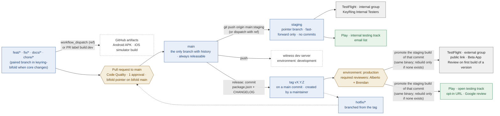

# Release flow — from a feature branch to testers' phones

**Scope.** How a change travels from a branch to a device: the branches that
exist and what each is for, the three delivery channels and the store track
each maps to, how versions and build numbers are assigned, how the
`keyring-bifold` submodule is pinned along the way, what GitHub enforces, and
the agent skill that makes the whole thing runnable without re-reading this
document. Keyring does not ship to the public App Store or Google Play
listings: the top channel **is** TestFlight external testing and Play open
testing (§3).

**Relation to other work.** The credential migration — getting the signing and
publishing secrets into `berkmancenter/keyring-wallet` after the move from the
private repository — is a prerequisite for §3's staging and release channels and
is tracked in a private operations document (it names infrastructure), not
here. The OpenVTC and locality plans are unaffected: they ride on this flow,
they do not change it.

**Reviews.** See [`release-flow-plan/`](./release-flow-plan/):

| Companion | Contents |
|---|---|
| [2026-08-21-al.md](./release-flow-plan/2026-08-21-al.md) | The evidence this plan is built on — how the team actually worked in `AdvancedIdentity` (epic branches, the months-open deploy PR, a dead `main`) and in `keyring-wallet` since April; the decisions taken on 2026-08-21 (channels, approvers, review rule, name); and the rejected `development`-branch and build-on-PR-to-staging positions, with the reasons they fail |

---

## 1. The flow at a glance



Three channels, one trunk. `main` is where history accumulates; `staging` and
the `v*` tags are *pointers* that say which commit each audience has. Nothing
is merged into `staging`, nothing is committed on it, and a tag is only ever
placed on a commit that is already on `main`.

| Channel | Trigger | Audience | Store surface | Needs signing secrets |
|---|---|---|---|---|
| **dev** | `workflow_dispatch` with a `ref`, or the `build:dev` label on a PR | the two of us, a reviewer, a demo | none — artifacts on the workflow run | no |
| **staging** | push / fast-forward of `staging`, or dispatch with a `ref` (a *preview*) | internal testers | TestFlight **internal** group; Play **internal testing** track (by email) | yes — environment `internal` |
| **release** | tag `vX.Y.Z` + approval in the `production` environment | everyone we invite | TestFlight **external** group; Play **open testing** track (URL) — by **promoting** the staging build of the tagged commit | yes — environment `production` |

### 1.1 A worked week

```
Mon  git switch -c feat/x origin/main  …  PR #21 → main        Code Quality · bifold pointer check · 1 approval
Tue  gh workflow run mobile.yml --ref feat/x -f channel=dev    APK + simulator build for a reviewer; no secrets
Wed  merge #21;  git push origin main:staging                  internal testers get build 97; CI tags staging-v0.2.0-97
Thu  testers OK;  PR "release: v0.2.0" (package.json + CHANGELOG, drafted by the skill) → main
Fri  git tag -a v0.2.0 && git push origin v0.2.0               run pauses at `production`; Alberto or Brendan approves;
                                                               build 97 is promoted to TestFlight external + Play open testing
```

Pushing to a feature branch triggers nothing but Code Quality. Every PR
targets `main`; nobody opens a PR against `staging`. The
`staging-v<version>-<build>` tag is a bookmark CI writes after each staging
deploy so that "build 97 is broken" maps to a commit; the `v<version>` tag is
the opposite — human-made, and it *is* the release trigger.

## 2. Branches

**`main`** — the trunk and the only long-lived branch with commits. It is
always in a releasable state because the only way in is a pull request that
passed Code Quality (prettier, lint, typecheck, jest) and has one approval
(§6). Documentation and plans go through the same door; the `docs/plans/`
protocol already works by PR.

**Short-lived branches** — `feat/`, `fix/`, `docs/`, `plan/`, `chore/`,
`hotfix/`. One purpose, one PR, deleted on merge. When a change touches
`bifold/packages/*`, the branch has a **paired branch of the same name** in
`keyring-bifold`; the bifold PR merges first, and the keyring-wallet PR is the
one that bumps the submodule pointer (§5). Stacked PRs are fine; a branch that
is open for weeks is not wrong, but it rebases onto `main` rather than
collecting merges from elsewhere.

**`staging`** — a pointer, not a branch you work on. `git push origin
main:staging` moves it to what internal testers should have; only the
`keyring-releasers` team (Alberto, Brendan) can move it (§6). Its ruleset
forbids force-push and deletion and requires linear history, so it can only
ever be fast-forwarded; a hotfix never lands here first (§4). A ruleset cannot
stop someone committing a single new commit directly on it, so the staging
channel run also checks `git merge-base --is-ancestor <staging> origin/main`
and fails before building if `staging` is not a commit of `main`. It can
point at a commit that is not on `main` only through the *preview* path — a
`workflow_dispatch` of the staging channel with an explicit `ref`, which
skips that check — and that build carries the branch name in its release
notes so nobody mistakes it for the trunk.

**Tags `vX.Y.Z`** — the release pointer. Annotated, created by a maintainer,
only on a commit that is an ancestor of `main` (the release workflow checks
`git merge-base --is-ancestor` and refuses otherwise). Protected by ruleset
so they cannot be moved or deleted.

**What does not exist**: a `development`/`develop` branch, epic branches,
release branches, or a bifold `staging`. The reasons are standing rationale,
not history, and they are in §8.

## 3. Channels and store tracks

Keyring's distribution ceiling is the testing programmes of both stores; there
is no public listing to submit to. That decides what "production" means here:

- **iOS.** Internal testing is for App Store Connect team members (Apple caps
  it at 100 testers); external testing is anyone with the public link or an
  invited email (up to 10,000), and **the first build of each new version
  number goes through Beta App Review before external testers can install
  it** — later builds of the same version usually do not. A build already in
  the internal group can be **added to the external group as it is** — no
  new upload; the review applies to the first external build of a version
  whether it was promoted or freshly uploaded. TestFlight builds
  **expire 90 days after upload**, on both groups. So: the external group is
  "prod", a version bump means one review round, a release is a *promotion*
  of an existing build, and a release older than 90 days needs a new upload
  even if nothing changed (Play has no such expiry). *(App Store Connect Help,
  "Distribute an app using TestFlight" → internal/external testing and build
  expiry; re-verify the numbers when the channel is built, they have moved
  before.)*
- **Android.** Internal testing is an email list (up to 100), available
  minutes after upload and not reviewed. Open testing is an opt-in URL anyone
  can use, **is reviewed by Google like a production release**, and requires
  the store-listing prerequisites (listing, content rating, data-safety form,
  privacy policy) to be complete. So: open testing is "prod", and the
  listing prerequisites are a one-time setup item to confirm (closed testing
  ran once in September 2025, which suggests they are done). *(Play Console
  Help, "Set up an open, closed, or internal test"; re-verify.)*

Consequences the flow absorbs:

- The **release cadence has a 90-day ceiling** on iOS. A calendar reminder at
  T+75 days from the last release is part of the skill (§7).
- A release is a **version bump** (so TestFlight shows a new train and Beta App
  Review runs once), never a build-number-only re-upload to the external
  group.
- A release **promotes, it does not rebuild.** The release run looks up the
  staging build of the tagged commit (by the `staging-v<version>-<build>`
  tag) and adds that build to the TestFlight external group and promotes the
  same AAB from the Play internal track to open testing — the binary testers
  approved is the binary everyone gets, and the run takes minutes instead of
  an hour. It rebuilds from the tag only if no staging build exists for that
  commit (or the iOS one has expired), uploading to both groups at once.
- The **dev channel needs no secrets** — Android builds with the debug
  keystore, iOS builds for the simulator — so it is the first thing to turn
  on, independent of the credential migration. The one value a dev build
  needs, `MEDIATOR_URL`, is a repository *variable*, not a secret.
- The witness server has the same two tiers: every push to `main` redeploys
  the **dev** witness (environment `development`, already wired in
  `staging-witness.yaml`, re-pointed to the new repository); a **prod**
  witness is a later environment gated like the app release.

## 4. Versions, build numbers, hotfixes

**Version** is `app/package.json` `version`, a plain `MAJOR.MINOR.PATCH`.
iOS takes it as `CFBundleShortVersionString`, which App Store Connect only
accepts as up to three period-separated integers — a pre-release suffix such
as `-alpha.2` is rejected at upload (ITMS-90060). The workflow strips any
suffix defensively for iOS and keeps it for the Android `versionName` and the
tag, so a `-rc.1` can exist on Android and in git without ever reaching Apple.
A release bump is one `release: vX.Y.Z — <headline>` commit that changes
`package.json` and `CHANGELOG.md` together, merged by PR like anything else,
then tagged.

Who sets what, and what moves on its own:

| Value | Lives in | Set by | Moves on its own? |
|---|---|---|---|
| Version `MAJOR.MINOR.PATCH` | `app/package.json` — the single source | a human (or the skill's draft) in the `release:` PR | no — deliberate; the skill proposes the bump from conventional commits (`feat` → minor, `fix` → patch, `!`/`BREAKING CHANGE` → major) |
| iOS `CFBundleShortVersionString`, Android `versionName` | the runner only — `agvtool new-marketing-version`, `VERSION_NAME` read by `build.gradle` | CI, from `package.json` | derived |
| iOS `CFBundleVersion`, Android `versionCode` | the runner only — `agvtool new-version`, `VERSION_CODE` read by `build.gradle` | CI, `run_number + OFFSET` | **yes, every run** |
| `staging-v<version>-<build>` tag | git | CI, after a staging deploy | yes |
| `v<version>` tag | git | a releaser (§6) | no |
| bifold packages' own `version` fields | `bifold/packages/*/package.json` | untouched by an app release — the submodule pin is the version | no |

Nothing native is committed per build: the Xcode project and `build.gradle`
keep placeholder defaults and CI overwrites them in the runner.

**Build number** (`CFBundleVersion` / `versionCode`) is allocated by **one**
workflow for all three channels: `github.run_number + OFFSET`, floored by
`MIN_BUILD_NUMBER`. One workflow, one counter, so dev, staging and release
builds can never collide, and a number is never reused. `MIN_BUILD_NUMBER` is
set above the highest build either store has ever accepted and is only ever
raised — if the repository moves again, it is raised first. Store-visible
names are `<version>-staging` and `<version>` (the dev channel does not reach
a store).

**Hotfix.** `git checkout -b hotfix/<slug> vX.Y.Z` → PR to `main` (same
gates) → `release: vX.Y.Z+1` → tag. If `main` has moved on with things that
must not ship, the hotfix branch is tagged directly — it is still an ancestor
of `main` once the PR merges, which is the only invariant the release
workflow checks. `staging` is moved to the same commit afterwards so internal
testers and external testers converge.

## 5. The submodule

`bifold/` is pinned by commit, and the pin is the pointer — there is no
bifold-side `staging` or release branch. The rule that keeps it honest:

> A keyring-wallet PR may only move the submodule to a commit that is
> reachable from `keyring-bifold:main`.

`quality.yml` enforces it (`git -C bifold merge-base --is-ancestor HEAD
origin/main`), so a PR that points at a feature branch of bifold fails until
the paired bifold PR has merged. Bifold commits keep their own conventions
(`Signed-off-by`, SSH-signed). Tags in keyring-wallet pin bifold implicitly
through the pointer; a bifold tag is not needed for a release.

## 6. What GitHub enforces

Owner in brackets; the repository admins are `bcisgit` and `bmiller59`.

| Rule | Mechanism | Status |
|---|---|---|
| `main`: PR required, **1 approval**, Code Quality checks required, no force-push, no deletion | ruleset `Main` (extend the existing one) | **blocked on an admin** |
| **Who can deploy**: an org team `keyring-releasers` = Alberto + Brendan | team; named as the bypass actor in the two rules below and as the reviewers of `production` | blocked on an admin |
| `staging`: updates restricted to `keyring-releasers`; linear history, no force-push, no deletion | ruleset `Staging` | blocked on an admin |
| Tags `v*`: creation restricted to `keyring-releasers`; no update, no deletion | tag ruleset | blocked on an admin |
| **Signing and publishing secrets live in environments, not at repository level**: `internal` (staging channel; deployment policy `staging` + `v*` + the preview dispatch) and `production` (release channel; `v*` only). A job only receives them by declaring the environment, and only on an admitted ref | environment secrets + deployment branch/tag policies | blocked on an admin (environments), Alberto (moving the values) |
| `production` environment: **required reviewers Alberto and Brendan**; only `v*` refs may deploy | environment protection rules | blocked on an admin |
| `development` environment: the witness dev server variables and key | environment | blocked on an admin |
| Preview dispatch of the staging channel: `github.actor` must be in the `RELEASERS` repository variable | job-level `if:` in `mobile.yml` | this plan, phase 2 |
| Fork PRs never see secrets; store channels only trigger on push/tag/dispatch, never on `pull_request` | GitHub default + workflow triggers | by construction |
| Submodule pointer is on bifold `main`; `staging` is a commit of `main` | `quality.yml` job; staging-channel pre-check | this plan, phases 2 and 4 |

One approval with two active developers means a PR waits when one is away;
admins can bypass the ruleset for that case, and a docs-only PR may be
self-approved by convention. That is the trade accepted on 2026-08-21.

Read together, the three layers answer "who can deploy" precisely: only a
releaser can move `staging` or create a `v*` tag (so only a releaser can
start a store run), only a releaser can approve the release run, and only a
run under `internal` or `production` — on a ref those environments admit —
ever holds the keys. Everything else, including any pull request, runs
without them.

## 7. The `release-flow` skill

The flow is only as good as its repeatability, and the people running it are
also the agents running it. A repository skill, `.claude/skills/release-flow/`,
is part of the deliverable, written in the same form as
[`openvtc-workspace`](../../.claude/skills/openvtc-workspace/SKILL.md):

- **Triggers on** anything about deploying, TestFlight, Play tracks, the
  `staging` branch, tags, versions, build numbers, hotfixes, or the submodule
  pointer.
- **Points at this plan first** and does not restate its reasoning.
- **Carries the runbook**: move staging (`git push origin main:staging`),
  dispatch a dev or preview build (`gh workflow run … -f channel=dev -f
  ref=…`), cut a release (bump + CHANGELOG + PR + tag + approve), hotfix, read
  the highest build number from both stores before touching
  `MIN_BUILD_NUMBER`, check the bifold pointer, watch a run, what each
  failure step usually means.
- **Drafts the release.** Given "cut a release", it reads `git log
  <last-tag>..main` in keyring-wallet *and* in bifold across the pointer
  move, groups the conventional-commit subjects into keep-a-changelog
  sections (Added / Changed / Fixed / Security), proposes the semver bump
  from the types, and writes the `CHANGELOG.md` entry and the `release:`
  commit for a human to review in the PR. From that entry it derives the
  TestFlight "What to Test" text and the Play release notes (Play caps them
  at 500 characters per language), which the release run lifts into the
  uploads.
- **Watches for breaking changes.** Beyond `!` and `BREAKING CHANGE:`
  footers, it flags the changes that have historically forced testers to
  reinstall or re-pair here — Askar store or migration changes, VRC context
  or credential-format changes, mediator or protocol flags, native
  permission or minimum-OS changes — and puts them in an *Upgrade notes*
  section of the entry (the old `RELEASE.md` is a list of "THIS BUILD
  REQUIRES A RE-INSTALL" lines for exactly this reason). A flagged change
  without an upgrade note is a release-PR blocker, not a warning.
- **Carries the guardrails**: never commit on `staging`; never tag a commit
  that is not on `main`; never lower `MIN_BUILD_NUMBER`; keep
  `CFBundleShortVersionString` plain; bifold PR merges before the bump;
  Alberto's `Signed-off-by` on bifold commits; the 90-day TestFlight clock.
- **Names what needs a human**: the production approval, Beta App Review,
  anything in the store consoles.
- **Is backed by scripts**, `scripts/release/` (move-staging, dispatch-build,
  check-bifold-pointer, draft-release, promote), so a person at a terminal
  and an agent run the same commands and the skill stays a thin guide over
  them rather than a second implementation.

## 8. Standing rationale — why not the other shapes

These rule out designs that would otherwise be re-proposed. They are
constraints, not history; the history is in the companion.

- **No `development` branch.** With `main` gated by PR + CI, a second trunk has
  nothing to hold except work that is not ready for `main` — and the evidence
  from this team is that the integration branch then *becomes* the trunk and
  `main` dies (six months dead in the previous repository). The legitimate
  need behind it, "put unfinished work on a phone", is served by the dev
  channel building any `ref`, at no governance cost.
- **No epic branches, no long-lived release branches.** Every long-lived
  branch here is two long-lived branches (keyring-wallet + keyring-bifold)
  and a pointer between them to keep consistent; the cost doubles and the
  ancestor rule in §5 stops being checkable. A stabilisation window, if one is
  ever needed, is a short-lived `release/x.y` that is tagged and deleted.
- **No building on `pull_request` to `staging`.** It is how a deploy PR stayed
  open for three months producing builds, it means an unmerged branch can
  reach internal testers without `main` ever seeing it, and on a public
  repository it is a secrets surface. The dispatch-with-`ref` preview path
  gives the same capability with the branch name stamped on the build.
- **No store production.** Not a choice this plan makes; it is the product's
  current distribution ceiling, and the channels are named for the tracks
  they really use so nobody looks for a "production" button that does not
  exist.
- **Build numbers are not `git rev-list --count`.** Deterministic, but it goes
  backwards the moment a preview build comes from a branch with fewer
  commits than `main`; a single workflow's `run_number` is monotonic by
  construction.
- **A release does not rebuild by default.** Rebuilding from the tag looks
  cleaner but produces a binary nobody has run; promoting the staging build
  ships the exact bytes internal testers approved, costs no CI hour, and
  carries the same Beta App Review either way. Rebuild is the fallback for
  a missing or expired staging build, not the path.
- **Secrets are not repository-level.** A repository secret is readable by
  any job in any workflow on any branch a collaborator pushes, including a
  workflow edited on a feature branch. Environment secrets are handed only
  to jobs that declare the environment, on refs the environment admits —
  which is the only mechanism GitHub offers that ties "may hold the signing
  key" to "is a release ref".

## 9. Implementation

Each phase names what must be true for it to be done. Phases 1 and 2 can run
in parallel; 0 is the only one blocked on someone else.

| # | Phase | Owner | Done when |
|---|---|---|---|
| 0 | **Governance** — team `keyring-releasers`; rulesets for `main`, `staging`, `v*`; environments `internal`, `production` (reviewers Alberto + Brendan, `v*` only) and `development`; `MEDIATOR_URL` and `RELEASERS` as repository variables | admin, from a checklist we hand over | `gh api repos/berkmancenter/keyring-wallet/rulesets` shows the three with the team as bypass actor; the three environments exist with their policies; a test PR without approval cannot merge; a non-releaser's push to `staging` is rejected |
| 1 | **Credentials** — the private migration document, with the values set as **environment** secrets on `internal` and `production` | Alberto (+ admin for the Apple/Google halves) | a `staging` push reaches the TestFlight internal group and the Play internal track; `gh secret list` at repository level shows nothing store-related |
| 2 | **One workflow, three channels** — `mobile.yml` replaces `staging.yaml`: `channel` (dev/staging/release) from the trigger; dev builds on dispatch/label with no secrets; staging-is-on-`main` pre-check (skipped for previews, which stamp the branch); `RELEASERS` actor check on preview dispatch; `MIN_BUILD_NUMBER` raised; fail-fast secrets check; iOS version suffix stripped; `BIFOLD_REPO_TOKEN` removed; `staging-v*` tag + Slack kept | Alberto | a dev dispatch on a feature branch yields an APK and a simulator build as artifacts; a `staging` push ships both apps; a `staging` pointing off-`main` fails before building; build numbers from a dev run and a staging run are distinct and increasing |
| 3 | **Release channel** — tag `v*` → ancestor-of-`main` check → `production` approval → **promote** the staging build (TestFlight external group; Play internal → open testing), rebuild-and-upload only when none exists; CHANGELOG section lifted into both stores' release notes | Alberto | `v0.2.0` is installable from the TestFlight public link and the Play open-testing URL with the **same build number** internal testers had; a tag on a non-`main` commit fails before doing anything; the rebuild path is exercised once on purpose |
| 4 | **Submodule guard** — the bifold-ancestor job in `quality.yml` | Alberto | a PR bumping to a bifold feature-branch sha fails; the same PR passes after the bifold PR merges |
| 5 | **Skill, scripts, public docs** — `.claude/skills/release-flow/SKILL.md` over `scripts/release/*`; `docs/RELEASING.md` (public-safe: branches, channels, secret *names* and owners, expiry dates) | Alberto | an agent given only the skill can move `staging`, dispatch a dev build, and draft a release — CHANGELOG entry, bump proposal, upgrade notes, store release-note texts — for a commit range that contains at least one `feat`, one `fix`, and one flagged change, without asking a question this plan already answers |

**Blocked on whom.** Phase 0 on the repository admins (checklist ready to
send). Phase 1's Apple and Google halves on the store admin, as the private
document lays out. Nothing else is blocked.

**Not yet decided.** Whether the prod witness server is part of the first
release (§3) or follows; whether the `build:dev` label also posts the artifact
links as a PR comment. Neither blocks a phase.
