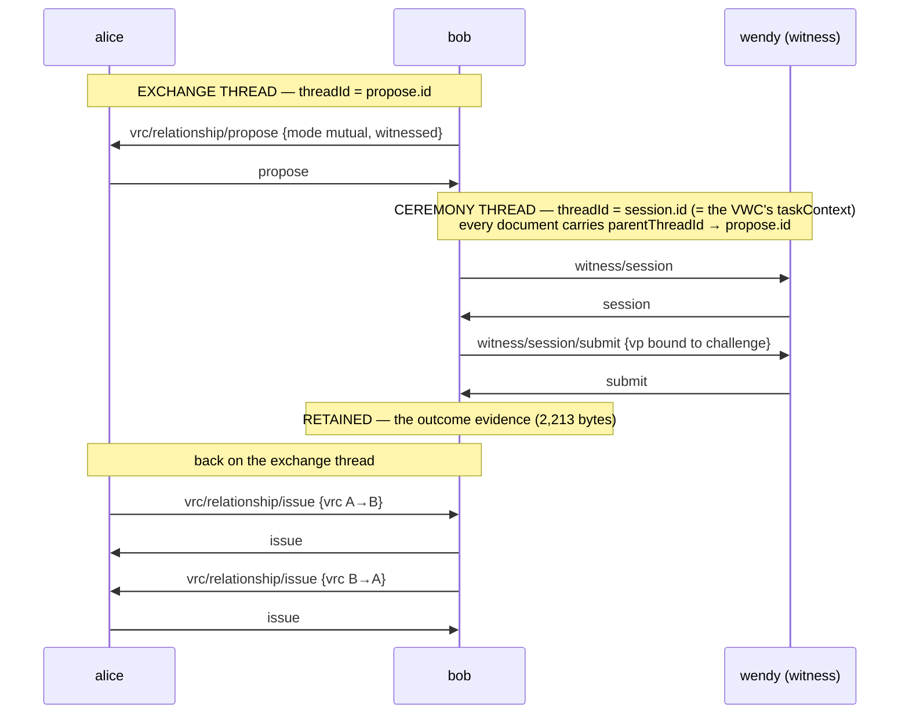

# ref-06w — the witnessed relationship exchange, as draft Trust Task documents

> **Status (2026-08-15): historical.** The draft specs this rung authored were
> merged upstream (revised) as #213 — bilateral sessions, receipt digest
> REQUIRED, `witnessed` answered on the response. The living version of this
> exchange runs on the published package: **ref-06w4-package-truth**. Kept as
> the record of what was proposed and why.

The appendix's raw material. The two-thread design from
[`trust_tasks_subtask.md`](../../docs/plans/openvtc-integration-plan/trust_tasks_subtask.md) §5,
run for real: **alice** and **bob** (the relationship parties) and **wendy**
(the witness), exchanging draft `vrc/*` and `witness/*` documents authored
here, with the official `@openvtc/trust-tasks` §7.2 pipeline on every receive,
over the dedicated-`@type` carriage (provisional pending the binding review —
the documents are carriage-independent, which is the task layer's whole point).
8 checks.

Run: `npm install && npm start` (`npm run check` for quiet).

## Fidelity to Keyring's real witnessed exchange

The skeleton is the app's ceremony, message for message (with the chat-regex
handshake replaced by `propose` — that *is* the recast). Deliberate
simplifications, which the appendix specs add back:

| This rung | The real flow |
|---|---|
| Only bob submits; one VWC naming both parties | **Bilateral** — both parties submit and each receives a VWC (`perRole` multiplicity in ceremony vocabulary) |
| Stub VWC shape | The cred-spec's VWC schema (digest/commitment, evidence axes) |
| No hardware attestation | Secure Enclave / StrongBox evidence rides the real submission |
| No `witness/announce` | The witness broadcasts capability first (the bearer task that needs a proof) |
| No RCard | Correctly absent — a VDS with its own future spec (decision B4) |
| Proof stubs | Real `eddsa-*` signatures (Phase D) |

## What it proves — the subtask's design decisions, executed

- **Two threads, nested by `parentThreadId` (framework 0.4 §4.9.2).** The
  relationship exchange is one thread (`propose.id`); the witness ceremony
  opens its **own** thread (`session.id`) whose every document carries
  `parentThreadId` pointing at the exchange. Asserted on the wire, both
  directions.
- **`taskContext` anchors on the ceremony's initiating document `id`** —
  §4.9.1's innermost-exchange rule, decision B5. The VWC wendy issues names
  `session.id`, never the outer thread — the failure mode B1 was designed
  against ("evidence of the wrong event") is structurally impossible here.
- **Our draft specs qualify, with teeth.** `witness/session#response` and
  `witness/session/submit#response` declare `proof: REQUIRED`; the rung sends
  an *unproofed* VWC response first and the pipeline rejects it with
  `proofRequired` before any code runs. The qualifying profile is satisfiable
  by the real flow — the exact question the joint-appendix invitation exists
  to test.
- **Outcome-evidence retention (review A5), priced.** Bob retains
  `submit#response` — **2,213 bytes per ceremony** — and act 4 performs the
  third-party verifier's pairing check (the ask-#5 sketch): evidence thread =
  the VWC's `taskContext`, evidence type is the terminal success form,
  evidence carries its own proof. Outcome Interpretability, executable.
- **Witnessing is additive.** The relationship-layer documents never
  reference the ceremony; act 5 closes the exchange with mutual `issue` +
  receipts on the outer thread alone — an unwitnessed exchange is the same
  flow minus acts 2–4.

## What feeds the appendix from here

The draft payloads and policies in `run.mjs` (`DRAFT_SPECS`) are the seed of
the `vrc/relationship/{propose,issue}` and `witness/session{,/submit}`
specifications — now written from a running exchange. Deliberately unresolved,
flagged for the spec work: the **namespace** (URIs here use a placeholder
authority; slug placement in the appendix is an open #173 question); the
real ceremony is **bilateral** (both parties submit under the same challenge —
`perRole` multiplicity in ceremony vocabulary; this rung runs one submitter);
and the VWC payload here is a stub shape, not the cred-spec's VWC schema.

## What it does NOT prove

- No cryptographic proofs (stubs under `acceptUnverified` — Phase D), no
  mediator hop (06v1b/06v1d cover the pattern), Node only (Hermes is ref-08).
- Nothing about the ceremony *layer* — no `ceremony{}` envelope members, no
  receipt. That half-step is deliberately later: it becomes the layer's first
  wire contact once upstream's stage-3 design firms up.

Pinned against: `@openvtc/trust-tasks` 0.6.0, `@credo-ts/*` 0.6.3,
`dtgwg-trust-tasks-tf` @ `fbe196a` (framework 0.4).
